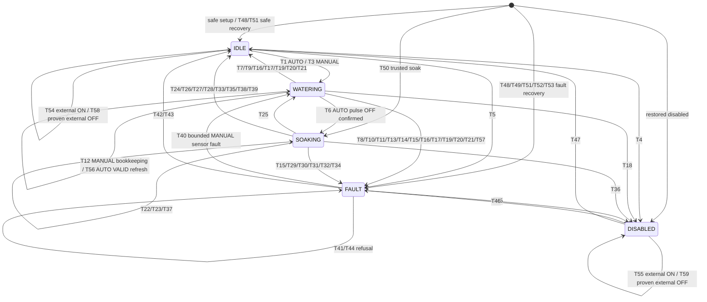
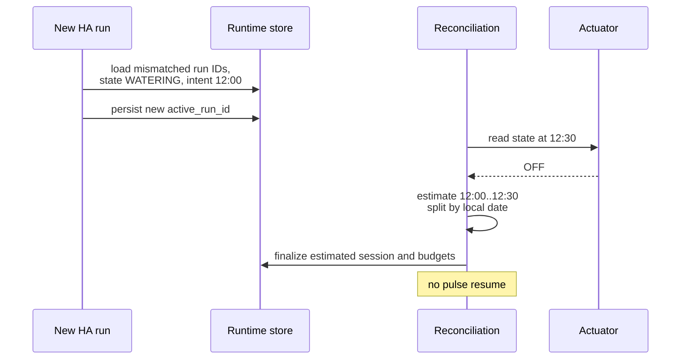
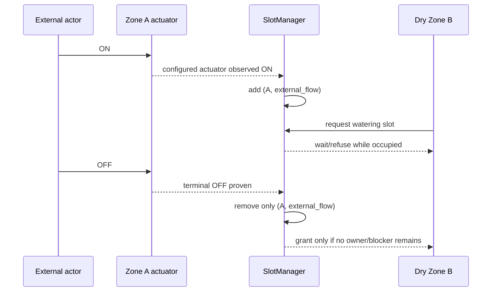

# Moisture Loop — v0.1 Technical Specification

**Closed-loop soil-moisture irrigation for Home Assistant**

| | |
|---|---|
| Status | Draft for review - implementation source of truth |
| Spec version | `0.1.0-spec.3` |
| Date | 2026-08-20 |
| Integration name (provisional) | Moisture Loop |
| Domain (provisional) | `moisture_loop` |
| Target platform | Home Assistant >= 2025.9.0 |
| Distribution | HACS custom integration |

> **Revision note:** spec.3 resolves runtime Store initialization/integrity identity, the minimum Home Assistant API floor, the AUTO sensor-freshness watchdog, external-flow resource serialization, and trusted-SOAKING run adoption. All previously accepted v0.1 architecture and safety behaviour remains unchanged except where these corrections require explicit strengthening.
>
> **Corrective edit:** AUTO freshness callbacks carry a generation/deadline token. A callback superseded by any newer VALID report is a no-op; expiry is decided from the current derived freshness deadline, not by comparing the new report timestamp with the old deadline.

---

## 1. Executive Summary

Moisture Loop is a hardware-agnostic Home Assistant custom integration for closed-loop irrigation. Each zone pairs one soil-moisture sensor with one `switch` or `valve` actuator. A new automatic session starts only when a valid, fresh moisture report is strictly below the configured start threshold. It then applies bounded watering pulses. Every pulse is followed by a soak, and the next continuation or completion decision uses only a valid, fresh sensor report made at or after that soak ends.

The controller has five states: `DISABLED`, `IDLE`, `WATERING`, `SOAKING`, and `FAULT`. Watering commands are globally serialized in v0.1, and any configured actuator observed or conservatively believed to be flowing occupies that shared resource even when an external actor opened it. Whole automatic pulses must fit within session and daily runtime budgets. AUTO water stops if its newest valid moisture report becomes stale mid-pulse. Interrupted watering is never resumed after restart or reload. Unknown watering duration is conservatively overestimated. Automatic behaviour fails toward water OFF; explicit, bounded manual watering remains possible when only the moisture sensor is faulty.

Key architectural decisions are:

- one config entry containing one config subentry and one Home Assistant device per zone;
- a pure Home Assistant-independent state-machine core;
- entity-filtered listeners for both changed moisture states and unchanged `state_reported` reports;
- one cooperative session-owner task per active zone, with cancellation only as teardown fallback;
- an independently identified, atomic-write runtime Store, write-ahead persistence before every ON command, and run-ID-based crash detection;
- actions registered once from integration-level `async_setup`;
- `integration_type: helper`, `iot_class: calculated`, and `single_config_entry: true`;
- completely local operation with no cloud, telemetry, API key, or external service.

Implementation readiness verdict: **READY WITH PROTOTYPE VALIDATIONS** (§46 and the final verdict).

---

## 2. Problem Definition

Most irrigation controllers are open loop: they run a timer, calendar, weather, or evapotranspiration calculation and optionally use moisture as a veto. Moisture Loop instead treats measured soil moisture as the authoritative automatic feedback signal.

Two physical facts drive the design:

1. Water redistributes through soil after the actuator closes. A reading taken shortly after OFF does not represent the result of a 20-minute soak. Therefore the controller must wait for the full configured soak and then require a report timestamped at or after the soak deadline.
2. Software controls a physical water path. Missing telemetry, uncertain restart history, actuator interference, or task races must stop or skip automatic watering. A user may deliberately override only a sensor-only fault through an explicitly bounded manual session.

The integration operates only on Home Assistant entity abstractions. It contains no Ecowitt, Holman, Zigbee, Wi-Fi, or other vendor-specific logic.

---

## 3. Goals

1. Support multiple zones, each with exactly one moisture sensor and one actuator.
2. Run moisture-driven pulse -> soak -> post-soak-report loops.
3. Produce deterministic transitions for a given state, input sequence, persisted state, and clock.
4. Fail toward actuator OFF on uncertainty.
5. Enforce maximum cycles, session runtime, daily runtime, and minimum automatic-session interval.
6. Provide explicit, bounded manual watering independent of sensor health but never independent of actuator, configuration, integrity, or runtime safety.
7. Provide UI configuration and per-zone reconfiguration through config subentries.
8. Never resume a WATERING pulse after restart or reload.
9. Preserve sufficient runtime history to reconcile crashes conservatively without Recorder.
10. Expose useful entities, events, diagnostics, logs, and Repairs.
11. Keep Home Assistant I/O out of the pure state-machine module.
12. Operate entirely locally.

---

## 4. Non-Goals (v0.1)

The following remain outside v0.1:

- weather, rain, forecasts, evapotranspiration, calendars, or seasonal scheduling;
- crop presets or agronomic threshold claims;
- adaptive learning, AI/ML, or automatic pulse tuning;
- flow meters, leak measurement, tank-level interlocks, or fertigation;
- multiple sensors or multiple actuators inside one zone;
- shared-pump/resource modelling beyond one global watering slot;
- stuck-sensor auto-blocking;
- vendor discovery or vendor-specific APIs;
- unbounded manual watering;
- cloud accounts, telemetry, or outbound network use.

The integration does not duplicate the source moisture entity, and thresholds remain config-subentry data rather than `number` entities in v0.1.

---

## 5. Home Assistant Architecture Research

Research for this revision was checked against official Home Assistant and HACS documentation, the Home Assistant Core `2025.7.0`, `2025.8.0`, and `2025.9.0` release sources, and current Core on 2026-08-20. Normative runtime API compatibility is anchored to the declared minimum release, not only to `dev`.

### 5.1 Config entries, runtime data, and subentries

- A config entry is the setup/unload/reload unit. Typed live data belongs in `entry.runtime_data`; listener cleanup is attached to entry unload. ([Config entries](https://developers.home-assistant.io/docs/config_entries_index/))
- One `ConfigSubentryFlow` of type `zone` represents each zone. Entities and the zone device use the subentry ID. Home Assistant 2025.9.0 is the minimum supported release because it is the first release whose `ConfigSubentryFlow` itself provides the required subentry-specific update-and-reload helper. ([Config flow and subentries](https://developers.home-assistant.io/docs/core/integration/config_flow/), [Core 2025.9.0 `ConfigSubentryFlow`](https://github.com/home-assistant/core/blob/2025.9.0/homeassistant/config_entries.py))
- Direct release-source inspection confirms that 2025.7.0 and 2025.8.0 contain only the different config-entry-flow overload, so neither release is supported and no compatibility implementation is specified. ([Core 2025.7.0](https://github.com/home-assistant/core/blob/2025.7.0/homeassistant/config_entries.py), [Core 2025.8.0](https://github.com/home-assistant/core/blob/2025.8.0/homeassistant/config_entries.py))
- Reconfiguration deliberately uses `ConfigSubentryFlow.async_update_reload_and_abort(entry, subentry, ..., reload_even_if_entry_is_unchanged=False)`. The integration registers no config-entry update listener, because combining an update listener with a flow reload can double-reload or race and is disallowed by the helper contract. ([Core 2025.9.0 API](https://github.com/home-assistant/core/blob/2025.9.0/homeassistant/config_entries.py), [reload-listener guidance](https://developers.home-assistant.io/blog/2026/05/07/config-entry-listener-together-with-reloading-methods/))
- The remaining normative APIs were source-checked on 2025.9.0: typed `entry.runtime_data`; config subentries and update/removal; `async_track_state_change_event`; `async_track_state_report_event`; nested `DeviceSelectorConfig.filter`; `IssueSeverity.WARNING/ERROR/CRITICAL`; valve OPEN/CLOSE features and position; and entity-registry update tracking. No required API raises the floor above 2025.9.0.

### 5.2 Moisture state writes and reports

Home Assistant distinguishes two event paths:

- `state_changed`: a write changed the state string and/or attributes;
- `state_reported`: a write left both state and attributes unchanged, while advancing `State.last_reported`.

`async_track_state_change_event` does **not** receive unchanged reports. Moisture Loop therefore installs both:

1. `async_track_state_change_event(hass, configured_moisture_entity_ids, ...)`; and
2. `async_track_state_report_event(hass, configured_moisture_entity_ids, ...)`.

The second helper is the higher-level API designed for this purpose and routes reports by explicit entity ID. It is preferred over direct event-bus registration and satisfies the filtered-listener contract. The 2024 announcement required direct listeners to pass `run_immediately=True`; the supported Core API handles report dispatch internally, so Moisture Loop does **not** pass it. Any unavoidable direct fallback would still require a callback-decorated entity `event_filter`; a global listener followed by Python filtering is forbidden. The event is intentionally excluded from wildcard delivery because of its volume. ([`last_reported` and `state_reported`](https://developers.home-assistant.io/blog/2024/03/20/state_reported_timestamp/), [Core 2025.9.0 event helpers](https://github.com/home-assistant/core/blob/2025.9.0/homeassistant/helpers/event.py), [Core 2025.9.0 EventBus](https://github.com/home-assistant/core/blob/2025.9.0/homeassistant/core.py))

Both listener callbacks normalize their input into the same `MoistureObservation` (§6, §37). For a changed state, `new_state.last_reported` is used. For an unchanged report, the event's `last_reported` and `new_state` are used. The pure state machine never receives a Home Assistant event object.

Actuator monitoring continues to use `async_track_state_change_event`, because command acknowledgement and interference depend on actual actuator state/attribute changes, not repeated identical reports.

### 5.3 Actions and validation

Integration actions are registered once from `async_setup(hass, config)`, not per entry from `async_setup_entry`. This keeps actions available to automation editors even when the config entry is unloaded or failed. A handler validates its required device target, resolves the zone device to the entry/subentry/controller, verifies `ConfigEntryState.LOADED`, and raises a translated `ServiceValidationError` if the target or runtime is unavailable. ([Service actions are registered in `async_setup`](https://developers.home-assistant.io/docs/core/integration-quality-scale/rules/action-setup/), [service action targeting](https://developers.home-assistant.io/docs/dev_101_services/))

Each action operates on a zone device as a whole, so the public schema requires exactly one `device_id`; it does not substitute an entity ID or config-entry ID. The field uses the nested device-selector filter equivalent to `DeviceSelectorConfig(filter={"integration": DOMAIN}, multiple=False)`, which is present on the minimum release. Backend resolution verifies the device has identifier `(DOMAIN, subentry_id)`, belongs to the Moisture Loop config entry/subentry, and is unambiguous. The backend never trusts frontend filtering. A deprecated/removed generic **target-selector** device filter is not used. ([Device target-filter removal](https://developers.home-assistant.io/blog/2025/10/14/device-filter-removed-from-target-selector/), [Core 2025.9.0 selector implementation](https://github.com/home-assistant/core/blob/2025.9.0/homeassistant/helpers/selector.py))

### 5.4 Manifest classification

Moisture Loop is not a gateway to discovered devices. It consumes existing HA entities and adds calculated control/helper behaviour. The manifest therefore uses:

```jsonc
{
  "integration_type": "helper",
  "iot_class": "calculated",
  "single_config_entry": true,
  "config_flow": true
}
```

`helper` is the documented type for integrations that provide helper entities/logic; `calculated` is the IoT class for integrations that do not communicate independently. `single_config_entry` accurately represents the one-controller topology. ([Integration manifest](https://developers.home-assistant.io/docs/creating_integration_manifest/))

### 5.5 Async, lifecycle, Repairs, and diagnostics

- All runtime work is event-loop-native. The entry owns background tasks and unloads cleanly. ([Async programming](https://developers.home-assistant.io/docs/asyncio_index/), [config-entry unloading](https://developers.home-assistant.io/docs/core/integration-quality-scale/rules/config-entry-unloading/))
- Full-process shutdown is detected with a once-only `EVENT_HOMEASSISTANT_STOP` listener. It is distinct from entry reload/unload. ([Listening for events](https://developers.home-assistant.io/docs/integration_listen_events/))
- Repairs use only supported enum constants: `IssueSeverity.WARNING`, `IssueSeverity.ERROR`, and the reserved `IssueSeverity.CRITICAL` only for a true panic such as a valve not proven OFF. ([Repairs severity](https://developers.home-assistant.io/docs/core/platform/repairs/))
- Config-entry diagnostics redact sensitive values with HA helpers. There are no credentials in v0.1.

### 5.6 HACS

Current HACS requirements are treated separately from Home Assistant runtime requirements: one integration directory under `custom_components`, the required manifest keys, a root `hacs.json`, and brand assets. Releases are preferred but optional for custom-repository use. HACS Action and hassfest are CI gates; default-store inclusion additionally requires a full GitHub release and a matching entry in `home-assistant/brands`. ([HACS integration publishing](https://hacs.xyz/docs/publish/integration/), [HACS validation action](https://hacs.xyz/docs/publish/action/), [HACS default inclusion](https://hacs.xyz/docs/publish/include/))

### 5.7 Coordinator pattern

`DataUpdateCoordinator` is not used. There is no polled external API or shared remote dataset. Entity reports, timers, a pure state machine, and controller callbacks are the correct model.

---

## 6. Terminology and Normalized Models

| Term | Normative definition |
|---|---|
| Zone | One moisture sensor, one actuator, one config subentry, one controller, and one zone device. |
| Automatic session | Controller-started session governed by moisture, pulse/soak logic, and all automatic guards. |
| Manual session | Explicit user-started, single bounded ON interval that ignores moisture but obeys all non-sensor safety rules. |
| Pulse | One bounded automatic actuator-ON interval of configured `pulse_duration`. |
| Soak | Actuator-OFF interval ending at `soak_ends_at_utc`. |
| Recheck | A continuation/completion decision based on a qualifying report at or after the soak deadline. |
| Fresh | `reported_at_utc >= now_utc - sensor_max_age`; equality is fresh. |
| AUTO freshness deadline | While `WATERING(AUTO)`, `sensor_fresh_until_utc = latest_valid_reported_at_utc + sensor_max_age`. Each arm has a monotonically changing generation/deadline token so a replaced callback cannot expire the current observation. |
| Qualifying recheck report | VALID, fresh, and `reported_at_utc >= recheck_not_before_utc`, where `recheck_not_before_utc = soak_ends_at_utc`. Equality qualifies. |
| Session runtime | Conservatively accounted potential actuator-ON time for one session, actual or estimated. |
| Daily runtime | Conservative runtime charged to a zone for an HA-local calendar day. |
| Water-resource blocker | A SlotManager record keyed by `(zone_id, reason)` that prevents every integration-commanded ON while a configured actuator is observed or conservatively believed to be flowing. Reasons include `integration_off_unconfirmed`, `external_flow`, and startup `actuator_not_proven_off`. |
| Retained sensor fault | A sensor-only fault kept visible while explicit manual watering temporarily occupies `WATERING`. |

The HA adapter produces this pure input model:

```text
MoistureObservation:
    value: float | None
    classification: VALID | STALE | INVALID | UNAVAILABLE
    reported_at_utc: datetime | None
    age_s: float | None
```

`reported_at_utc` is derived from Home Assistant `last_reported`; the pure core has no knowledge of `state_reported`.

---

## 7. Proposed Name and Domain

**Provisional recommendation: Moisture Loop, domain `moisture_loop`.** Searches of current Home Assistant Core integrations, the HACS default repository list, and practical GitHub repository/name variants on 2026-08-20 found adjacent irrigation projects but no material collision for the exact name/domain. Relevant adjacent names include Smart Irrigation, Irrigation Unlimited, OpenSprinkler, and crop-steering projects; none use `moisture_loop`. ([Core integration catalog](https://github.com/home-assistant/core/tree/dev/homeassistant/components), [HACS default repository catalog](https://github.com/hacs/default))

The name remains provisional until repository creation/release. The domain must be finalized before implementation because it becomes part of storage keys, action names, entity unique IDs, and brand paths. No rename is justified by the current search.

---

## 8. User Experience

1. Install through HACS or manual copy and restart Home Assistant.
2. Add one Moisture Loop integration entry.
3. Add one or more zone subentries by selecting a name, sensor, actuator, thresholds, pulse/soak timing, and safety limits.
4. Each zone appears as a device with status, runtime, last-session, needs-water, watering, problem, enable, stop, evaluate, and clear-fault entities.
5. Normal automatic operation runs quietly and reports session outcomes.
6. Manual watering is requested with an explicit duration through `moisture_loop.start_manual_watering`.
7. Sensor-only faults still permit bounded manual watering. Actuator, configuration, and integrity faults do not.
8. Reconfiguration cooperatively terminates an active old session, records `CONFIG_CHANGED`, updates the subentry, and reloads the entry exactly once.

---

## 9. Zone Configuration Schema

All fields are per-zone config-subentry data.

| Key | Type | Default | Range / validation |
|---|---|---|---|
| `name` | text | required | 1-64 characters; unique case-insensitively |
| `moisture_sensor` | entity ID | required | existing `sensor`; same sensor may be shared with warning |
| `actuator` | entity ID | required | existing `switch`, or `valve` with OPEN+CLOSE features; unique across zones |
| `start_threshold` | percent | 30 | 1-99; strictly less than target |
| `target_threshold` | percent | 40 | 2-100; strictly greater than start |
| `pulse_duration` | duration | 5 min | 30 s-30 min; <= session and daily limits |
| `soak_duration` | duration | 20 min | 1 min-4 h |
| `max_cycles` | integer | 4 | 1-20 |
| `max_session_runtime` | duration | 30 min | pulse duration-4 h |
| `max_daily_runtime` | duration | 60 min | pulse duration-12 h |
| `min_session_interval` | duration | 6 h | 15 min-7 d |
| `sensor_max_age` | duration | 2 h | 5 min-24 h |
| `actuator_confirm_timeout` | duration | 30 s | 5 s-5 min |
| `manual_max_duration` | duration | 30 min | 1 min-2 h |

No separate `recheck_grace` setting is added in v0.1. The grace deadline is `soak_ends_at_utc + sensor_max_age`. This is coherent: the controller waits at most one configured freshness horizon after the physical soak, and a report at the soak boundary remains fresh through the entire grace window. A second knob would create configuration complexity without adding a distinct safety property.

The enabled flag is runtime state exposed as a switch, not configuration. All reconfigured fields apply only after the controlled reload; no live session mutates its configuration.

Defaults are safe starting points, not agronomic advice. Users must calibrate thresholds and timing from their own soil, emitter, probe location, and sensor behaviour.

---

## 10. Moisture Sensor Contract

### 10.1 Accepted values

Any `sensor` whose state parses to a finite number in `[0, 100]` may be selected. Device class `moisture` and unit `%` are preferred for UI filtering but not required. No unit conversion is attempted. Values `0` and `100` are valid.

### 10.2 Classification

| Classification | Condition | Automatic use |
|---|---|---|
| `UNAVAILABLE` | entity absent or state `unavailable` | never |
| `INVALID` | `unknown`, unparsable, NaN, infinity, `< 0`, or `> 100` | never |
| `STALE` | finite in range, but older than `sensor_max_age` | never |
| `VALID` | finite in range and fresh | eligible subject to other guards |

Out-of-range data is rejected, never clamped. Clamping could turn a broken negative reading into a watering request or a huge raw value into false saturation.

### 10.3 Report subscription and freshness

Moisture Loop listens to both changed states and unchanged reports as defined in §5.2. A repeated identical report is a real observation: it advances `last_reported`, refreshes the observation and an active AUTO freshness deadline, can auto-clear a stale fault, and can qualify as the post-soak report if its timestamp satisfies §18.4.

The configured moisture entity IDs are passed directly to `async_track_state_report_event`. A global `state_reported` listener is forbidden. The fallback scan reads current state as a safety net but is not a substitute for report-event subscription and cannot manufacture a new report timestamp.

### 10.4 State-specific behaviour

- `IDLE` or `DISABLED`: unavailable, invalid, or stale data prevents automatic start; it does not by itself latch a fault.
- automatic `WATERING`: `UNAVAILABLE` or `INVALID` requests immediate cooperative termination and OFF. Fault is `SENSOR_UNAVAILABLE` or `SENSOR_INVALID`. In addition, every AUTO pulse has a freshness watchdog at `latest_valid_reported_at_utc + sensor_max_age`; expiry without a newer VALID report requests the same cooperative OFF path and faults `SENSOR_STALE`. The interrupted session never resumes.
- manual `WATERING`: all sensor states are deliberately ignored for control and never stop the run. Observation and fault-recovery bookkeeping may update.
- `SOAKING`: reports before the soak deadline update observability only. A valid report at or after the deadline may decide. A post-deadline invalid/unavailable observation may terminate with its corresponding fault; otherwise absence of a qualifying report through the grace deadline terminates as `SENSOR_STALE`.
- entity registry removal: `CONFIGURATION_INVALID` and an ERROR Repair until reconfigured.

Entity rename tracking is a prototype validation (§46). Replacement uses zone reconfiguration and does not reset runtime budgets.

---

## 11. Actuator Contract

### 11.1 Supported states

- `switch`: ON=`on`, OFF=`off`; actions `switch.turn_on` and `switch.turn_off`.
- `valve`: ON=`open`, OFF=`closed`; actions `valve.open_valve` and `valve.close_valve`. Selection requires both `ValveEntityFeature.OPEN` and `ValveEntityFeature.CLOSE`; a position-only valve is not accepted in v0.1.
- `opening` and `closing` are transitional, never proof of the requested terminal state.
- For a position-reporting valve, a known `current_valve_position > 0` is treated as potentially flowing; position `0` with terminal `closed` state is OFF. Full open/close actions are used; arbitrary positions are not commanded.
- `unknown`, `unavailable`, unrecognized, and transitional states are **not proven OFF**.

These names and position semantics match the HA Valve entity contract on the minimum release. ([Valve entity](https://developers.home-assistant.io/docs/core/entity/valve/), [Core 2025.9.0 Valve component](https://github.com/home-assistant/core/blob/2025.9.0/homeassistant/components/valve/))

### 11.2 ON sequence

Only the active session-owner task normally commands ON:

1. all pure guards pass and the global slot is granted;
2. create `pulse_intent_at_utc`, set persisted state to WATERING, and save the hazardous intent;
3. issue ON with a tagged HA `Context`;
4. persist `pulse_commanded_at_utc` immediately after the service call is issued/returns;
5. await ON/open acknowledgement within `actuator_confirm_timeout`;
6. on confirmation, set `pulse_confirmed_at_utc` and arm the pulse/manual deadline;
7. on timeout, request cooperative termination, execute defensive OFF, and fault `ACTUATOR_ON_TIMEOUT` if OFF becomes proven, or `ACTUATOR_OFF_TIMEOUT` if it does not.

A crash after intent persistence but before ON may overcount runtime during reconciliation. That is deliberate and safe. A crash must never be able to undercount a command that may have reached hardware.

### 11.3 Idempotent OFF sequence

Every integration-owned WATERING exit attempts OFF exactly once through a shared idempotent OFF operation:

1. the first caller creates the OFF-operation future and issues the domain-appropriate OFF action with tagged context;
2. later callers await that same future; they do not issue another normal OFF sequence;
3. observe OFF/closed within the timeout;
4. retry up to three total attempts when not confirmed;
5. on confirmation, persist `off_confirmed_at_utc`, close accounting, release the zone's slot, and remove only the corresponding `integration_off_unconfirmed` blocker;
6. if still unconfirmed, latch `ACTUATOR_OFF_TIMEOUT`, continue conservative accounting until OFF is observed, raise a CRITICAL Repair, and retain that zone's `integration_off_unconfirmed` blocker.

Unavailable during OFF handling is not proof of OFF. OFF attempts continue where service calls are possible. A later observed OFF closes accounting and removes that zone/reason blocker, but the `ACTUATOR_OFF_TIMEOUT` fault remains acknowledgement-required and unrelated blockers remain untouched.

### 11.4 External interference

Ownership is phase-sensitive:

| Event | Normative behaviour |
|---|---|
| External ON while `IDLE` | Respect it; do not command OFF. Set `external_actuator_on=true`; automatic/manual integration sessions cannot start while already ON. |
| External ON while `DISABLED` | Respect it; do not command OFF. Set `external_actuator_on=true` even though the zone is disabled. |
| External ON while `IDLE` or `DISABLED`, global effect | Add `(zone_id, external_flow)` to the water-resource blocker set. No zone may receive a watering slot while it remains. |
| Proven external OFF after external ON | Remove only that zone's `external_flow` blocker. Clear global resource occupancy only when the blocker set is empty; never remove another zone's blocker or an `integration_off_unconfirmed` blocker. |
| Unknown, unavailable, or transitional after external ON | Keep that zone's `external_flow` blocker. Absence of OFF proof is not evidence that flow stopped. |
| External OFF while `WATERING` | Treat as intentional stop. Signal termination, never reopen, run the idempotent defensive OFF sequence, account through the observed external-OFF time, and finish `EXTERNAL_ACTUATOR_STATE_CHANGE`. |
| External ON while `SOAKING` | This interferes with an active integration-owned automatic session whose expected state is OFF. Add the zone's `integration_off_unconfirmed` blocker, immediately wake the session owner, execute defensive OFF, invalidate the soak's moisture reports, and abort `EXTERNAL_ACTUATOR_STATE_CHANGE`. If OFF is not confirmed, fault `ACTUATOR_OFF_TIMEOUT` and retain the blocker. |
| External ON during an OFF already in flight | Join the existing OFF operation; do not create a second normal OFF sequence. The session still aborts for external interference. The result is deterministic and idempotent. |

Outside an active integration session, external manual operation is respected but occupies the shared water resource. During an active integration-owned session, unexpected state is interference and the controller restores the safe expected state. Multiple externally flowing configured actuators are tracked independently; the representation is a keyed blocker set, never a single boolean that one OFF event could clear prematurely.

Actuator observation remains armed while a zone is DISABLED. The SlotManager observes every configured actuator independently of the zone's five-state presentation. Thus an external ON in a non-session sensor-only FAULT also adds `external_flow`, even though no extra zone-state transition is needed. At startup, an unknown/unavailable/transitional actuator is not proven OFF and adds `actuator_not_proven_off`; this preserves conservative blocking across restart even when the previous flow owner cannot be identified.

---

## 12. Controller State Model

### 12.1 Five states

| State | Meaning | Expected actuator |
|---|---|---|
| `DISABLED` | Integration control disabled. No automatic or manual integration watering. | no control outside an owned shutdown; external ON respected |
| `IDLE` | Enabled, no active session. | OFF before an integration session may start |
| `WATERING` | AUTO pulse or MANUAL bounded run active. | ON until termination/OFF sequence |
| `SOAKING` | AUTO session active; water OFF; waiting for deadline and qualifying report. | OFF |
| `FAULT` | Automatic blocked; manual allowed only for sensor-only codes. | OFF/proven safe before any allowed manual run |

Manual watering does not add a sixth state. `SessionContext.mode` distinguishes AUTO/MANUAL. A sensor fault can be retained as an overlay while state is `WATERING(MANUAL)`.

### 12.2 Session context

```text
SessionContext:
    session_id
    owner_run_id
    config_fingerprint
    mode: AUTO | MANUAL
    started_at_utc
    cycle
    session_runtime_s
    runtime_estimated
    runtime_estimation_reason
    pulse_intent_at_utc
    pulse_commanded_at_utc
    pulse_confirmed_at_utc
    pulse_ends_at_utc
    sensor_fresh_until_utc
    sensor_freshness_watchdog_generation
    off_confirmed_at_utc
    soak_ends_at_utc
    recheck_not_before_utc
    recheck_grace_deadline_at_utc
    manual_requested_duration_s
    manual_effective_duration_s
    manual_clamp_reasons[]
    moisture_at_start
    last_recheck_value
    retained_sensor_fault
    pending_termination_reason
```

The config fingerprint covers every setting that can affect an active session plus configured sensor and actuator IDs.

### 12.3 Fault overlay during manual watering

For a permitted sensor fault, the transition is:

```text
FAULT(sensor-only)
  -> WATERING(mode=MANUAL, retained_sensor_fault=same fault)
  -> FAULT(same fault) if still invalid/unavailable/stale at completion
  -> IDLE if VALID+fresh at completion
```

The `problem` binary sensor remains ON and the fault remains visible while manual water flows. Starting manual does not emit `fault_cleared`; returning to the same fault does not emit a duplicate `fault_set`. Sensor recovery during manual watering updates bookkeeping but never interrupts the manual run. If an actuator fault occurs, it supersedes the sensor fault as the active blocking fault; the sensor fault remains secondary diagnostic context.

---

## 13. Required Scenario Outcomes

- Above target: remain IDLE.
- Between start and target: do not begin a new AUTO session; continue an existing AUTO session after a qualifying recheck if below target.
- Below start: begin only if every guard passes.
- Pulse end: cooperatively execute OFF, confirm, then enter SOAKING.
- Target reached: `TARGET_REACHED` -> IDLE.
- Still below target: request another whole pulse only if all limits and actuator/slot guards pass.
- Maximum cycles/session/daily limit: constrained completion, no partial pulse.
- AUTO sensor becomes UNAVAILABLE or INVALID during WATERING: immediate termination signal, OFF, corresponding sensor fault; never resume.
- AUTO sensor becomes stale during WATERING without emitting another event: terminate at its freshness deadline, OFF, `SENSOR_STALE`; a changed or identical VALID report before the decision commits extends the deadline.
- MANUAL sensor becomes UNAVAILABLE or INVALID: continue to the bounded manual deadline.
- Report 10 seconds after OFF during a 20-minute soak, then silence: it is observable but cannot decide at minute 20; wait until grace, then `SENSOR_STALE`.
- Identical-value report at minute 20: `state_reported` advances the report time and qualifies.
- Report at minute 19:59: does not qualify. Report exactly at soak end: qualifies.
- Crash during WATERING, actuator ON at restart: OFF, account intent through OFF confirmation as estimated.
- Crash during WATERING, actuator OFF at restart: account intent through reconciliation time as estimated; scheduled pulse end is not an upper bound.
- Restart actuator unavailable/unknown: not proven OFF; defensive OFF and blocking fault if confirmation fails.
- Disable or Stop during WATERING: cooperative session termination and exactly one OFF operation.
- External ON during SOAKING: defensive OFF and cancellation; OFF failure escalates.
- External ON in IDLE/DISABLED: respect it without OFF, but occupy the global water resource until that specific actuator is proven OFF.
- Sensor-only FAULT manual request: allowed and bounded; return to FAULT unless the sensor has recovered.
- Reconfiguration: terminate old session `CONFIG_CHANGED`, persist, update subentry, reload once, and never continue the old soak.
- Generic entry reload: terminate any active WATERING or SOAKING session `CONFIG_RELOAD`; do not mark process shutdown clean.
- Full graceful HA shutdown: stop WATERING; persist eligible SOAKING for possible trusted continuation; mark the process run clean only after safety handling.
- Previously initialized missing, corrupt, unreadable, future-version, or generation-mismatched Store: no watering; reconcile OFF, exhaust the current-day budget, reconstruct safe integrity state, and require acknowledgement of `RESTORED_FROM_UNSAFE_STATE`. A true first install is identified independently by config-entry data.

### Scenario M — post-soak measurement boundary

The spec.1 scenario label is retained for traceability. A pulse turns OFF and confirms at 12:00:00; the configured soak ends at 12:20:00. A VALID report at 12:00:10 or 12:19:59 may update observability but cannot decide. An identical or changed VALID fresh report at exactly 12:20:00 qualifies. Without any qualifying report through the bounded grace deadline, the session follows `SENSOR_STALE`; it never reuses the 12:00:10 reading.

---

## 14. Formal State Transition Table

Guard legend:

- `G-EN`: enabled.
- `G-FRESH`: observation VALID and fresh.
- `G-START`: value `< start_threshold`.
- `G-POST`: observation VALID, fresh, and `reported_at_utc >= soak_ends_at_utc`.
- `G-ACT`: actuator available and terminal OFF before ON.
- `G-SLOT`: global FIFO slot granted and the water-resource blocker set is empty.
- `G-CYC`: `cycle < max_cycles`.
- `G-SESS`: `session_runtime_s + pulse_duration <= max_session_runtime`.
- `G-DAY`: current-day runtime + pulse duration <= daily limit.
- `G-INT`: minimum session interval elapsed.
- `G-MANUAL-SENSOR`: active fault is `SENSOR_UNAVAILABLE`, `SENSOR_STALE`, or `SENSOR_INVALID`.
- `G-MANUAL-SAFE`: enabled, no active session, fault absent or `G-MANUAL-SENSOR`, actuator available and observed OFF, daily remaining > 0, and slot grantable.
- `G-OFF`: OFF/closed confirmed.
- `POST(fault)`: after a manual session, FAULT if retained sensor fault remains or a new fault exists; otherwise IDLE.

Every created session updates `last_session_end_utc` when conservative accounting closes, including zero-flow starts/timeouts, user cancellations, config changes, manual sessions, and crash recovery. If OFF is unconfirmed, the terminal reason is committed and FAULT is entered, but `session_finished` and `last_session_end_utc` wait until later OFF evidence closes the open accounting interval. This deliberately resets the automatic minimum interval in every case and uses the later, safer timestamp when OFF proof is delayed.

| ID | From | Trigger | Guard | Action | To | Reason/fault |
|---|---|---|---|---|---|---|
| T1 | IDLE | evaluation | G-EN & G-FRESH & G-START & G-INT & G-ACT & G-DAY & G-SLOT | create AUTO; persist intent; ON | WATERING | — |
| T2 | IDLE | evaluation | any T1 guard fails | record guard result only | IDLE | — |
| T3 | IDLE | manual action | G-MANUAL-SAFE | clamp duration; create MANUAL; persist intent; ON | WATERING | — |
| T4 | IDLE | Disable | — | persist disabled | DISABLED | — |
| T5 | IDLE | configured entity removed/invalid config | — | block operation; Repair | FAULT | `CONFIGURATION_INVALID` |
| T6 | WATERING(AUTO) | pulse deadline | G-OFF | cooperative normal pulse end; one OFF; arm soak | SOAKING | — |
| T7 | WATERING(MANUAL) | manual deadline | G-OFF; no retained/new fault | one OFF; finalize | IDLE | `MANUAL_COMPLETE` |
| T8 | WATERING(MANUAL) | manual deadline | G-OFF; retained sensor fault still active | one OFF; finalize; restore fault state | FAULT | `MANUAL_COMPLETE`; retained sensor code |
| T9 | WATERING(MANUAL) | manual deadline | G-OFF; retained sensor fault recovered | one OFF; finalize; clear fault after finish event | IDLE | `MANUAL_COMPLETE` |
| T10 | WATERING(AUTO) | moisture UNAVAILABLE | — | signal termination; one OFF | FAULT | `SENSOR_FAULT` / `SENSOR_UNAVAILABLE` |
| T11 | WATERING(AUTO) | moisture INVALID | — | signal termination; one OFF | FAULT | `SENSOR_FAULT` / `SENSOR_INVALID` |
| T12 | WATERING(MANUAL) | any sensor observation | — | bookkeeping only; never terminate | WATERING | — |
| T13 | WATERING | actuator becomes unavailable | G-OFF after defensive sequence | signal termination; defensive OFF | FAULT | `ACTUATOR_FAULT` / `ACTUATOR_UNAVAILABLE` |
| T14 | WATERING | ON confirmation timeout | G-OFF | defensive OFF; finalize | FAULT | `ACTUATOR_FAULT` / `ACTUATOR_ON_TIMEOUT` |
| T15 | WATERING or SOAKING defensive OFF | OFF not confirmed after retries | not G-OFF | add keyed `integration_off_unconfirmed` blocker; keep accounting | FAULT | `ACTUATOR_FAULT` / `ACTUATOR_OFF_TIMEOUT` |
| T16 | WATERING | external OFF | — | signal; idempotent OFF; close accounting at observed OFF | POST(retained/new fault) | `EXTERNAL_ACTUATOR_STATE_CHANGE` |
| T17 | WATERING | Stop | — | signal; one OFF; finalize | POST(retained/new fault) | `USER_STOP` |
| T18 | WATERING | Disable | — | signal; one OFF; finalize; retain fault metadata | DISABLED | `ZONE_DISABLED` |
| T19 | WATERING | full HA shutdown | — | cooperative stop; one OFF; persist | POST(retained/new fault), then process stops | `HOME_ASSISTANT_SHUTDOWN` |
| T20 | WATERING | generic entry unload/reload | — | cooperative stop; one OFF; persist | POST(retained/new fault), then unload | `CONFIG_RELOAD` |
| T21 | WATERING | subentry reconfigure preparation | — | cooperative stop; one OFF; persist | POST(retained/new fault) | `CONFIG_CHANGED` |
| T22 | SOAKING | moisture report before soak end | reported_at < soak end | update observation/needs-water only | SOAKING | — |
| T23 | SOAKING | soak deadline | no G-POST yet | arm/retain grace wait | SOAKING | — |
| T24 | SOAKING | qualifying report | G-POST & value >= target | finalize | IDLE | `TARGET_REACHED` |
| T25 | SOAKING | qualifying report | G-POST & value < target & G-CYC & G-SESS & G-DAY & G-ACT & G-SLOT | persist next intent; ON | WATERING | — |
| T26 | SOAKING | qualifying report below target | not G-CYC | finalize | IDLE | `MAX_CYCLES` |
| T27 | SOAKING | qualifying report below target | G-CYC & not G-SESS | finalize | IDLE | `MAX_SESSION_RUNTIME` |
| T28 | SOAKING | qualifying report below target | G-CYC & G-SESS & not G-DAY | finalize | IDLE | `DAILY_RUNTIME_LIMIT` |
| T29 | SOAKING | post-deadline observation INVALID | reported_at >= soak end | finalize | FAULT | `SENSOR_FAULT` / `SENSOR_INVALID` |
| T30 | SOAKING | post-deadline observation UNAVAILABLE | reported_at >= soak end | finalize | FAULT | `SENSOR_FAULT` / `SENSOR_UNAVAILABLE` |
| T31 | SOAKING | grace deadline | no G-POST | finalize | FAULT | `SENSOR_FAULT` / `SENSOR_STALE` |
| T32 | SOAKING | actuator unavailable | — | finalize; actuator already previously confirmed OFF | FAULT | `ACTUATOR_FAULT` / `ACTUATOR_UNAVAILABLE` |
| T33 | SOAKING | external ON | G-OFF after defensive command | keyed blocker during OFF; invalidate soak; one OFF; finalize | IDLE | `EXTERNAL_ACTUATOR_STATE_CHANGE` |
| T34 | SOAKING | external ON | not G-OFF | keyed blocker remains | FAULT | `ACTUATOR_FAULT` / `ACTUATOR_OFF_TIMEOUT` |
| T35 | SOAKING | Stop | — | terminate; idempotent OFF assurance | IDLE | `USER_STOP` |
| T36 | SOAKING | Disable | — | terminate; OFF assurance | DISABLED | `ZONE_DISABLED` |
| T37 | SOAKING | full HA shutdown | trusted context possible | persist active soak unchanged; no new water | SOAKING, then process stops | none yet |
| T38 | SOAKING | generic entry unload/reload | — | terminate old session | IDLE, then unload | `CONFIG_RELOAD` |
| T39 | SOAKING | subentry reconfigure preparation | — | terminate old session | IDLE | `CONFIG_CHANGED` |
| T40 | FAULT | manual action | G-MANUAL-SENSOR & G-MANUAL-SAFE | retain sensor fault; clamp; create MANUAL; ON | WATERING | — |
| T41 | FAULT | manual action | fault blocks manual or other guard fails | translated refusal | FAULT | — |
| T42 | FAULT | auto-clear condition | condition verified and no manual session | clear fault | IDLE | — |
| T43 | FAULT | clear_fault | code permits acknowledgement and underlying safety condition resolved | clear/ack | IDLE | — |
| T44 | FAULT | clear_fault | condition unresolved or code requires reconfigure | refuse | FAULT | — |
| T45 | FAULT | Disable | — | retain fault metadata | DISABLED | — |
| T46 | DISABLED | Enable | retained active fault exists | restore fault presentation | FAULT | retained code |
| T47 | DISABLED | Enable | no retained fault | schedule evaluation | IDLE | — |
| T48 | any persisted WATERING | process startup reconciliation, actuator proven ON or OFF | prior session present | never resume; conservative estimate; defensive OFF as needed | POST(retained/new fault) | `RESTART_RECOVERY` |
| T49 | any persisted WATERING | startup actuator unavailable/unknown and OFF cannot be proven | — | defensive OFF attempts; open-ended conservative accounting; keyed blocker | FAULT | `ACTUATOR_OFF_TIMEOUT` |
| T50 | persisted SOAKING | startup | trusted clean run & prior owner match & fingerprint match & actuator OFF & timing valid | after all checks, rebase owner to current run; atomically persist; resume wait/recheck only | SOAKING | — |
| T51 | persisted SOAKING | startup | any T50 integrity guard fails | terminate old session; no pulse | IDLE or FAULT if unsafe | `RESTART_RECOVERY` |
| T52 | any | initialized Store missing/unloadable/corrupt/future-version or generation mismatch | — | block AUTO/MANUAL; OFF reconciliation; exhaust today's budget; persist replacement integrity state; Repair | FAULT | `RESTORED_FROM_UNSAFE_STATE` |
| T53 | any | setup configuration invalid | — | never arm watering listeners; persist/raise Repair; setup may then abort | FAULT | `CONFIGURATION_INVALID` |
| T54 | IDLE | external actuator ON | no integration-owned session | mark external ON; add this zone's `external_flow` blocker; do not command OFF | IDLE | — |
| T55 | DISABLED | external actuator ON | — | mark external ON; add this zone's `external_flow` blocker; do not command OFF | DISABLED | — |
| T56 | WATERING(AUTO) | changed or unchanged VALID moisture report | report is current/newer and no terminal request committed | update observation; derive `sensor_fresh_until_utc = reported_at_utc + sensor_max_age`; replace the watchdog with a new generation/deadline token | WATERING | — |
| T57 | WATERING(AUTO) | current sensor-watchdog callback | callback token still matches the armed generation/deadline and recomputed `sensor_fresh_until_utc <= now_utc` | commit termination; one OFF; never resume | FAULT | `SENSOR_FAULT` / `SENSOR_STALE` |
| T58 | IDLE | actuator proven OFF after external-flow occupancy | no integration-owned session | clear only this zone's `external_flow` blocker | IDLE | — |
| T59 | DISABLED | actuator proven OFF after external-flow occupancy | — | clear only this zone's `external_flow` blocker | DISABLED | — |

The normative table contains **59 transitions**. A watchdog callback that finds a non-AUTO-WATERING state, a mismatched superseded token, or a recomputed deadline in the future is a no-op controller event and therefore not a state transition; the current future deadline is armed if necessary. Waiting for the global slot and startup population of the SlotManager blocker set are likewise controller/resource operations, not additional zone-state transitions. The zone stays IDLE or SOAKING with `waiting_for_slot=true`; every guard is re-run when a grant is offered.

---

## 15. State Diagram

The diagram is a readable projection of §14; lifecycle exits that stop the process are annotated below it.



T19 and T37 end the HA process after persisting their shown state. T20/T38 unload the entry. T21/T39 terminate before `async_update_reload_and_abort` schedules exactly one reload. Startup arrows represent T48-T53 because no old runtime task is resumed. T54/T55/T58/T59 expose the external-occupancy bookkeeping without changing the five-state model. T56/T57 are the AUTO freshness refresh/expiry pair. Arrows that list T16/T17/T19/T20/T21 in both IDLE and FAULT use the deterministic `POST(...)` destination rule. Every T1-T59 table ID is represented; rows with a conditional destination are deliberately shown on each possible destination arrow.

---

## 16. Automatic Evaluation Strategy

Evaluation triggers are:

1. configured-entity `async_track_state_change_event` moisture callbacks;
2. configured-entity `async_track_state_report_event` callbacks for identical reports;
3. pulse, AUTO sensor-freshness, soak, grace, and confirmation deadlines;
4. one fixed 15-minute per-entry fallback scan;
5. HA-local midnight rollover;
6. explicit evaluate action/button;
7. slot-grant callbacks.

Callbacks normalize an observation, acquire the zone lock, update bookkeeping, and either record a state-machine event or coalesce an evaluation. At most one evaluation runs and one dirty/pending evaluation is retained. `state_reported` callback code must remain lightweight; it must not call actuator services directly.

New AUTO eligibility is:

```text
state == IDLE
and enabled
and observation is VALID and fresh
and moisture < start_threshold
and min_session_interval elapsed
and full pulse fits today's remaining budget
and actuator is available and proven OFF
and the water-resource blocker set is empty
and FIFO slot granted
```

Every guard is re-run after queue wait. The fallback scan may evaluate the latest report, but it cannot treat scan time as report time.

---

## 17. Hysteresis

The comparisons remain exact and asymmetric:

| Decision | Rule |
|---|---|
| New AUTO start | `moisture < start_threshold` |
| Continue active AUTO after qualifying recheck | `moisture < target_threshold` |
| Complete active AUTO | `moisture >= target_threshold` |

`target_threshold` must be strictly greater than `start_threshold`. Equality at the start threshold does not start. Equality at the target completes. No epsilon is used.

---

## 18. Pulse, Soak, and Recheck Algorithm

### 18.1 Automatic pulse

```text
require whole-pulse cycle/session/daily guards
request and receive global slot
re-run every guard
create pulse_intent_at_utc and persist WATERING before ON
sensor_fresh_until_utc = latest_valid_reported_at_utc + sensor_max_age
replace watchdog token with (next_generation, sensor_fresh_until_utc)
after persistence verification, re-check the deadline under the zone lock
if it has expired, do not issue ON; terminate through SENSOR_STALE/OFF assurance
issue ON; persist pulse_commanded_at_utc
arm the AUTO freshness watchdog no later than the ON command
await ON confirmation while the watchdog remains active
wait until pulse_confirmed_at_utc + pulse_duration
or until cooperative termination is signalled
execute the one idempotent OFF sequence
if normal AUTO pulse expiry and OFF confirmed:
    soak_ends_at_utc = off_confirmed_at_utc + soak_duration
    recheck_not_before_utc = soak_ends_at_utc
    recheck_grace_deadline_at_utc = soak_ends_at_utc + sensor_max_age
    persist SOAKING
```

### 18.2 Timing anchors

| Anchor | Meaning |
|---|---|
| `pulse_intent_at_utc` | durable conservative hazard anchor written before ON |
| `pulse_commanded_at_utc` | ON service call issued/returned; normal accounting start |
| `pulse_confirmed_at_utc` | ON/open observed; configured pulse timer starts |
| `sensor_fresh_until_utc` | live AUTO-WATERING deadline derived from the newest VALID report; paired with a replaceable generation/deadline token so obsolete callbacks no-op |
| `off_confirmed_at_utc` | OFF/closed observed; normal accounting closes |
| `soak_ends_at_utc` | `off_confirmed_at_utc + soak_duration` |
| `recheck_not_before_utc` | exactly `soak_ends_at_utc` |
| `recheck_grace_deadline_at_utc` | `soak_ends_at_utc + sensor_max_age`; latest permitted recheck arrival |

### 18.3 Whole-pulse fit

An automatic pulse starts only if the complete configured `pulse_duration` fits within remaining session and current-day budgets. A four-minute pulse does not run when only two minutes remain. Trailing budget may remain unused.

### 18.4 Post-soak measurement rule

A continuation or completion decision after a pulse requires all of:

```text
classification == VALID
reported_at_utc >= recheck_not_before_utc
reported_at_utc >= now_utc - sensor_max_age
```

Since `recheck_not_before_utc = soak_ends_at_utc`, a report exactly at soak end qualifies; one microsecond before does not.

- Reports during SOAKING before the deadline update the status/needs-water view but cannot decide.
- At the deadline, if the latest observed report already qualifies, evaluate immediately.
- Otherwise remain SOAKING and wait for the next qualifying report.
- An identical percentage received through `state_reported` qualifies exactly like a changed value.
- A post-deadline INVALID or UNAVAILABLE observation may take its explicit fault path rather than wait.
- If no qualifying report has been observed by `recheck_grace_deadline_at_utc`, enter `SENSOR_STALE`. The grace timer re-checks the current normalized observation before faulting, so a report observed exactly at the grace deadline qualifies.

The old rule `last_reported > off_commanded_at` is prohibited. It could accept a measurement taken seconds after OFF and reuse it after a long soak, defeating the physical model.

### 18.5 AUTO WATERING freshness watchdog

Before an AUTO ON command, calculate `sensor_fresh_until_utc = latest_valid_reported_at_utc + sensor_max_age` from the same VALID observation that passed the guards. Because verified write-ahead persistence may consume time, re-check the deadline under the zone lock immediately after persistence and before ON; if expired, never issue ON and terminate the created zero-flow session through the stale/OFF-assurance path. Increment the watchdog generation and arm a callback carrying the exact `(generation, sensor_fresh_until_utc)` token no later than issuing ON, because flow may begin before acknowledgement.

While `WATERING(AUTO)`, every changed VALID observation and every unchanged VALID `state_reported` observation updates the authoritative observation from its own `reported_at_utc`, derives a new `sensor_fresh_until_utc`, increments/replaces the watchdog generation, and arms the new deadline. The report does **not** need `reported_at_utc >=` the old deadline: any newer VALID report processed before expiry extends freshness from its own timestamp. Cancelling the old timer handle is best-effort cleanup; correctness comes from token validation if an obsolete callback was already queued. INVALID and UNAVAILABLE retain their immediate, more specific `SENSOR_INVALID` and `SENSOR_UNAVAILABLE` paths.

Every watchdog callback performs this exact algorithm:

1. acquire the zone transition lock;
2. if state is no longer `WATERING(AUTO)`, no-op;
3. if the callback's generation/deadline token does not match the currently armed token, it is stale and must no-op;
4. recompute/inspect `sensor_fresh_until_utc = latest_valid_reported_at_utc + sensor_max_age` from the newest processed VALID observation;
5. if `sensor_fresh_until_utc > now_utc`, do not fault and ensure the current generation is armed for that deadline;
6. if `sensor_fresh_until_utc <= now_utc`, commit `SENSOR_FAULT`/`SENSOR_STALE`, cooperatively wake the session owner, execute the one idempotent OFF operation, and never resume that session.

At the boundary, a VALID report timestamped exactly at the old deadline that is processed first derives a new deadline in the future, replaces the token, and prevents expiry. If the watchdog commits first, the later report may recover the fault but can never resurrect the session. The zone lock, token check, recomputed current deadline, and first-terminal-request rule make both orderings deterministic.

MANUAL WATERING never arms or obeys this watchdog; sensor reports remain bookkeeping only. SOAKING uses the separate soak/recheck/grace rules in §18.4 and does not reuse this timer.

`sensor_fresh_until_utc` and the watchdog generation/token do not require independent persistence. Persisted WATERING is never resumed after any restart/reload, so startup reconciliation terminates it regardless of this timer. A trusted persisted SOAKING session has no water flowing and uses its persisted soak/recheck/grace deadlines instead.

---

## 19. Runtime and Safety Limits

### 19.1 Normal measured accounting

For a normally observed pulse or manual run:

```text
accounted_runtime = off_confirmed_at_utc - pulse_commanded_at_utc
```

This counts ON-command and OFF-confirmation latency conservatively. If external OFF is observed during WATERING, that observed timestamp is trustworthy closure evidence, so accounting closes there even though the idempotent defensive OFF action is still issued.

Actual conservative accounting can exceed a configured session or daily cap after the fact because confirmation is late, an actuator fails, or a crash interval is estimated. This does not mean the state machine intentionally started an over-budget pulse: the pre-ON fit guard used the configured duration. Once water may be flowing, safe OFF handling overrides ordinary budget arithmetic and all resulting runtime is charged.

### 19.2 Crash/uncertain accounting

**Unknown watering duration must be overestimated, never underestimated.** Recorder history is never required or consulted for v0.1 safety correctness.

The conservative start anchor on restart is `pulse_intent_at_utc`, falling back only to older migrated hazardous timestamps if necessary. Outcomes are:

| Startup observation | Accounting interval | Estimation reason |
|---|---|---|
| actuator ON/open/position > 0 | intent -> observed OFF confirmation after defensive OFF | `restart_found_on` |
| actuator already OFF/closed, with no trustworthy persisted OFF timestamp | intent -> reconciliation time | `restart_found_off_unknown_stop` |
| actuator unavailable/unknown/transitional, later OFF confirmed | intent -> later OFF confirmation | `off_unconfirmed` |
| actuator never proven OFF | interval stays open and accrues through now | `off_unconfirmed` |

Using the scheduled pulse end when the actuator is found OFF is forbidden. The hardware may have closed long after that schedule and before restart. Reconciliation time is the v0.1 upper bound for potential continuous flow after a persisted intent.

Each session summary carries:

- `runtime_s`;
- `runtime_estimated: bool`;
- `runtime_estimation_reason: none | restart_found_on | restart_found_off_unknown_stop | off_unconfirmed`.

If any part of a session is estimated, the summary flag is true. Diagnostics and `session_finished` expose it. Estimated values count fully against safety budgets.

### 19.3 Daily allocation across local days

Every measured or estimated runtime interval is split at HA-local calendar-day boundaries. Each segment is charged to the local date it overlaps. Boundaries are constructed in HA's configured timezone and converted to UTC; never add fixed 24-hour durations, because DST days may be 23 or 25 hours.

The active store needs only the current local date and its counter. Reconciliation computes all date segments for correctness and diagnostics, then retains the current-day segment for the enforceable current budget; historical segments are reflected in the last-session total but need not be retained as active counters. Existing persisted runtime for the current date is added before clamping. A lazy date check and a local-midnight callback keep normal rollover deterministic.

For a crash from 23:55 to 00:30, the potential interval is split 5 minutes to the prior date and 30 minutes to the new date. For a multi-day outage, every full intervening local day is recognized in diagnostics, and the current day receives only its own interval. This is conservative per calendar day without arbitrarily charging the whole outage to one day.

### 19.4 Minimum session interval

`last_session_end_utc` is updated when conservative accounting closes for **every** created session, every mode, and every reason, including:

- a five-second sensor fault;
- user Stop after three seconds;
- ON timeout where flow was not confirmed;
- CONFIG_CHANGED before confirmed flow;
- manual watering;
- crash-recovered sessions.

This is deliberate and conservative. When OFF is initially unconfirmed, the session reason and fault are committed immediately but the accounting interval stays open; the end timestamp is the later observed OFF time, not the earlier fault-transition time. A simple universal rule avoids rapid automatic retriggering after ambiguous or failed attempts. Manual requests ignore the interval; all later automatic starts obey it.

---

## 20. Manual Watering

Manual watering is the explicit dead-sensor fallback. It ignores moisture control but remains a first-class bounded session.

### 20.1 Effective duration

```text
effective_manual_duration = min(
    requested_duration,
    manual_max_duration,
    max_session_runtime,
    remaining_daily_budget,
)
```

The request is refused when `remaining_daily_budget <= 0`, the requested duration is invalid/non-positive, the zone is disabled, another session exists, the actuator is not available and proven OFF, the water-resource blocker set is nonempty, or the active fault blocks manual operation.

When effective duration is below the request, the session stores and emits:

- `requested_duration_s`;
- `effective_duration_s`;
- `clamp_reasons`, containing every cap among `manual_max_duration`, `max_session_runtime`, and `remaining_daily_budget` that is below the requested duration (including ties). This reports all constraints that reduced the request, even when one was the final minimum.

Clamping is an INFO-level manual-action/session message, not a fault. No action exposes unbounded ON.

### 20.2 Allowed and blocked faults

Manual watering is allowed only from sensor-only faults:

- `SENSOR_UNAVAILABLE`;
- `SENSOR_STALE`;
- `SENSOR_INVALID`.

It is refused for:

- `ACTUATOR_UNAVAILABLE`;
- `ACTUATOR_ON_TIMEOUT`;
- `ACTUATOR_OFF_TIMEOUT`;
- `CONFIGURATION_INVALID`;
- `RESTORED_FROM_UNSAFE_STATE`.

Manual also remains refused while DISABLED or while any actuator is not proven OFF. `clear_fault` cannot be used to evade these rules.

### 20.3 Sensor recovery and new actuator faults

The retained sensor fault remains visible throughout manual watering. Sensor recovery does not shorten or stop the bounded run. At terminal OFF confirmation:

- if the sensor is still not VALID+fresh, state returns to FAULT with the same fault episode;
- if it is VALID+fresh, the session finishes, the fault then clears, and state becomes IDLE;
- if an actuator failure occurs, immediate safe termination applies, the actuator fault becomes primary, manual operation becomes blocked, and the sensor fault is retained only as secondary diagnostics.

Event order on recovered completion is `session_finished` then `fault_cleared`. No `fault_cleared`/`fault_set` pair is emitted merely to pass through WATERING.

---

## 21. Multi-Zone Behaviour and Water-Resource Blockers

v0.1 permits at most one integration-commanded watering actuator at a time and never commands any zone ON while another configured actuator is observed or conservatively believed to be flowing. A FIFO slot is acquired immediately before ON and released only after OFF is proven. Soaking zones release and later requeue at the tail, allowing fair pulse interleaving.

The slot queue is not persisted. The `SlotManager` owns a deterministic blocker set keyed by `(zone_id, reason)`, with `external_flow`, `integration_off_unconfirmed`, and `actuator_not_proven_off`. A grant requires both no active slot owner and an empty blocker set. Startup reconciles **every configured actuator** and populates this set before granting any request. A startup unknown/unavailable/transitional actuator remains blocked until terminal OFF is proven, regardless of whether its pre-restart flow owner can be identified.

An integration-owned OFF-unconfirmed incident adds its keyed blocker. Release of that blocker is allowed only when:

1. the actuator is observed terminal OFF/closed; or
2. a future administrator override explicitly designed for this purpose exists (not v0.1).

An external ON/open/nonzero position in a genuinely non-session IDLE or DISABLED zone adds that zone's `external_flow` blocker without commanding OFF. If the actuator later becomes unknown, unavailable, or transitional, the blocker remains. It is removed only by proven terminal OFF/closed evidence. With two external flows, two keys remain; either OFF clears only its own key. A stronger OFF-unconfirmed blocker may coexist for the same or another zone and is not cleared by external-flow bookkeeping.

Reconfiguring or removing a broken zone does not by itself prove water OFF and therefore cannot silently remove a blocker. If the entity is removed and safety cannot be established, v0.1 remains blocked and surfaces the Repair; recovery requires restoring an observable actuator or stopping water outside the integration and providing observable OFF evidence.

`clear_fault` is refused for actuator safety faults until OFF is observed. When OFF is later observed, only the matching blocker releases; acknowledgement-required fault state may remain until the user clears it. External flow has no integration fault merely because another actor opened a configured valve, but diagnostics identify the blocking zone(s), reason(s), and last observation.

---

## 22. Concurrency, Cooperative Termination, and Races

### 22.1 Ownership model

Each zone has:

- one transition lock;
- at most one session-owner task;
- one cooperative termination request/future with reason;
- one idempotent OFF-operation future;
- explicit timer/listener unsubscribe handles.

The session task is the only normal ON caller and the normal OFF owner. Event callbacks do not cancel it as routine control. Instead they:

1. acquire the zone lock;
2. validate current state;
3. atomically set the pending termination reason if none is terminally committed;
4. signal/wake the session task;
5. optionally await its completion when lifecycle/action semantics permit.

The session task wakes from pulse/manual/soak wait, enters the idempotent OFF operation when needed, confirms or faults, records exactly one final reason, persists, and transitions. If OFF remains unconfirmed, it commits the fault/reason and leaves an open accounting record; the eventual OFF observation closes that record and emits the one `session_finished` event.

`Task.cancel()` is reserved for cooperative-shutdown timeout, HA forced teardown, or unexpected programming-error cleanup. Cancellation cleanup makes a best-effort call into the same idempotent OFF operation. It is not the primary Stop, Disable, sensor-fault, config-reload, or graceful-shutdown path.

### 22.2 Reason arbitration

The first terminal request accepted under the zone lock owns the session reason. Later normal requests no-op. An OFF failure discovered while finalizing supersedes the requested destination with `ACTUATOR_OFF_TIMEOUT`, because an unproven valve is a new safety fact. This yields exactly one final session reason while preserving the fault cause in fault metadata.

Timer expiry and Stop cannot produce two reasons: one event commits first under the lock; the other sees finalization in progress or the next state. OFF invocation remains one shared future in either order.

### 22.3 Required race outcomes

| Race | Outcome |
|---|---|
| Stop vs pulse/manual expiry | one final reason, one OFF operation |
| Disable vs Stop | first committed request determines cancellation reason; disabled state still wins as operational state if Disable is subsequently applied |
| Sensor INVALID vs AUTO pulse expiry | if still WATERING when handled, sensor fault; if already SOAKING with OFF proven, post-soak rules apply; never another ON without qualification |
| VALID report vs AUTO freshness expiry at the same instant | zone lock orders processing; a report processed first derives a future deadline and replaces the token, while a current-token watchdog that commits first terminates permanently |
| Superseded watchdog callback already queued | callback acquires the lock, finds its generation/deadline token differs from the current arm, and no-ops even if its old deadline is now due |
| Stop/Disable vs AUTO freshness expiry | first terminal request under the zone lock owns the session reason; Disable still controls operational state; exactly one OFF operation |
| External ON during OFF in flight | join OFF future; abort interference; no duplicate normal OFF |
| Unload during actuator command | request termination, await cooperative OFF within lifecycle budget, then fallback-cancel if necessary |
| Multiple moisture events | normalized and coalesced; no duplicate session |
| Manual request vs AUTO evaluation | lock serializes; second sees active/changed state and is refused/no-op |
| Two zones request ON | global FIFO slot makes concurrent integration ON impossible |
| External-flow ON/OFF vs slot grant | blocker update and grant decision serialize in SlotManager; every grant rechecks the full blocker set, and one zone's OFF cannot clear another key |
| External ON during startup snapshot | passive listener is subscribed before snapshot, controllers/grants remain disabled, final re-read catches the latest state, then activation occurs only with an empty blocker set |

---

## 23. Persistence and Run Integrity

### 23.1 Storage ownership

| Data | Storage |
|---|---|
| zone configuration | config entry/subentry data |
| runtime Store identity (`runtime_store_generation_id`, `runtime_store_initialized`) | top-level config-entry data, independently persisted from the runtime Store |
| matching generation, controller runtime, faults, sessions, budgets, run IDs | versioned runtime safety `Store` |
| entity presentation | derived live state; never safety authority |
| history | Recorder if enabled; never safety authority |

The top-level config entry is created with a random UUID4 `runtime_store_generation_id` and `runtime_store_initialized=false`. These fields are not options and are never regenerated merely because Store loading returns no data. Every runtime Store instance is constructed as `Store(..., atomic_writes=True)` on the 2025.9.0 floor. Core 2025.9.0 exposes that option and passes it to its JSON write path. Atomic replacement is required because this file contains write-ahead actuator intent, session/runtime budgets, and crash-integrity data; an interrupted write must leave either the previous complete snapshot or the next complete snapshot, never authorize operation from a partial document. ([Core 2025.9.0 Store](https://github.com/home-assistant/core/blob/2025.9.0/homeassistant/helpers/storage.py))

Home Assistant 2025.9.0 `Store.async_load()` returns `None` both for absence and after JSON corruption is moved aside. The independent initialized flag is therefore the authority for whether absence is permissible; Recorder and unsupported filesystem probing are never used to infer history.

### 23.2 Runtime store schema version 1

Implementation has not begun, so spec.3 defines the **first implementation schema**. Store schema version remains `1`; there is no deployed schema to migrate. Any earlier document-only example is not a persisted production contract.

```jsonc
{
  "version": 1,
  "generation_id": "uuid4-matching-config-entry",
  "store_revision": 42,
  "run": {
    "active_run_id": "uuid4",
    "last_clean_shutdown_run_id": "uuid4-or-null"
  },
  "zones": {
    "<subentry_id>": {
      "state": "idle|disabled|watering|soaking|fault",
      "enabled": true,
      "active_fault": null,
      "secondary_fault": null,
      "last_session_end_utc": "...",
      "last_auto_session_start_utc": "...",
      "daily": {"date_local": "2026-08-20", "runtime_s": 312.5},
      "last_session_summary": {
        "mode": "auto",
        "reason": "target_reached",
        "runtime_s": 720.4,
        "runtime_estimated": false,
        "runtime_estimation_reason": "none",
        "requested_duration_s": null,
        "effective_duration_s": null,
        "clamp_reasons": [],
        "cycles": 3,
        "moisture_before": 27.0,
        "moisture_after": 40.0,
        "started_at_utc": "...",
        "ended_at_utc": "..."
      },
      "session": {
        "session_id": "uuid4",
        "owner_run_id": "uuid4",
        "config_fingerprint": "stable-hash",
        "mode": "auto",
        "started_at_utc": "...",
        "cycle": 2,
        "session_runtime_s": 480.0,
        "runtime_estimated": false,
        "runtime_estimation_reason": "none",
        "pulse_intent_at_utc": "...",
        "pulse_commanded_at_utc": "...",
        "pulse_confirmed_at_utc": "...",
        "pulse_ends_at_utc": "...",
        "off_confirmed_at_utc": null,
        "soak_ends_at_utc": null,
        "recheck_not_before_utc": null,
        "recheck_grace_deadline_at_utc": null,
        "manual_requested_duration_s": null,
        "manual_effective_duration_s": null,
        "manual_clamp_reasons": [],
        "retained_sensor_fault": null,
        "moisture_at_start": 27.0
      }
    }
  }
}
```

`store_revision` increases on every safety-state write and supports exact read-back verification. Latest moisture data is re-read from HA and not persisted as authority. Queue positions, blocker-set contents, task/listener handles, `sensor_fresh_until_utc`, its watchdog generation/token, and derived next-eligible time are not persisted. Blockers are conservatively rebuilt by reconciling every actuator before grants; AUTO freshness need not survive because WATERING never resumes.

`config_fingerprint` is the SHA-256 digest of versioned canonical JSON containing the configured sensor/actuator IDs, every §9 zone setting, and the HA timezone. Keys are sorted and durations use integer seconds. Its purpose is deterministic equality, not secrecy; a changed fingerprint makes persisted SOAKING ineligible for continuation.

### 23.3 Run-ID protocol

The former `clean_shutdown` boolean is removed.

After the Store initialization/integrity decision in §23.5, integration-level startup performs the run protocol before any entry can water:

1. load the store and capture the previous `active_run_id` and `last_clean_shutdown_run_id`;
2. previous run is clean only when both are non-null and equal;
3. generate a new random UUID4 `active_run_id`;
4. persist and read-back verify it while leaving `last_clean_shutdown_run_id` unchanged;
5. only after that save may config-entry setup arm watering-capable runtime.

At graceful full HA shutdown, after zone safety handling succeeds or is honestly persisted:

```text
last_clean_shutdown_run_id = active_run_id
```

and the Store is atomically saved and verified. A crash or power loss leaves the IDs unequal. A crash immediately before the new ID is verified is safe because this process was never allowed to water; a crash after it is verified is unambiguously unclean. Entry reload, subentry change, entry removal, and setup failure never mark the process run clean.

A trusted persisted SOAKING session is first validated against the immediately previous clean `active_run_id`. Only after every trust check succeeds is `session.owner_run_id` replaced by the new current `active_run_id`; the otherwise unchanged session is atomically saved and read-back verified before controllers, normal listeners/evaluations, or slot grants activate. A passive actuator listener may already be capturing reconciliation state but cannot evaluate or command water. This adoption is ownership transfer, not a new session or pulse.

### 23.4 Write ordering

- Persist and verify hazardous session intent before ON.
- Persist `pulse_commanded_at_utc` immediately after issuing the service call.
- Persist ON confirmation and absolute deadline.
- Persist OFF confirmation and finalized accounting immediately.
- Persist all faults, session ends, enable changes, daily resets, and lifecycle outcomes immediately.
- Persist and verify a trusted SOAKING owner rebase before controller activation.
- Delayed saves may be used only for non-safety diagnostic churn.

All runtime Store load/modify/save/read-back operations are serialized by one entry-wide persistence lock and write a complete merged snapshot; per-zone locks do not independently race revisions. For initialization and every safety-state write listed above, the persistence adapter increments `store_revision`, awaits `async_save`, then loads through a fresh same-key `Store(..., atomic_writes=True)` and compares schema, generation, revision, and the safety payload expected for that revision. This supported-Store round trip is required because Core 2025.9.0 logs and consumes serialization/write errors instead of propagating them from `async_save`. A missing, older, mismatched, or unloadable read-back is a failed safety write: do not command ON or activate watering-capable runtime, preserve or enter the applicable integrity fault, reconcile OFF where needed, and surface setup failure/Repair. No direct filesystem existence test is used.

The intent/command distinction is deliberate. A crash between verified intent and actual ON may overcount from intent; a crash during/after the service call cannot be missed. Atomic writes reduce torn-file risk; read-back verification makes a swallowed write failure fail conservatively.

### 23.5 Initialization identity and integrity-loss matrix

The first-install transaction is normative:

1. the config entry already exists with a generated `runtime_store_generation_id` and `runtime_store_initialized=false`;
2. load the runtime Store through the HA abstraction;
3. when legitimately absent, create schema-1 initial safe state with the matching `generation_id`, no sessions, zero current-day runtime, null run IDs, and `store_revision=1`;
4. save atomically and complete the fresh-Store read-back verification in §23.4;
5. only after successful verification call `async_update_entry` with unchanged generation and `runtime_store_initialized=true`;
6. only after that in-memory config-entry update and the new-run protocol may setup become watering-capable.

The setup decision matrix is:

| Config-entry identity | Store result | Required outcome |
|---|---|---|
| initialized=false | absent | legitimate first initialization; execute the transaction above |
| initialized=false | present, valid, matching generation | crash between Store creation and initialized-flag update; verify the safe Store, set initialized=true, and continue without a corruption fault |
| initialized=false | present, valid, mismatched generation | integrity loss; never reinterpret as first install |
| initialized=true | absent, including `None` after Core moved corrupt JSON aside | integrity loss |
| initialized=true | unloadable/corrupt exception, malformed payload, or generation mismatch | integrity loss |
| either value | future Store schema/version | integrity loss; no downgrade or defaulting |

A write failure or failed read-back during first initialization leaves `runtime_store_initialized=false`, returns setup not ready or failed, arms no watering listeners or slots, and commands no actuator. A crash after the initial Store is durable but before the flag update is exactly the recoverable matching-Store row; setup completes the flag update on the next run. A later config-entry save crash can therefore repeat this safe adoption but cannot create a zero-history watering window.

For every integrity-loss row, runtime and delivered-water history cannot be reconstructed safely. Before any watering-capable setup:

1. inhibit all automatic and manual starts;
2. reconcile every configured actuator; if not proven OFF, attempt defensive OFF and retain the matching water-resource blocker until proven;
3. set `RESTORED_FROM_UNSAFE_STATE` when OFF is safe, or the stronger `ACTUATOR_OFF_TIMEOUT` when it is not;
4. initialize the local date of detection with `daily_runtime_s = max_daily_runtime` (budget exhausted for the rest of that day);
5. atomically persist and read-back verify a replacement safe Store using the config-entry generation, an integrity-incident marker, faults, and exhausted budgets;
6. raise an ERROR Repair and require acknowledgement.

No AUTO or MANUAL action is permitted while reconstruction, Store verification, or acknowledgement is pending. The integrity fault remains across midnight until acknowledged. The daily counter may reset normally at the next local midnight because the integration has prevented all watering since detection. Same-day acknowledgement leaves the day exhausted and cannot make either mode eligible through a zero counter; next-day acknowledgement may begin with a zero counter only because no integration watering was allowed during the intervening fault.

Recorder is not used to decide whether a Store used to exist or to relax this policy. No probing for `.storage` files, corrupt sidecars, or filesystem metadata is part of the design.

---

## 24. Lifecycle Algorithms

### 24.1 Full graceful Home Assistant shutdown

The integration-level once-only stop handler sets a process-stopping flag before entry unload callbacks can interpret the lifecycle.

```text
block new evaluations, slot grants, and manual starts
for every zone:
    if WATERING:
        request cooperative HOME_ASSISTANT_SHUTDOWN
        await one OFF operation within shutdown budget
        persist final accounting/fault honestly
    elif SOAKING:
        ensure actuator remains proven OFF
        persist active SOAKING context without completing it
    else:
        persist current safe state
after all zones have been handled:
    persist last_clean_shutdown_run_id = active_run_id
```

If cooperative termination does not complete in the available shutdown window, use forced task cancellation and best-effort OFF through the idempotent path. Marking the run clean means the shutdown handler itself completed and persisted its honest results; it does not claim that an unconfirmed actuator is safe. Such a zone remains an actuator fault with open accounting and will be reconciled again.

SOAKING is not finalized during a full graceful shutdown, so a trusted restart may continue waiting. No new water begins during shutdown.

### 24.2 Generic config-entry unload/reload

Entry unload is not process shutdown and never changes run IDs. When the process-stopping flag is set, unload cleanup follows §24.1 and must not overwrite an eligible persisted SOAKING context. Otherwise Moisture Loop chooses the simple v0.1 policy:

- terminate WATERING cooperatively as `CONFIG_RELOAD` and await OFF;
- terminate SOAKING as `CONFIG_RELOAD` rather than preserve it;
- persist every termination;
- detach entry listeners/platforms only after cooperative cleanup, with cancellation fallback;
- setup creates fresh controllers and performs safe reconciliation.

Continuing SOAKING across a generic reload was rejected. The benefit is small, while distinguishing unchanged settings and transferring an owned session across controller objects adds avoidable complexity. Only a full clean process restart can continue SOAKING.

### 24.3 Subentry reconfiguration

Before updating data, the async reconfigure flow asks the loaded runtime to `prepare_reconfigure(subentry_id)`:

1. prevent a new session for that zone;
2. cooperatively terminate WATERING or SOAKING with `CONFIG_CHANGED`;
3. await OFF and persistence;
4. call `async_update_reload_and_abort(..., reload_even_if_entry_is_unchanged=False)`;
5. do not register a config-entry update listener;
6. allow the helper to schedule exactly one entry reload;
7. construct fresh controllers and run setup reconciliation.

The old session never resumes under changed configuration. Subentry deletion follows the same safety preparation with `CONFIG_CHANGED`, then removes runtime/device records only after safety is established. Removal cannot clear an unproven-OFF water-resource blocker.

### 24.4 Setup failure

Setup never arms sensor/timer/action-to-controller routing until Store identity initialization/integrity handling, verified run-ID persistence, any trusted-SOAKING owner adoption, config validation, and all-actuator reconciliation complete. Actions remain globally registered but reject unavailable runtime with translated errors.

If normal entry setup fails after config can be read, the integration still attempts minimal defensive reconciliation for any actuator associated with persisted WATERING/unsafe state. No setup failure path may command ON.

---

## 25. Startup Reconciliation

Startup reconciliation runs for all zones before listeners can start automatic evaluation and before the slot manager grants a request.

### 25.1 Order

1. Read config-entry generation/initialized identity and load the atomic-write Store through the supported abstraction.
2. Execute the §23.5 first-install, interrupted-initialization, or integrity-loss path; verify every required write.
3. Determine previous-run cleanliness, generate/persist/read-back the new active run ID, and retain the immediately previous IDs for trust checks.
4. Validate subentry configuration and entity registry references.
5. With controllers and grants still disabled, install passive configured-actuator safety listeners, then classify every configured actuator. This subscribe-before-snapshot ordering closes the external-ON observation gap; queued callbacks and the snapshot both update the keyed set under SlotManager serialization.
6. Populate `external_flow`, `integration_off_unconfirmed`, and `actuator_not_proven_off` blockers as applicable and reconcile persisted WATERING, SOAKING, or safe resting state. For trusted SOAKING, complete all checks and persist the current-run owner rebase.
7. Re-read every actuator classification after reconciliation and apply conservative daily allocation. No grant is possible if a listener/snapshot interleaving leaves any actuator not proven OFF.
8. Only after every zone is reconciled, arm moisture and normal controller evaluation routing, forward platforms, enable SlotManager grants, and allow normal evaluation. The passive actuator listeners are then retained as the normal actuator listeners rather than duplicated.

### 25.2 Persisted WATERING

Never resume.

- Found ON: add the zone's `integration_off_unconfirmed` blocker, defensive OFF, estimate from pulse intent through OFF confirmation, split daily charges, and finalize `RESTART_RECOVERY` with estimation metadata.
- Found OFF: capture `reconciliation_time_utc`, estimate intent through that time, split/charge budgets, finalize. Do not use scheduled pulse end.
- Found unavailable/unknown/transitional: add the zone's `integration_off_unconfirmed` blocker and attempt OFF. If confirmed, estimate through confirmation and finalize. If not, enter `ACTUATOR_OFF_TIMEOUT`; accounting stays open and no slot can be granted.

Large downtime may exhaust or exceed current-day/session budgets. Those overruns are recorded, never discarded, and prevent later watering through the ordinary guards.

### 25.3 Persisted SOAKING

Continue SOAKING only when all are true:

- previous `active_run_id == last_clean_shutdown_run_id`;
- session owner matches that previous run ID;
- persisted session structure is valid;
- current config fingerprint exactly matches persisted fingerprint;
- actuator is available and proven OFF;
- soak/recheck/grace timestamps are valid and ordered.

After all listed checks pass, adopt the persisted session before restoring runtime control:

1. set only `session.owner_run_id = current_active_run_id`;
2. retain the same `session_id`, original session start, cycle, runtime totals/estimate metadata, moisture-at-start, soak/recheck/grace timestamps, and config fingerprint;
3. atomically persist and read-back verify that rebase before normal controller listeners/evaluations or SlotManager grants are armed; passive actuator reconciliation observation has no command path;
4. remain SOAKING and do not create a pulse merely because ownership changed.

If rebase persistence or verification fails, watering-capable setup is prohibited and the integrity-safe setup-failure path applies. If trusted and adopted, restore SOAKING only. If the soak deadline passed while HA was offline:

- use a currently observed report only if it is VALID, fresh, and timestamped at/after the stored soak deadline;
- never use a report from before the deadline;
- if no qualifying report exists and grace remains, wait only until the original grace deadline;
- if the original grace deadline has passed, fault `SENSOR_STALE` immediately after checking the current observation.

If any trust condition fails, terminate the old session `RESTART_RECOVERY`; never rebase first and validate later. If actuator safety itself is uncertain, use the applicable actuator/integrity fault. CONFIG_CHANGED and generic reload sessions are already terminated and never qualify. Thus Run A can transfer one soak to clean Run B, Run B can transfer the same soak to clean Run C, and a crash in Run B leaves its run IDs unequal so Run C refuses continuation.

### 25.4 Safe resting persisted state

IDLE/DISABLED/FAULT state may be restored only after actuator reconciliation. External ON in a genuinely non-session IDLE/DISABLED state is respected rather than counter-commanded, but adds that zone's `external_flow` blocker and prevents every integration-controlled ON until OFF is proven. An unknown/unavailable/transitional resting actuator adds `actuator_not_proven_off`; this also preserves safety if an earlier external ON became unavailable across restart. Persisted evidence that the integration may have left water ON or an actuator safety fault remains follows the stronger defensive-OFF path. Corrupt/inconsistent history follows §23.5.

---

## 26. Fault Model and Completion Reasons

### 26.1 Fault property matrix

`blocks_automatic` is true for every latched fault.

| Fault | Manual allowed | Auto-clear | Acknowledgement / clearing | Notes |
|---|---:|---:|---|---|
| `SENSOR_UNAVAILABLE` | Yes | Yes | none; VALID+fresh | AUTO WATERING stops immediately |
| `SENSOR_STALE` | Yes | Yes | none; VALID+fresh report | AUTO freshness-watchdog or SOAKING grace expiry |
| `SENSOR_INVALID` | Yes | Yes | none; VALID+fresh | AUTO WATERING stops immediately |
| `ACTUATOR_UNAVAILABLE` | No | Yes | available and observed OFF | used when OFF was already proven or later proven |
| `ACTUATOR_ON_TIMEOUT` | No | Yes | actuator available and observed OFF | defensive OFF required first |
| `ACTUATOR_OFF_TIMEOUT` | No | No | user ack only after observed OFF | CRITICAL Repair; keyed resource blocker |
| `CONFIGURATION_INVALID` | No | No | successful reconfigure/migration | `clear_fault` refused |
| `RESTORED_FROM_UNSAFE_STATE` | No | No | user ack after OFF; daily policy §23.5 | ERROR Repair |

For auto-clearing sensor faults, clear only when the current observation is both VALID and fresh. Clearing never resumes the interrupted session and returns to IDLE (or is deferred until a manual session finishes).

### 26.2 Completion reasons

Every session has exactly one:

| Reason | Class |
|---|---|
| `TARGET_REACHED` | success |
| `MANUAL_COMPLETE` | success |
| `MAX_CYCLES` | constrained |
| `MAX_SESSION_RUNTIME` | constrained |
| `DAILY_RUNTIME_LIMIT` | constrained |
| `USER_STOP` | cancellation |
| `ZONE_DISABLED` | cancellation |
| `EXTERNAL_ACTUATOR_STATE_CHANGE` | cancellation |
| `CONFIG_RELOAD` | cancellation |
| `CONFIG_CHANGED` | cancellation |
| `HOME_ASSISTANT_SHUTDOWN` | graceful full-process cancellation |
| `RESTART_RECOVERY` | startup reconciliation after interrupted or untrusted persisted session |
| `SENSOR_FAULT` | fault |
| `ACTUATOR_FAULT` | fault |

`CONFIG_CHANGED` is reserved for deliberate subentry reconfiguration/deletion preparation. Generic reload uses `CONFIG_RELOAD`. Neither is a clean-process marker.

---

## 27. Safety Invariants

Each invariant is formal and testable.

- **I1 — Start data:** AUTO never starts without a VALID fresh report with `moisture < start_threshold`.
- **I2 — Unchanged reports:** freshness and eligibility observe unchanged sensor writes through an entity-filtered `state_reported` listener.
- **I3 — Post-soak data:** an AUTO continuation/completion after a pulse uses only a VALID fresh report with `reported_at_utc >= soak_ends_at_utc`.
- **I4 — Equality:** a report exactly at `soak_ends_at_utc` qualifies; any earlier report does not.
- **I5 — Sensor fail-safe:** INVALID or UNAVAILABLE during AUTO WATERING signals immediate OFF termination within one dispatch path.
- **I6 — Manual sensor independence:** sensor state never terminates MANUAL WATERING.
- **I7 — Fault-limited manual:** manual may ignore only sensor-only faults and never actuator, config, integrity, disabled, active-session, unknown-OFF, or exhausted-budget guards.
- **I8 — Bounded manual:** manual effective duration is finite and no greater than requested, manual max, session max, and remaining daily budget.
- **I9 — Whole pulse:** AUTO ON begins only when the complete configured pulse fits session and daily budgets.
- **I10 — Accounting honesty:** uncertainty/confirmation may make charged runtime exceed a configured cap after the fact, but no normal start intentionally violates the fit guard.
- **I11 — Crash upper bound:** restart accounting from persisted WATERING is never less than potential continuous flow from the durable hazard anchor through reconciliation/OFF evidence under the v0.1 uncertainty model.
- **I12 — Estimated budgets:** estimated runtime is marked, split by HA-local date, and charged exactly like measured runtime.
- **I13 — No pulse resume:** restart/reload never resumes or restarts an interrupted WATERING pulse.
- **I14 — Run integrity:** previous-run cleanliness is true only for matching persisted run IDs; it cannot leak from an earlier clean process into a later crashed process.
- **I15 — Hazard write-ahead:** durable session intent exists before every ON request.
- **I16 — One OFF:** every integration-owned WATERING exit attempts exactly one idempotent OFF sequence; cooperative termination is the normal control path.
- **I17 — OFF proof:** unavailable, unknown, transitional, and nonzero-position actuator states are never accepted as OFF.
- **I18 — Slot safety:** no new slot grant occurs while any integration-owned OFF is unconfirmed or startup reconciliation is incomplete.
- **I19 — Physical-flow serialization:** Moisture Loop never commands a configured zone ON while any other configured actuator is observed or conservatively believed to be flowing, regardless of who initiated that flow; keyed blockers cannot clear one another.
- **I20 — Disabled:** DISABLED never starts integration watering, and Disable terminates an active session.
- **I21 — Serialization:** at most one zone is integration-commanded ON at a time.
- **I22 — Single session/reason:** at most one session task exists per zone and each created session records exactly one final reason.
- **I23 — Interval:** every session termination resets the minimum interval for later AUTO starts.
- **I24 — Integrity-loss budget:** missing, corrupt, unreadable, future-version, or generation-mismatched initialized safety state cannot reset daily history to zero or permit AUTO/MANUAL; same-day acknowledgement leaves the budget exhausted.
- **I25 — Action lifecycle:** integration actions are registered once independently of config-entry setup and reject unloaded runtime safely.
- **I26 — Config lifecycle:** subentry reconfigure terminates with CONFIG_CHANGED and schedules exactly one reload; entry reload never marks process shutdown clean.
- **I27 — Needs-water isolation:** the informational needs-water entity never bypasses a state-machine guard.
- **I28 — Local-only:** no controller decision requires cloud, Recorder, or outbound network access.
- **I29 — Store initialization identity:** previously initialized runtime safety state can never be silently reinterpreted as a first installation merely because Store loading returns no data; generation identity must match independently persisted config-entry identity.
- **I30 — AUTO flowing freshness:** automatic WATERING is governed by the current derived freshness deadline for the newest processed VALID report; a superseded watchdog callback can never fault that fresher observation, while actual expiry cooperatively stops and never resumes the session and MANUAL remains unaffected.
- **I31 — Trusted SOAKING adoption:** a persisted SOAKING session is validated against the immediately previous clean run, then atomically adopted by the current run before controller activation without changing its session identity or timing.

---

## 28. Home Assistant Entity Model

All entities use stable `{subentry_id}_{key}` unique IDs, `has_entity_name = True`, translation keys, and the zone device with `config_subentry_id`. Source devices do not route through this helper, so `via_device` is not used.

### 28.1 Sensors

| Key | Content |
|---|---|
| `status` | enum state; attributes mode, cycle, runtime, estimated flag/reason, waiting, `sensor_fresh_until_utc`, active/retained fault, moisture/class/report time, external actuator ON, and sorted water-resource blockers by zone/reason |
| `watering_runtime_today` | conservative current local-day runtime |
| `last_session` | end timestamp; reason, mode, runtime, estimate metadata, cycles, moisture before/after, requested/effective manual duration and clamp reasons |
| `next_eligible` | derived min-interval timestamp when otherwise meaningful |

### 28.2 Binary sensors

| Key | Semantics |
|---|---|
| `watering` | ON while integration believes this configured actuator may be flowing, including integration WATERING, respected external ON, and OFF-unconfirmed accounting |
| `problem` | ON whenever active or retained fault metadata exists, including MANUAL WATERING from a sensor fault |
| `needs_water` | ON only when latest observation is VALID+fresh and `< start_threshold`; entity unavailable when invalid, unavailable, stale, or absent |

`needs_water` is informational. During SOAKING, a pre-deadline report may update it but cannot authorize continuation. During MANUAL with a bad sensor it is unavailable, not falsely OFF. If the sensor recovers during manual, it may show the current informational value while the retained fault remains until terminal processing.

### 28.3 Controls

- `enabled` switch: runtime enable/disable.
- `stop` button: cooperative Stop.
- `evaluate_now` button: normal guarded AUTO evaluation.
- `clear_fault` button: same validated path as the action.

There is no manual-start button because a mandatory duration cannot be safely supplied by a button press.

---

## 29. Config Flow, Reconfiguration, and Deletion

The top-level entry flow creates the single controller entry, including the immutable runtime Store generation UUID and initialized=false flag. `single_config_entry: true` prevents a second entry. On the 2025.9.0 floor, the deterministic UI is create the controller entry and then use **Add zone**; the design does not depend on a later `async_on_create_entry` convenience.

The zone `ConfigSubentryFlow` has steps for identity/entities, thresholds/timing, and safety limits. It validates all §9 bounds, strict target/start ordering, entity existence/domain, duplicate actuator refusal, and shared-sensor warning.

Reconfigure follows §24.3 and calls the current update-and-reload helper exactly once with no update listener. An unchanged submission uses `reload_even_if_entry_is_unchanged=False` and may complete without reload after any unnecessary pre-termination is avoided by comparing proposed data first.

Deletion first performs the same cooperative safety preparation. Active WATERING and SOAKING terminate `CONFIG_CHANGED`. Runtime orphan/device cleanup occurs only after update/removal and may not erase an unresolved actuator resource blocker.

---

## 30. Options and Apply Semantics

There is no options flow in v0.1. All configuration is per zone. Enable/disable is operational runtime state.

Every changed zone setting uses one uniform rule: safely terminate the old session, persist, update the subentry, reload once, and evaluate later through normal guards. No threshold or duration mutates an active session.

---

## 31. Actions

Registered once in `async_setup` and never removed on entry unload:

| Action | Required fields | Behaviour |
|---|---|---|
| `moisture_loop.start_manual_watering` | exactly one zone `device_id`; `duration` | validate runtime/faults; clamp per §20; queue slot; no unbounded ON |
| `moisture_loop.stop_watering` | exactly one zone `device_id` | signal cooperative Stop; no-op in inactive states |
| `moisture_loop.evaluate_zone` | exactly one zone `device_id` | run normal AUTO evaluation; bypasses nothing |
| `moisture_loop.clear_fault` | exactly one zone `device_id` | clear only per fault matrix and OFF proof |

The action field uses the nested `DeviceSelector` integration filter specified in §5.3 and `multiple: false`; the removed generic target device-filter syntax is not used. Backend resolution is authoritative.

Translated `ServiceValidationError` cases include missing/ambiguous/wrong-integration device, deleted subentry, entry not loaded, setup not ready, disabled, active session, blocked fault, actuator not OFF/available, occupied water resource, invalid duration, and exhausted daily budget.

---

## 32. Events

Event types remain:

- `moisture_loop_session_started`;
- `moisture_loop_session_finished`;
- `moisture_loop_fault_set`;
- `moisture_loop_fault_cleared`.

Common identity fields are zone subentry ID, zone name, device ID, session ID where applicable, and mode. Session finish adds reason/outcome, runtime, `runtime_estimated`, estimation reason, cycles, moisture before/after, requested/effective manual duration, and clamp reasons.

Manual from a sensor fault emits `session_started` without clearing the fault. If the fault remains, completion emits only `session_finished`. If recovered, completion emits `session_finished` followed by `fault_cleared`. An actuator fault during that manual run emits a new actuator `fault_set` with `replaces_code` while retaining sensor context diagnostically.

Pulse-level bus events remain omitted to avoid noise.

---

## 33. Logging and Diagnostics

### 33.1 Log levels

| Level | Events |
|---|---|
| DEBUG | individual moisture observations/reports, evaluation guards, pulse start/stop, soak start/end, recheck details, queue changes |
| INFO | session start/success, significant explicit manual action, duration clamping, fault auto-clear, external-flow blocker add/remove |
| WARNING | constrained completion, external interference, sensor-fault termination, crash reconciliation with OFF proven, estimated runtime |
| ERROR | actuator availability/ON timeout, config invalid, runtime Store integrity loss, failed setup/reconciliation |
| CRITICAL-level Repair + ERROR log | actuator OFF not proven after retries |

Safety-relevant events are never debug-only. Normal per-pulse cycles are DEBUG to avoid excessive logs across many beds.

### 33.2 Diagnostics

Diagnostics include:

- integration/HA version and manifest classification;
- runtime Store initialized flag, expected/observed generation result, schema/revision, current run ID, previous-clean result, and SOAKING-adoption result, with UUIDs redacted/hash-shortened if desired;
- per-zone config, state, active/retained faults, normalized observation including `reported_at_utc`, active AUTO freshness deadline, actuator classification, slot owner, and the full sorted blocker set;
- current session anchors, termination request state, OFF-operation state;
- runtime totals plus estimate flag/reason and current-day split charge;
- last 50 transitions in an in-memory ring buffer;
- raw versioned store after standard redaction.

Diagnostics explicitly identify measured versus estimated runtime. Recorder availability/history is not a safety diagnostic dependency.

---

## 34. Repairs

| Issue | API severity | Condition |
|---|---|---|
| `zone_sensor_missing` | `IssueSeverity.ERROR` | configured sensor missing; zone currently broken |
| `zone_actuator_missing` | `IssueSeverity.ERROR` | configured actuator missing |
| `actuator_off_unconfirmed` | `IssueSeverity.CRITICAL` | possible uncontrolled water flow; true panic |
| `runtime_store_integrity_lost` | `IssueSeverity.ERROR` | initialized Store missing/corrupt/unreadable/future/mismatched or safety write unverifiable; operation blocked |

`IssueSeverity.WARNING` is reserved for future breakage/deprecation-style issues and is not used for a condition already breaking this controller. Transient sensor faults, constrained completions, and resolved interference remain events/log/entity state rather than Repairs.

---

## 35. Examples

### 35.1 Normal multi-pulse session

Start 30, target 38, pulse 4 minutes, soak 20 minutes. Sensor reports 27 at 12:00; AUTO pulse runs 12:00-12:04 and OFF confirms. `soak_ends_at=12:24`.

- Report 33 at 12:04:10: status updates, but it cannot decide.
- No report at 12:24: remain SOAKING.
- Identical report 33 at 12:25: `state_reported` advances; it is fresh and after deadline, so next-pulse guards run.
- After pulse 2, report 39 at/after its soak deadline: complete `TARGET_REACHED`.

### 35.2 Pre-deadline report rejected

With soak ending 12:24:00, a new value at 12:23:59 is not a recheck. A report at 12:24:00 qualifies. If no later report arrives through `12:24 + sensor_max_age`, fault `SENSOR_STALE`.

### 35.3 Crash, actuator found OFF

Pulse intent persisted at 12:00, HA crashes 12:02, intended timer was 12:04, hardware actually closes 12:18, HA reconciles at 12:30 and sees OFF. Runtime is estimated from 12:00 through 12:30 with reason `restart_found_off_unknown_stop`. It is **not** recorded as four minutes. The conservative 30 minutes can exhaust the daily budget.

### 35.4 Crash spanning midnight

Intent 23:55, reconcile 00:30, actuator found OFF. Using the HA local timezone, estimate 35 minutes total, split 5 minutes to the prior date and 30 to the current date. A DST boundary uses real UTC instants for local midnights rather than a fixed-day assumption.

### 35.5 Manual from sensor fault

Zone is `FAULT(SENSOR_UNAVAILABLE)`. User requests 45 minutes; manual max 30, session max 20, daily remaining 12. Effective duration is 12 minutes and clamp reasons include all caps tied above the result as applicable. State becomes WATERING(MANUAL), problem remains ON. If the sensor is still unavailable at OFF confirmation, state returns to the same FAULT. If it reported valid+fresh during the run, completion goes IDLE after the fault-cleared event.

### 35.6 External ON during SOAKING

Actuator is expected OFF. An external ON is observed, the zone's keyed blocker is set, the soak's reports are invalidated, and the session owner immediately commands OFF. OFF confirmed -> cancellation `EXTERNAL_ACTUATOR_STATE_CHANGE`, IDLE. OFF unconfirmed -> `ACTUATOR_OFF_TIMEOUT`, CRITICAL Repair, blocker retained.

### 35.7 Freshness expires mid-pulse

The newest valid report is at 12:00 and `sensor_max_age` is five minutes. AUTO starts at 12:04:50 with a 30-minute pulse. With no further report, the current-token watchdog commits at 12:05, commands the one OFF sequence, and ends in `FAULT(SENSOR_STALE)` with `SENSOR_FAULT`; the remaining pulse never runs. An identical report processed at 12:04:59 instead moves the deadline to 12:09:59 and replaces the token; an already queued 12:05 callback must observe the mismatch and no-op.

### 35.8 External flow blocks another zone

Zone A is IDLE when an external actor opens its configured valve. Moisture Loop does not close A, but `(A, external_flow)` blocks dry Zone B. If A becomes unavailable, the block remains. Only a proven OFF for A removes that key; any blocker for Zone C or an OFF-unconfirmed incident remains.

---

## 36. Sequence Diagrams

### 36.1 Normal automatic watering

```mermaid
sequenceDiagram
    participant S as Moisture sensor
    participant C as Zone controller
    participant Q as Global slot
    participant A as Actuator
    S->>C: changed report 27%
    C->>Q: request slot; re-run guards
    Q-->>C: granted
    C->>C: persist pulse intent
    C->>A: ON
    A-->>C: ON confirmed
    Note over C: WATERING bounded pulse
    C->>A: OFF
    A-->>C: OFF confirmed
    C->>Q: release
    Note over C: SOAKING until soak_ends_at
    S->>C: 32% before soak deadline
    C->>C: observability only; no decision
    Note over C: soak deadline reached; wait for report
    S->>C: 32% report at/after deadline
    C->>C: valid+fresh; below target
    C->>Q: request next pulse; all guards again
    Note over C,A: bounded pulse, OFF confirmed, full soak
    S->>C: 39% report at/after second soak deadline
    C->>C: TARGET_REACHED -> IDLE
```

### 36.2 Identical-value post-soak report

```mermaid
sequenceDiagram
    participant S as Sensor entity
    participant HA as HA state machine
    participant C as Moisture listener/controller
    S->>HA: write 33% before deadline
    HA->>C: state_changed (or first observation)
    C->>C: record; cannot decide before soak end
    Note over C: soak_ends_at reached
    S->>HA: write identical 33%, identical attributes
    HA->>C: state_reported(entity-filtered)<br/>last_reported advances
    C->>C: normalize 33% at new timestamp
    C->>C: timestamp >= soak end; qualifies
```

### 36.3 INVALID during automatic WATERING

```mermaid
sequenceDiagram
    participant S as Moisture sensor
    participant C as Session owner
    participant A as Actuator
    Note over C: WATERING(AUTO)
    S->>C: INVALID (NaN/out of range/unknown)
    C->>C: commit SENSOR_FAULT termination; wake
    C->>A: one defensive OFF sequence
    A-->>C: OFF confirmed
    Note over C: FAULT(SENSOR_INVALID)<br/>session never resumes
```

### 36.4 Crash restart, actuator found OFF



### 36.5 Manual while SENSOR_UNAVAILABLE remains latched

```mermaid
sequenceDiagram
    participant U as User
    participant C as Controller
    participant A as Actuator
    Note over C: FAULT(SENSOR_UNAVAILABLE)
    U->>C: start_manual_watering(device, duration)
    C->>C: validate sensor-only fault;<br/>retain fault; clamp duration
    C->>A: ON
    A-->>C: ON confirmed
    Note over C: WATERING(MANUAL)<br/>problem remains ON; sensor ignored
    C->>A: OFF at effective deadline
    A-->>C: OFF confirmed
    Note over C: session_finished<br/>FAULT(SENSOR_UNAVAILABLE) if still bad
```

### 36.6 External ON during SOAKING

```mermaid
sequenceDiagram
    participant X as External actor
    participant C as Session owner
    participant Q as SlotManager blockers
    participant A as Actuator
    Note over C,A: SOAKING; expected OFF
    X->>A: ON
    A-->>C: unexpected ON state change
    C->>Q: block new slot grants
    C->>C: invalidate soak; commit interference; wake
    C->>A: defensive OFF (join if already in flight)
    alt OFF confirmed
        A-->>C: OFF
        C->>Q: remove matching blocker only
        Note over C: IDLE; EXTERNAL_ACTUATOR_STATE_CHANGE
    else OFF not confirmed
        Note over C,Q: FAULT(ACTUATOR_OFF_TIMEOUT)<br/>CRITICAL Repair; block retained
    end
```

### 36.7 AUTO freshness expiry during a pulse

```mermaid
sequenceDiagram
    participant S as Moisture sensor
    participant C as Zone/session owner
    participant A as Actuator
    S->>C: VALID report at R
    C->>C: D1 = R + sensor_max_age;<br/>arm token (g1, D1)
    C->>A: ON after verified intent
    Note over C,A: WATERING(AUTO)
    alt VALID report R2 before D1
        S->>C: changed or identical VALID report at R2
        C->>C: D2 = R2 + sensor_max_age;<br/>arm replacement token (g2, D2)
        C->>C: queued old callback (g1, D1)<br/>locks, sees token mismatch, no-op
        Note over C,A: WATERING continues only to current D2
    else no newer VALID report
        C->>C: callback (g1, D1) locks;<br/>token current and fresh_until <= now
        C->>C: commit SENSOR_FAULT / SENSOR_STALE
        C->>A: one idempotent OFF operation
        A-->>C: OFF proven
        Note over C: FAULT; interrupted session never resumes
    end
```

### 36.8 External IDLE flow occupies the resource



### 36.9 Trusted SOAKING run adoption

```mermaid
sequenceDiagram
    participant H as New Run B
    participant ST as Atomic runtime Store
    participant C as Controllers/SlotManager
    H->>ST: load clean Run A and SOAKING owner A
    H->>H: validate previous IDs, owner A,<br/>fingerprint, OFF, structure/timestamps
    H->>ST: persist same session with owner B<br/>and next store_revision
    ST-->>H: fresh-Store read-back matches
    H->>C: activate still-SOAKING session
    Note over H,C: same session/timestamps; no new pulse from adoption
```

---

## 37. Internal Software Architecture

```text
HA adapter/surface
  config flows, actions, entities, events, Repairs, diagnostics
        |
EntryRuntime / SafetyStore
  generation transaction, atomic revisioned persistence, run IDs,
  all-zone startup reconciliation, trusted-SOAKING adoption
        |
SlotManager
  FIFO ownership plus keyed external-flow/off-unconfirmed blockers
        |
ZoneController (async side effects)
  entity-filtered listeners, freshness/pulse/soak timers, locks, cooperative session owner,
  actuator commands/confirmation, persistence, normalized observations
        |
StateMachine (pure Python)
  states, guards, transitions, decisions, reasons
        |
models.py
  ZoneConfig, MoistureObservation, SessionContext, enums/results
```

The boundary rule remains:

> If a line decides whether water should flow, it belongs in `state_machine.py`; if it makes water flow or observes Home Assistant, it belongs in `zone_controller.py` or the HA surface.

The pure state machine consumes `MoistureObservation` and actuator-result events. It decides that OFF is required but never calls HA. The controller executes OFF and feeds confirmation/failure back into the pure transition path. `state_reported`, `State`, `ServiceCall`, entity registry, and HA Context never leak into the pure core.

`ZoneController` responsibilities include both moisture listener types, conversion of event timestamps, AUTO freshness watchdog management, cooperative termination, one OFF future, actuator acknowledgement/interference, session task ownership, SlotManager interaction, and persistence requests. `EntryRuntime` owns the independent Store identity transaction and prevents any controller activation until initialization/integrity handling, run-ID persistence, trusted-SOAKING adoption, and all-actuator blocker reconciliation are complete. `SlotManager` owns the keyed blocker set; per-zone state machines do not fake global resource state.

---

## 38. Proposed File Layout (Implementation Phase Only)

This is an architecture plan, not authorization to scaffold in this task.

```text
custom_components/moisture_loop/
  __init__.py              # async_setup actions; entry setup/unload lifecycle
  manifest.json            # helper, calculated, single_config_entry
  const.py
  models.py
  state_machine.py          # no homeassistant imports
  zone_controller.py
  slot_manager.py
  storage.py                # generation transaction, atomic revision/read-back, run IDs
  services.py
  config_flow.py
  entity.py
  sensor.py
  binary_sensor.py
  switch.py
  button.py
  diagnostics.py
  repairs.py
  services.yaml
  strings.json
  icons.json
  translations/en.json
  brand/icon.png
tests/
  test_state_machine.py
  test_zone_controller.py
  test_state_reported.py
  test_lifecycle.py
  test_storage.py
  test_slot_manager.py
  test_config_flow.py
  test_services.py
  test_entities.py
  test_repairs.py
```

`__init__.py` registers actions from `async_setup`, creates entry runtime in `async_setup_entry`, and performs lifecycle routing. Before any watering-capable controller activation, the entry runtime completes Store identity handling, verified new-run persistence, trusted-SOAKING adoption, and all-zone actuator/blocker reconciliation. `services.py` defines schemas/resolution/handlers but does not register per entry.

---

## 39. Testing Strategy and Traceability

### 39.1 Test mechanics

- pure table-driven tests for the state machine;
- Home Assistant test harness for listeners, actions, lifecycle, registries, entities, and events;
- controllable mocked UTC/local time; no real sleeps;
- scripted mock switch and valve platforms;
- deterministic race/interleaving control with futures/events;
- no real hardware required for CI.

The release suite has a mandatory Home Assistant 2025.9.0 harness job and a separate job for the explicitly supported current HA release. Where Python/dependency constraints make a single matrix impractical, they remain separate pinned environments; 2025.9.0 cannot be dropped. An exact-tag release-source signature check covers every API listed in §5.1 before release, and compatibility is claimed only for source-verified/tested versions.

To test unchanged reports accurately, install `async_track_state_report_event` for the configured sensor, call `hass.states.async_set` once with `33` and fixed attributes, advance mocked time, then call `hass.states.async_set` again with the identical state and identical attributes. Current Core emits `state_reported` for the second write. Assert that no ordinary state-change callback is required, the report callback runs, and the stored/current `last_reported` advances. Do not fake this only as an ordinary state change.

### 39.2 Mandatory behavioural tests

Sensor/report tests:

- **SR1:** `33%` then identical `33%` emits the filtered report path, advances `last_reported`, remains fresh, and may qualify post-soak.
- **SR2:** a report 10 seconds after OFF with a 20-minute soak and no later report is not used; grace ends `SENSOR_STALE`.
- **SR3:** an identical report at minute 20 qualifies; a new value at 19:59 does not; a report exactly at `soak_ends_at_utc` qualifies.
- **SR4:** no qualifying post-soak report by grace enters `SENSOR_STALE` without confusing that timer with WATERING freshness.
- **SR5:** initial VALID report has 10 seconds of freshness left, pulse is 30 minutes, and no further report occurs: AUTO performs OFF at the freshness deadline, faults `SENSOR_STALE`, reason `SENSOR_FAULT`, and never resumes.
- **SR6:** an identical VALID `state_reported` at any time before expiry derives `sensor_fresh_until_utc` from the new report timestamp and replaces the watchdog generation/token; it need not reach the old deadline.
- **SR7:** a changed VALID report before expiry replaces the deadline/token identically, including when its `reported_at_utc` is earlier than the old deadline.
- **SR8:** INVALID before expiry immediately uses `SENSOR_INVALID`, not stale; UNAVAILABLE before expiry immediately uses `SENSOR_UNAVAILABLE`.
- **SR9:** MANUAL ignores the AUTO freshness watchdog and all sensor events through its bounded deadline.
- **SR10:** a VALID report at the exact watchdog boundary processed first prevents stale expiry; watchdog-first commits stale and a later callback cannot resume. Both interleavings are deterministic.
- **SR11:** Stop/Disable and freshness expiry races produce exactly one OFF and one terminal session reason; Disable still leaves the zone operationally disabled.
- **SR12:** threshold equality and freshness equality outside the active-flow watchdog match §§10/17/18 exactly.
- **SR13:** with `sensor_max_age=2h`, report 10:00 arms 12:00; VALID report 11:59 arms 13:59; deliberately run the already queued `(old_generation, 12:00)` callback and assert it no-ops, leaves WATERING active, emits no fault/OFF/reason, and preserves the 13:59 arm.

Store initialization, crash, and persistence tests:

- **PI1:** genuine first-ever entry has initialized=false and no Store; it writes/verifies matching safe generation, then sets initialized=true before watering-capable setup.
- **PI2:** initialized=false plus a valid matching Store safely completes initialization without an integrity fault.
- **PI3:** initialized=true plus missing Store follows integrity loss, OFF reconciliation, current-day exhaustion, Repair, and acknowledgement.
- **PI4:** initialized=true plus corrupt Store where Core returns `None`, and an unloadable Store that raises, both follow the same integrity-loss path.
- **PI5:** generation mismatch follows integrity loss for both initialized=true and initialized=false; it is never first installation.
- **PI6:** injected crash between initial Store save and config-entry flag update restarts through PI2; session/budget data is not reset.
- **PI7:** initial Store write failure or stale/missing read-back leaves initialized=false, fails setup safely, arms no listeners/grants, and never commands ON.
- **PI8:** a future Store version follows integrity loss and is never downgraded/defaulted.
- **PI9:** every PI3-PI5/PI8 integrity-loss case prohibits both AUTO and MANUAL until verified reconstruction and acknowledgement.
- **PI10:** same-day integrity acknowledgement leaves `daily_runtime_s=max_daily_runtime`, so both modes remain budget-blocked that day.
- **PI11:** runtime Store is constructed with `atomic_writes=True`; a fault injected before atomic replacement leaves the previous complete revision, and revision/read-back mismatch prevents the safety action.
- **PI12:** crash mid-pulse, actuator ON at restart -> OFF, estimated intent-to-confirm runtime, and `RESTART_RECOVERY`.
- **PI13:** crash mid-pulse, actuator OFF at restart -> estimated intent-to-reconciliation runtime and `RESTART_RECOVERY`, never scheduled duration.
- **PI14:** actuator unavailable/unknown at restart -> OFF attempt, keyed blocker, fault if unproven.
- **PI15:** large downtime, including more than one day, does not underestimate; estimated runtime can exhaust the budget and block a start.
- **PI16:** for every modeled actual stop within the uncertainty interval, estimated runtime is at least plausible delivered runtime.
- **PI17:** normal and crash-estimated midnight splits, DST spring/fall, and multi-day restart use HA-local boundaries.
- **PI18:** clean Run A, new Run B persisted active then crash, Run C sees mismatch; no stale clean truth.
- **PI19:** crash before new run-ID verification cannot have watered; crash after verification is unclean.
- **PI20:** concurrent safety writes from two zones serialize through the entry persistence lock, produce strictly increasing complete revisions, and cannot lose either zone's state.

Manual/fault tests:

- **MF1:** each sensor fault permits manual; each actuator/config/integrity fault refuses.
- **MF2:** duration formula includes requested, manual max, session max, and daily remaining; all clamp reasons are exposed.
- **MF3:** manual completion with bad sensor returns FAULT without fault-event churn.
- **MF4:** sensor recovery mid-manual does not interrupt and completion goes IDLE with ordered events.
- **MF5:** actuator fault mid-manual overrides and blocks further manual operation.

Actuator/concurrency and external-resource tests:

- **AC1:** Stop and Disable during a pulse each perform one OFF sequence.
- **AC2:** Stop simultaneous with pulse/manual expiry produces one final reason.
- **AC3:** entry unload awaits cooperative OFF; forced-cancellation fallback still attempts the same best-effort OFF path.
- **AC4:** OFF is idempotent across session, lifecycle, freshness, and external callbacks; delayed OFF proof uses the later closure timestamp for accounting/session finish.
- **ER1:** external ON in IDLE is respected without OFF and blocks a dry second zone.
- **ER2:** external ON in DISABLED is respected without OFF and blocks a dry second zone.
- **ER3:** proven external OFF removes that zone's blocker and permits a grant when no other blocker/owner remains.
- **ER4:** two externally ON zones require both to become OFF; the first OFF cannot release global occupancy.
- **ER5:** unavailable/unknown/transitional after external ON retains that zone's blocker.
- **ER6:** startup finds a configured IDLE actuator ON: no forced OFF, `external_flow` is populated, and no AUTO/MANUAL grant occurs.
- **ER7:** `ACTUATOR_OFF_TIMEOUT`/`integration_off_unconfirmed` coexists with one or more `external_flow` blockers; clearing any one reason leaves all others.
- **ER8:** events for one zone/reason can never clear another zone/reason key, including adversarial interleavings with slot requests.
- **ER9:** external OFF during WATERING aborts and accounts through observed OFF.
- **ER10:** external ON during SOAKING is counter-commanded OFF; failure escalates and blocks grants.
- **ER11:** external ON while OFF is already in flight joins the same OFF future.
- **ER12:** external ON interleaved with startup subscribe/snapshot/re-read is never missed and no grant occurs before its blocker is visible.

Lifecycle/action/config tests:

- **LC1:** actions exist with zero loaded entries, register once across reloads, and raise translated unavailable errors.
- **LC2:** device-ID resolution rejects non-zone, ambiguous, deleted, unloaded, and wrong-integration targets.
- **LC3:** subentry reconfigure terminates `CONFIG_CHANGED` and schedules exactly one reload with no update listener; generic reload uses `CONFIG_RELOAD` and never changes run IDs.
- **LC4:** full shutdown stops WATERING, preserves eligible SOAKING, and marks clean only after safety persistence.
- **LC5:** Run A -> clean Run B during SOAKING validates owner A, then persists owner B while retaining the session.
- **LC6:** Run B -> clean Run C during that same SOAKING validates owner B, persists owner C, and remains trusted SOAKING.
- **LC7:** Run B crashes before clean marking; Run C rejects continuation even if the session owner was B.
- **LC8:** config-fingerprint change prevents continuation before any owner rebase.
- **LC9:** owner-rebase persistence/read-back failure prohibits watering-capable setup and fails safe.
- **LC10:** rebase changes only `owner_run_id`: session ID, original start, cycle/runtime totals, moisture-at-start, soak/recheck/grace timestamps, and fingerprint are identical.
- **LC11:** trusted SOAKING still requires a post-deadline report; expired offline soak never uses a pre-deadline report; rebase alone never creates a pulse.
- **LC12:** general setup failure never arms watering and still attempts safe reconciliation where possible.

Minimum-platform tests:

- **HA1:** a release-source contract test/checklist verifies every API enumerated in §5.1 against the exact declared minimum tag, including the subentry-specific update/reload signature and `Store.atomic_writes`.
- **HA2:** CI runs the HA harness against 2025.9.0 and the explicitly supported current HA version when dependency/Python constraints permit one matrix. If they cannot share a clean matrix, 2025.9.0 remains a mandatory dedicated release job and the current version runs separately; the release checklist records exact Core-tag source verification and no untested version compatibility is claimed.

### 39.3 Invariant mapping

| Invariants | Test groups |
|---|---|
| I1-I4 | SR1-SR4, SR12, and threshold boundary table tests |
| I5-I6, I30 | SR5-SR11, SR13 |
| I7-I8 | MF1-MF5, PI9-PI10 |
| I9-I12 | whole-fit arithmetic, MF2, PI12-PI17 |
| I13-I15 | PI11-PI20, LC3-LC4, write-order fault injection |
| I16-I19 | AC1-AC4, ER1-ER12, SR11 |
| I20-I23 | AC1-AC4, ER1-ER8, ER12, disable/slot/session/interval table tests |
| I24, I29 | PI1-PI11 |
| I25-I26 | LC1-LC4 |
| I27 | entity/state-machine isolation tests |
| I28 | dependency/network audit |
| I31 | LC4-LC11 |

All **31 invariants** map to at least one named test group. `state_machine.py` target is 100% branch coverage; overall target is at least 90%.

---

## 40. Security and Failure Analysis

| Hazard | Mitigation | Residual risk |
|---|---|---|
| mechanically stuck valve | OFF retries, CRITICAL Repair, keyed global resource blocker, accounting continues | software cannot close failed hardware; recommend hardware max-runtime/master valve |
| entity lies OFF while hardware flows | none beyond available state | flow meter deferred |
| HA hangs mid-pulse | on later dispatch/restart, OFF and conservative accounting | hardware backstop required |
| sensor fails/invalid during AUTO flow | immediate cooperative OFF and sensor fault | water already delivered remains |
| sensor silently stops reporting during AUTO flow | freshness deadline derived from newest VALID report; cooperative OFF at expiry | water delivered before expiry remains |
| false-low but valid sensor | pulse/cycle/session/daily/interval bounds | up to configured daily budget; stuck detection deferred |
| false-high sensor | automatic watering suppressed | plant risk, but safe water direction |
| initialized Store missing/corrupt/unreadable/future/mismatched | independent config-entry identity prevents first-install reinterpretation; RESTORED fault, OFF reconciliation, AUTO/MANUAL block, current-day exhausted | user intervention; no historical reconstruction |
| Store write interrupted or error swallowed by HA helper | atomic replacement plus revision/payload read-back; no ON or controller activation on mismatch | underlying storage must be repaired |
| crash with actuator later found OFF | estimate through reconciliation, not scheduled end | overcount can suppress watering; deliberate |
| external ON during soak | immediate defensive OFF and session invalidation | other HA actors cannot be prevented |
| external ON outside a session | respect actor, keyed global resource blocker until proven OFF | Moisture Loop cannot bound external flow itself |
| trusted SOAKING owner rebase fails | setup remains non-watering; session is not activated | watering is suppressed until persistence recovers |
| repeated restart | new run IDs, idempotent reconciliation, never ON | persistent hardware fault remains physical risk |
| task race/cancellation | cooperative owner, lock, one OFF future, fallback cancellation | forced process death can bypass software |
| invalid configuration/entity removal | CONFIGURATION_INVALID and no watering | user must reconfigure |

The integration adds no credentials, external API, executable content, or outbound connection. Diagnostics remain local unless the user exports them.

---

## 41. HACS and Distribution

Current packaging requirements:

- one `custom_components/moisture_loop/` integration directory in the repository;
- custom manifest keys `domain`, `name`, `version`, `documentation`, `issue_tracker`, and `codeowners`, plus the HA keys chosen in §5.4;
- compliant brand assets; keep a local `brand/icon.png` where supported for custom-repository presentation;
- root `hacs.json`, minimally naming the integration and declaring `homeassistant: "2025.9.0"` as the supported HA floor;
- README, license, GitHub description/topics, and issue tracker;
- HACS Action with `category: integration`, hassfest, and tests in CI.

GitHub releases are preferred but optional for custom-repository use. Before applying for HACS default inclusion, publish a full release, pass non-ignored HACS/hassfest checks, and submit `moisture_loop` assets to the centralized `home-assistant/brands` repository; the default-inclusion workflow explicitly checks that entry. Local brand assets do not replace that default-store requirement.

HACS packaging is orthogonal to state-machine safety.

---

## 42. Versioning and Migration

- First integration release: `0.1.0`; custom manifest version matches release.
- Config entry schema begins at version 1/minor 1 and uses `async_migrate_entry` for later changes.
- Config entry schema 1 includes immutable runtime Store generation identity and the initialized flag from first creation.
- Runtime Store begins at schema 1 as defined by spec.3, including matching `generation_id` and monotonic `store_revision`. There is no deployed spec.1/spec.2 Store.
- Unknown future Store version and generation mismatch follow the integrity-loss policy, never a zero-budget default.
- Domain/name must be finalized before first release.

---

## 43. Documentation Plan

Shipping documentation must cover:

- closed-loop purpose and v0.1 non-goals;
- threshold hysteresis and exact equality behaviour;
- why every pulse has a complete soak and needs a report after the soak deadline;
- unchanged sensor reports and sensor cadence requirements;
- the AUTO-WATERING freshness watchdog and its difference from post-soak grace;
- every runtime limit and conservative crash estimates;
- manual watering from sensor faults and refusals for other faults;
- external actuator ownership and shared-resource blocker rules;
- first-install Store identity, missing/corrupt/mismatched Store recovery, shutdown, reload, reconfigure, crash, and no-resume behaviour;
- Home Assistant 2025.9.0 minimum and matching HACS metadata;
- hardware failsafe recommendation;
- action examples with required device and duration;
- diagnostics, Repairs, events, and troubleshooting;
- local-only/privacy statement.

---

## 44. Future Extension Points

Deferred features remain weather/ET modifiers, watering windows, flow/leak sensing, tank/pump resources, multi-sensor zones, profiles, notifications, stuck-sensor advisories, and adaptive suggestions. Each must enter through new pure guards/observations or explicit resource models; none may weaken v0.1 invariants by default.

---

## 45. v0.1 Acceptance Criteria

Functional and safety release gates:

1. UI creates/reconfigures/deletes zones with all §9 validation and duplicate rules.
2. AUTO start/continue/complete threshold boundaries match §17.
3. Both changed and unchanged sensor reports reach normalized observation handling.
4. No post-pulse decision uses a report before soak end; all §39 timing cases pass.
5. INVALID/UNAVAILABLE during AUTO WATERING stops immediately with the specific fault; MANUAL ignores both.
6. Every AUTO pulse arms and refreshes a generation/deadline-token sensor watchdog; any VALID report before expiry extends from its own timestamp, obsolete queued callbacks no-op, genuine current-deadline expiry stops with one OFF and `SENSOR_STALE`, the exact boundary race is deterministic, and MANUAL is unaffected.
7. Whole-pulse session/daily fit cannot be bypassed.
8. Manual duration formula, clamping diagnostics, sensor-fault allowance, and blocking-fault refusals all pass.
9. Stop/Disable/external/lifecycle termination uses cooperative signalling and one OFF operation.
10. OFF timeout retries, CRITICAL Repair, continued accounting, and keyed blocker release pass.
11. External ON in configured IDLE/DISABLED is respected without OFF but blocks every integration ON; multiple blockers, unavailable-after-ON, startup occupancy, and coexistence tests pass.
12. No WATERING pulse resumes after clean restart, crash, generic reload, or reconfigure.
13. Crash found-ON, found-OFF, and unknown/unavailable paths never underestimate and charge daily budgets.
14. Run-ID crash detection cannot inherit stale clean truth.
15. A genuine first install, interrupted initialization, initialized missing/corrupt Store, generation mismatch, write failure, and future version all follow the exact §23.5 matrix.
16. Every runtime safety Store uses `atomic_writes=True`; safety writes are revision/payload read-back verified and failure cannot authorize ON.
17. Every initialized integrity-loss case blocks AUTO and MANUAL, reconciles actuators, exhausts today's budget, and retains that exhaustion after same-day acknowledgement.
18. Trusted SOAKING restart satisfies every §25.3 guard, rebases owner to the current run before activation, preserves all other session fields, and still waits for a qualifying report.
19. Two consecutive clean restarts during one SOAKING session remain trusted; an unclean intermediate run, fingerprint change, or rebase-write failure prevents continuation.
20. External ON during SOAKING is counter-commanded OFF and OFF failure escalates.
21. Actions are registered once in `async_setup`, remain discoverable unloaded, validate device/subentry/runtime, and raise translated errors.
22. Reconfigure uses the 2025.9.0 subentry update-and-reload helper exactly once and has no reload update listener.
23. Every normative Home Assistant API is source-verified and exercised where practical on 2025.9.0; no 2025.7/2025.8 compatibility is claimed.
24. Manifest is `helper`/`calculated`/single-entry and passes hassfest; HACS metadata declares Home Assistant 2025.9.0 and packaging passes current validation.
25. Repairs use supported `IssueSeverity` constants.
26. All 59 transition rows are represented in the state diagram, and table/diagram parity is mechanically reviewed before release.
27. Every I1-I31 invariant maps to passing tests using mocked time and no real sleeps.
28. Integration contains no cloud/outbound dependency and Recorder is not required for safety.

---

## 46. Prototype Validations Remaining

These items require implementation or hardware evidence but do not leave behavioural choices unresolved:

1. **HA 2025.9+ subentry UI/UX:** practically validate create-controller-then-Add-zone, add/reconfigure/delete, per-subentry device attribution, and zone-device selection in actions. The 2025.9.0 API floor is already source-resolved; this item may refine presentation, not lower safety or reopen API compatibility.
2. **Valve hardware matrix:** test at least one physical valve and templates for `opening`, `closing`, `open`, `closed`, availability, and position semantics; the conservative contract remains fixed.
3. **Entity rename tracking:** validate `async_track_entity_registry_updated_event` auto-fixup. If unreliable, ship Repair-and-reconfigure rather than guessing.
4. **Shutdown OFF budget:** measure cooperative OFF completion within HA's real stop window and tune the bounded fallback interval; never weaken startup reconciliation.
5. **Serialized queue scale:** validate FIFO latency/visibility with approximately ten simultaneously dry zones.
6. **Initial sensor cadence/default:** validate the two-hour `sensor_max_age` default against deployment sensors and adjust the default only, not freshness semantics.
7. **HACS/brand presentation:** validate local brand presentation on supported HA 2025.9+ and complete the required centralized `home-assistant/brands` submission before seeking HACS default inclusion, without changing runtime behaviour.

Removed as open questions because release-source behaviour is conclusive: the 2025.9.0 minimum API floor, `ConfigSubentryFlow.async_update_reload_and_abort`, `Store.atomic_writes`, `last_reported`/`state_reported` mechanics, action registration lifecycle, manifest integration type/IoT class, nested device selectors, and Repairs severity names.

---

## 47. Final Recommended v0.1 Behaviour

1. Moisture is the authoritative AUTO signal. New AUTO sessions require VALID fresh `< start`; active AUTO continuation requires a qualifying post-soak `< target`; `>= target` completes.
2. Both changed states and unchanged reports are observed through entity-filtered HA helpers. Freshness uses report time, never callback/scan time.
3. Every AUTO pulse is bounded, must fit whole, ends in confirmed OFF, and is followed by the full configured soak before any report can decide.
4. AUTO INVALID/UNAVAILABLE stops immediately, and silent telemetry stops AUTO at the newest-valid-report freshness deadline. Changed and identical VALID reports extend it; MANUAL deliberately ignores sensor health.
5. Sensor-only FAULT permits explicit bounded MANUAL watering while keeping the fault visible; actuator/config/integrity faults do not.
6. Every normal termination is cooperative and funnels through one idempotent OFF sequence. Cancellation is fallback only.
7. External manual ON is respected outside an active session but occupies the global water resource until that actuator is proven OFF. External ON during active SOAKING is interference and is defensively turned OFF.
8. WATERING never resumes after restart/reload. Crash uncertainty is overcounted through trustworthy reconciliation/OFF evidence and charged to daily budgets.
9. Matching process run IDs are the only clean-run proof. Entry reload/reconfigure is not process shutdown.
10. Trusted SOAKING may continue only across full clean HA restart with matching config and proven OFF; after validation it is atomically adopted by the current run without changing session/timing identity and still requires a report at/after the original soak deadline.
11. Independent config-entry generation/initialized identity distinguishes true first install from previously initialized Store loss. Missing/corrupt/future/mismatched runtime history blocks both modes, forces safe reconciliation, and exhausts the current day even after same-day acknowledgement.
12. One zone waters at a time; keyed OFF-unconfirmed and external-flow resource blockers prevent all new ON commands and release independently only on proven OFF.
13. Actions exist once at integration level and reject missing runtime safely.
14. All operation is local and hardware agnostic.

---

## Architectural Decisions Summary

| Decision | Chosen spec.3 approach |
|---|---|
| States | five states; sensor fault overlay during MANUAL |
| Moisture events | entity-filtered change + `state_reported` listeners |
| AUTO flowing freshness | newest VALID report + sensor max age; changed/unchanged reports extend; stale expiry OFF; MANUAL exempt |
| Recheck | VALID/fresh report timestamp >= soak end; grace = sensor max age |
| AUTO invalid telemetry | immediate cooperative OFF fault |
| Manual duration | min of request, manual max, session max, daily remaining |
| Manual faults | sensor-only allowed; actuator/config/integrity blocked |
| Runtime | measured command-to-OFF; uncertain intent-to-reconciliation/OFF; estimated metadata |
| Midnight/DST | split every measured/estimated interval at HA-local calendar boundaries |
| Restart integrity | UUID4 active/last-clean run IDs |
| WATERING recovery | never resumed |
| SOAKING recovery | validate previous clean owner/fingerprint/OFF/timing, then atomically rebase owner to current run before activation |
| Generic reload | terminate WATERING and SOAKING as CONFIG_RELOAD |
| Reconfigure | pre-terminate CONFIG_CHANGED; one subentry update-and-reload helper |
| Normal termination | cooperative signal; one idempotent OFF; cancellation fallback |
| External ON in SOAKING | keyed blocker + defensive OFF + cancel |
| Store identity | config-entry generation + initialized flag; first-save transaction and exact decision matrix |
| Runtime Store writes | schema 1, atomic writes, monotonic revision and fresh-Store safety read-back |
| Integrity loss | missing/corrupt/future/mismatched initialized Store: RESTORED fault, OFF proof, both modes blocked, current day exhausted through same-day acknowledgement |
| Global slot | FIFO plus keyed `external_flow`/`integration_off_unconfirmed`/`actuator_not_proven_off` blockers; all actuators reconciled before grants |
| Actions | register once in `async_setup`; required zone device ID |
| Manifest | helper / calculated / single config entry |
| Logging | pulse/soak details DEBUG; session INFO; safety WARNING/ERROR |
| HA minimum | 2025.9.0, first subentry-specific update/reload API release; HACS metadata matches |

---

## Implementation Readiness Verdict

**READY WITH PROTOTYPE VALIDATIONS**

The architecture now has independent and atomic runtime-state identity, a release-verified Home Assistant 2025.9.0 floor, a mid-pulse AUTO freshness watchdog, ownership-independent physical-flow serialization, and repeatable trusted-SOAKING adoption across clean runs. The five-state design and accepted pulse/soak/manual/restart safety model remain intact. All 59 transitions are represented by the §15 projection, all 31 invariants map to explicit tests, and the remaining §46 items are platform UX, hardware confirmation, timing calibration, or packaging checks rather than unresolved watering decisions.

No implementation begins as part of this specification revision.
