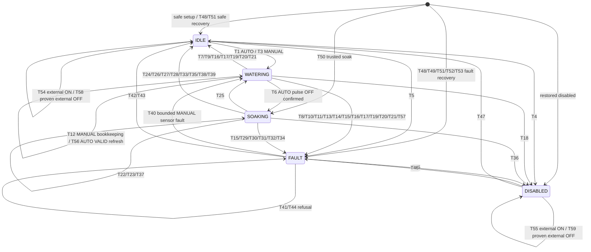
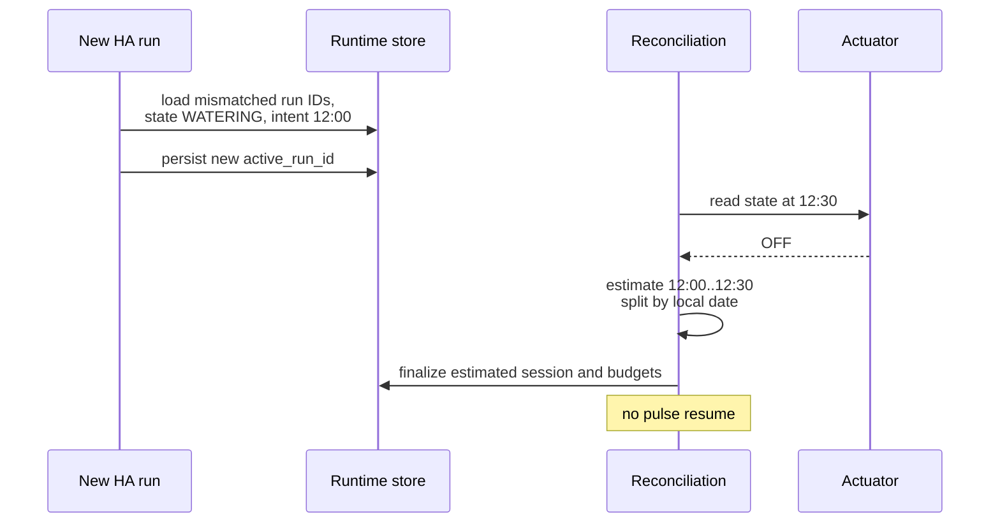
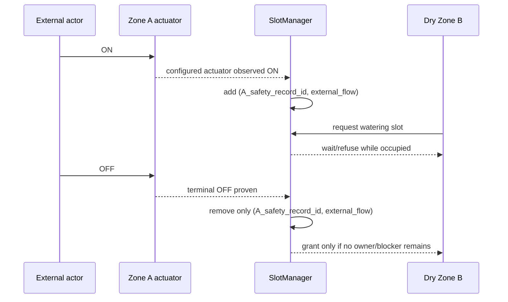

# SoilSync — v0.1 Technical Specification

**Closed-loop soil moisture irrigation for Home Assistant**

| | |
|---|---|
| Status | Draft for review - implementation source of truth |
| Spec version | `0.1.0-spec.4` |
| Date | 2026-08-22 |
| Integration name | SoilSync |
| Domain | `soilsync` |
| Target platform | Home Assistant >= 2025.9.0 |
| Distribution | HACS custom integration |

> **Revision note:** spec.4 is a normative architectural revision that resolves the config-subentry deletion lifecycle mismatch found during implementation. Home Assistant removes a native subentry before scheduling an unawaited config-entry update listener, so configuration-object lifetime is now separated from runtime safety-object lifetime. The approved design is update-listener-driven tombstoned runtime reconciliation with authoritative final pre-ON configuration gates, persisted actuator identity, Store/config startup-union reconciliation, and listener-owned add/reconfigure/delete synchronization. This final corrective edit makes one canonical mutable safety record authoritative for each durable actuator lineage, defines independent zone-budget continuity when reconfiguration replaces actuator A with B, and broadens only the T21/T39 trigger wording to cover both reconfiguration and deletion reconciliation. The Home Assistant 2025.9.0 minimum is unchanged. All settled spec.3 behaviour remains normative except where this lifecycle correction explicitly strengthens it.
>
> **Corrective edit:** AUTO freshness callbacks carry a generation/deadline token. A callback superseded by any newer VALID report is a no-op; expiry is decided from the current derived freshness deadline, not by comparing the new report timestamp with the old deadline.
>
> **Corrective edit (operational-state ownership):** within unchanged Store schema 2, logical-zone operational state (`enabled`, current controller presentation state, current sensor identity, sensor/configuration faults, and current session ownership) now persists in a clearly named `zone_runtime` section of the existing `zone_histories` structure, while the canonical actuator safety record retains only actuator-scoped safety authority (identity, blockers, possible-flow ownership, open accounting, actuator faults, and acknowledgement). Reactivating a retained actuator record can therefore never leak that record's historical operational state into a different current logical zone. No transition, invariant count, state, or schema version changes.

---

## 1. Executive Summary

SoilSync is a hardware-agnostic Home Assistant custom integration for closed-loop irrigation. Each zone pairs one soil-moisture sensor with one `switch` or `valve` actuator. A new automatic session starts only when a valid, fresh moisture report is strictly below the configured start threshold. It then applies bounded watering pulses. Every pulse is followed by a soak, and the next continuation or completion decision uses only a valid, fresh sensor report made at or after that soak ends.

The controller has five states: `DISABLED`, `IDLE`, `WATERING`, `SOAKING`, and `FAULT`. An orthogonal runtime/configuration lifecycle (`ACTIVE`, `DELETE_PENDING`, `RETIRED`) allows a safety object to outlive its deleted subentry without adding a sixth controller state. Watering commands are globally serialized in v0.1, and any configured or tombstoned actuator observed or conservatively believed to be flowing occupies that shared resource even when an external actor opened it. Whole automatic pulses must fit within session and daily runtime budgets. AUTO water stops if its newest valid moisture report becomes stale mid-pulse. Interrupted watering is never resumed after restart or reload. Unknown watering duration is conservatively overestimated. Automatic behaviour fails toward water OFF; explicit, bounded manual watering remains possible when only the moisture sensor is faulty.

Key architectural decisions are:

- one config entry containing one config subentry and one Home Assistant device per zone;
- a pure Home Assistant-independent state-machine core;
- entity-filtered listeners for both changed moisture states and unchanged `state_reported` reports;
- one cooperative session-owner task per active zone, with cancellation only as teardown fallback;
- an independently identified, atomic-write runtime Store, write-ahead persistence before every ON command, and run-ID-based crash detection;
- one entry-wide update-listener/reconciliation owner for add, reconfigure, and delete, with immutable applied-configuration shadows and a latest-snapshot-wins dirty barrier;
- authoritative final configuration checks immediately before every integration ON, plus one canonical mutable safety record per durable actuator lineage and durable tombstones that retain actuator identity, blockers, accounting, faults, and history after native deletion;
- actuator-specific safety identity kept separate from logical zone irrigation history, so replacing actuator A with B preserves A's hazards and the zone's conservative budget/interval independently;
- actions registered once from integration-level `async_setup`;
- `integration_type: helper`, `iot_class: calculated`, and `single_config_entry: true`;
- completely local operation with no cloud, telemetry, API key, or external service.

Implementation readiness verdict: **READY WITH PROTOTYPE VALIDATIONS** (§46 and the final verdict).

---

## 2. Problem Definition

Most irrigation controllers are open loop: they run a timer, calendar, weather, or evapotranspiration calculation and optionally use moisture as a veto. SoilSync instead treats measured soil moisture as the authoritative automatic feedback signal.

Two physical facts drive the design:

1. Water redistributes through soil after the actuator closes. A reading taken shortly after OFF does not represent the result of a 20-minute soak. Therefore the controller must wait for the full configured soak and then require a report timestamped at or after the soak deadline.
2. Software controls a physical water path. Missing telemetry, uncertain restart history, actuator interference, or task races must stop or skip automatic watering. A user may deliberately override only a sensor-only fault through an explicitly bounded manual session.

The integration operates only on Home Assistant entity abstractions. It contains no Ecowitt, Holman, Zigbee, Wi-Fi, or other vendor-specific logic.

---

## 3. Goals

1. Support multiple zones, each with exactly one moisture sensor and one actuator.
2. Run moisture-driven pulse -> soak -> post-soak-report loops.
3. Produce deterministic transitions for a given state, input sequence, persisted state, and clock.
4. Fail toward actuator OFF on uncertainty.
5. Enforce maximum cycles, session runtime, daily runtime, and minimum automatic-session interval.
6. Provide explicit, bounded manual watering independent of sensor health but never independent of actuator, configuration, integrity, or runtime safety.
7. Provide UI configuration and per-zone reconfiguration through config subentries.
8. Never resume a WATERING pulse after restart or reload.
9. Preserve sufficient runtime history to reconcile crashes conservatively without Recorder.
10. Expose useful entities, events, diagnostics, logs, and Repairs.
11. Keep Home Assistant I/O out of the pure state-machine module.
12. Operate entirely locally.
13. Make native config-subentry deletion safe without a private hook, frontend interception, or user-triggered reload.
14. Preserve unresolved water-safety evidence and runtime history across deletion, restart, and same-record delete/re-add reactivation.

---

## 4. Non-Goals (v0.1)

The following remain outside v0.1:

- weather, rain, forecasts, evapotranspiration, calendars, or seasonal scheduling;
- crop presets or agronomic threshold claims;
- adaptive learning, AI/ML, or automatic pulse tuning;
- flow meters, leak measurement, tank-level interlocks, or fertigation;
- multiple sensors or multiple actuators inside one zone;
- shared-pump/resource modelling beyond one global watering slot;
- stuck-sensor auto-blocking;
- vendor discovery or vendor-specific APIs;
- unbounded manual watering;
- cloud accounts, telemetry, or outbound network use.

The integration does not duplicate the source moisture entity, and thresholds remain config-subentry data rather than `number` entities in v0.1.

---

## 5. Home Assistant Architecture Research

Research for this revision was checked against official Home Assistant and HACS documentation, the Home Assistant Core `2025.7.0`, `2025.8.0`, and `2025.9.0` release sources, the frontend pinned by 2025.9.0, current stable Core/frontend, and current Core `dev` through 2026-08-22. Normative runtime API compatibility is anchored to the declared minimum release, not only to `dev`.

### 5.1 Config entries, runtime data, and subentries

- A config entry is the setup/unload/reload unit. Typed live data belongs in `entry.runtime_data`; listener cleanup is attached to entry unload. ([Config entries](https://developers.home-assistant.io/docs/config_entries_index/))
- One `ConfigSubentryFlow` of type `zone` represents each configured zone. Entities and the configured zone device use the subentry ID. Home Assistant 2025.9.0 remains the minimum supported release; no compatibility implementation for 2025.7/2025.8 is specified. ([Config flow and subentries](https://developers.home-assistant.io/docs/core/integration/config_flow/), [Core 2025.9.0 `ConfigSubentryFlow`](https://github.com/home-assistant/core/blob/2025.9.0/homeassistant/config_entries.py))
- `ConfigEntry.add_update_listener` is the supported synchronization hook for subentry add, update, and removal. The listener is registered before watering grants are enabled and removed with `entry.async_on_unload(...)`. It owns entry-wide reconciliation, but is not itself an awaited pre-delete safety barrier.
- Core updates a `ConfigSubentry` object in place during reconfigure before notifying listeners. Runtime comparison therefore uses immutable normalized shadows/fingerprints captured from values, never a retained reference to the mutable Core object.
- Reconfiguration uses `ConfigSubentryFlow.async_update_and_abort(entry, subentry, ...)`. `async_update_reload_and_abort` **MUST NOT** be used because Home Assistant 2025.9.0 raises when that helper is combined with an entry update listener. Any reload required after add/reconfigure is scheduled exactly once by the reconciliation coordinator after safety handoff. ([Core 2025.9.0 API](https://github.com/home-assistant/core/blob/2025.9.0/homeassistant/config_entries.py), [listener/reload guidance](https://developers.home-assistant.io/blog/2026/05/07/config-entry-listener-together-with-reloading-methods/))
- The remaining normative APIs were source-checked on 2025.9.0: typed `entry.runtime_data`; config subentries and update/removal; `async_track_state_change_event`; `async_track_state_report_event`; nested `DeviceSelectorConfig.filter`; `IssueSeverity.WARNING/ERROR/CRITICAL`; valve OPEN/CLOSE features and position; and entity-registry update tracking. No required API raises the floor above 2025.9.0.

Native 2025.9.0 subentry deletion has this supported/public lifecycle:

1. the frontend sends `config_entries/subentries/delete`;
2. Core removes the `ConfigSubentry` from the public `entry.subentries` mapping;
3. Core invokes each config-entry update listener and schedules the returned coroutine without awaiting its completion;
4. Core clears associated device-registry and entity-registry records;
5. Core returns websocket success while listener safety work may still be running.

Native removal does not reload/unload the entry, call integration subentry-deletion preparation, call whole-entry `async_remove_entry`, or pass the removed `ConfigSubentry` to the listener. The integration cannot hide or replace the native Delete control. Therefore the changed `entry.subentries` mapping is an authoritative immediate no-ON predicate, and the runtime/applied shadow retains the removed configuration needed for later reconciliation. ([Core 2025.9.0 removal](https://github.com/home-assistant/core/blob/2025.9.0/homeassistant/config_entries.py#L2471-L2485), [Core 2025.9.0 listener scheduling](https://github.com/home-assistant/core/blob/2025.9.0/homeassistant/config_entries.py#L2448-L2458))

Only the public APIs above are normative. Private dispatchers such as `_async_update_entry`, `_async_save_and_notify`, `_async_dispatch`, `SIGNAL_CONFIG_ENTRY_CHANGED`, and `async_dispatcher_send_internal`; eager-task timing; monkey patches; websocket interception; frontend/custom-card replacement; registry cleanup as a pre-hook; and Core patches are prohibited safety foundations.

### 5.2 Moisture state writes and reports

Home Assistant distinguishes two event paths:

- `state_changed`: a write changed the state string and/or attributes;
- `state_reported`: a write left both state and attributes unchanged, while advancing `State.last_reported`.

`async_track_state_change_event` does **not** receive unchanged reports. SoilSync therefore installs both:

1. `async_track_state_change_event(hass, configured_moisture_entity_ids, ...)`; and
2. `async_track_state_report_event(hass, configured_moisture_entity_ids, ...)`.

The second helper is the higher-level API designed for this purpose and routes reports by explicit entity ID. It is preferred over direct event-bus registration and satisfies the filtered-listener contract. The 2024 announcement required direct listeners to pass `run_immediately=True`; the supported Core API handles report dispatch internally, so SoilSync does **not** pass it. Any unavoidable direct fallback would still require a callback-decorated entity `event_filter`; a global listener followed by Python filtering is forbidden. The event is intentionally excluded from wildcard delivery because of its volume. ([`last_reported` and `state_reported`](https://developers.home-assistant.io/blog/2024/03/20/state_reported_timestamp/), [Core 2025.9.0 event helpers](https://github.com/home-assistant/core/blob/2025.9.0/homeassistant/helpers/event.py), [Core 2025.9.0 EventBus](https://github.com/home-assistant/core/blob/2025.9.0/homeassistant/core.py))

Both listener callbacks normalize their input into the same `MoistureObservation` (§6, §37). For a changed state, `new_state.last_reported` is used. For an unchanged report, the event's `last_reported` and `new_state` are used. The pure state machine never receives a Home Assistant event object.

Actuator monitoring continues to use `async_track_state_change_event`, because command acknowledgement and interference depend on actual actuator state/attribute changes, not repeated identical reports.

### 5.3 Actions and validation

Integration actions are registered once from `async_setup(hass, config)`, not per entry from `async_setup_entry`. This keeps actions available to automation editors even when the config entry is unloaded or failed. A handler validates its required device target, resolves the zone device to the entry/subentry/controller, verifies `ConfigEntryState.LOADED`, and raises a translated `ServiceValidationError` if the target or runtime is unavailable. ([Service actions are registered in `async_setup`](https://developers.home-assistant.io/docs/core/integration-quality-scale/rules/action-setup/), [service action targeting](https://developers.home-assistant.io/docs/dev_101_services/))

Each action operates on a zone device as a whole, so the public schema requires exactly one `device_id`; it does not substitute an entity ID or config-entry ID. The field uses the nested device-selector filter equivalent to `DeviceSelectorConfig(filter={"integration": DOMAIN}, multiple=False)`, which is present on the minimum release. Backend resolution verifies the device has identifier `(DOMAIN, subentry_id)`, belongs to the SoilSync config entry/subentry, and is unambiguous. The backend never trusts frontend filtering. A deprecated/removed generic **target-selector** device filter is not used. ([Device target-filter removal](https://developers.home-assistant.io/blog/2025/10/14/device-filter-removed-from-target-selector/), [Core 2025.9.0 selector implementation](https://github.com/home-assistant/core/blob/2025.9.0/homeassistant/helpers/selector.py))

### 5.4 Manifest classification

SoilSync is not a gateway to discovered devices. It consumes existing HA entities and adds calculated control/helper behaviour. The manifest therefore uses:

```jsonc
{
  "integration_type": "helper",
  "iot_class": "calculated",
  "single_config_entry": true,
  "config_flow": true
}
```

`helper` is the documented type for integrations that provide helper entities/logic; `calculated` is the IoT class for integrations that do not communicate independently. `single_config_entry` accurately represents the one-controller topology. ([Integration manifest](https://developers.home-assistant.io/docs/creating_integration_manifest/))

### 5.5 Async, lifecycle, Repairs, and diagnostics

- All runtime work is event-loop-native. The entry owns background tasks and unloads cleanly. ([Async programming](https://developers.home-assistant.io/docs/asyncio_index/), [config-entry unloading](https://developers.home-assistant.io/docs/core/integration-quality-scale/rules/config-entry-unloading/))
- Full-process shutdown is detected with a once-only `EVENT_HOMEASSISTANT_STOP` listener. It is distinct from entry reload/unload. ([Listening for events](https://developers.home-assistant.io/docs/integration_listen_events/))
- Repairs use only supported enum constants: `IssueSeverity.WARNING`, `IssueSeverity.ERROR`, and the reserved `IssueSeverity.CRITICAL` only for a true panic such as a valve not proven OFF. ([Repairs severity](https://developers.home-assistant.io/docs/core/platform/repairs/))
- Config-entry diagnostics redact sensitive values with HA helpers. There are no credentials in v0.1.

### 5.6 HACS

Current HACS requirements are treated separately from Home Assistant runtime requirements: one integration directory under `custom_components`, the required manifest keys, a root `hacs.json`, and brand assets. Releases are preferred but optional for custom-repository use. HACS Action and hassfest are CI gates; default-store inclusion additionally requires a full GitHub release and a matching entry in `home-assistant/brands`. ([HACS integration publishing](https://hacs.xyz/docs/publish/integration/), [HACS validation action](https://hacs.xyz/docs/publish/action/), [HACS default inclusion](https://hacs.xyz/docs/publish/include/))

### 5.7 Coordinator patterns

`DataUpdateCoordinator` is not used. There is no polled external API or shared remote dataset. Entity reports, timers, a pure state machine, and controller callbacks remain the correct device-control model.

An integration-owned `ConfigurationReconciliationCoordinator` is required for a different purpose: it serializes and coalesces config-entry update notifications, compares immutable applied shadows with fresh `entry.subentries` snapshots, owns add/reconfigure/delete runtime synchronization, and controls any resulting reload. It is not a `DataUpdateCoordinator` and does not poll.

---

## 6. Terminology and Normalized Models

| Term | Normative definition |
|---|---|
| Configured zone | One current config subentry pairing a moisture sensor and actuator, normally with one live controller and one zone device. |
| Runtime safety object | Controller/safety record whose lifetime is independent of the Core `ConfigSubentry` and zone-device registry objects. It may remain after deletion to close flow, accounting, blockers, or acknowledgement. |
| Safety record | The one canonical mutable Store record for one physical/logical durable actuator safety lineage. Its stable `safety_record_id` and `safety_lineage_id` do not change when the same actuator is deleted and exactly re-added. |
| Zone irrigation history | Budget/interval history plus the logical-zone operational runtime (`zone_runtime`) for one logical configured-zone lineage, identified separately by `zone_history_id`. It survives actuator replacement and is not an actuator hazard owner. |
| Zone runtime | The `zone_runtime` section of one zone irrigation history: the sole persistence authority for the logical zone's `enabled` flag, current controller presentation state, current sensor identity, sensor/configuration faults, and current session ownership. It is never owned or overridden by a retained actuator safety record. |
| Applied configuration shadow | Immutable normalized copy of the configuration actually applied to a runtime zone, including its subentry ID, fingerprint, actuator identity, sensor identity, settings, and entry snapshot generation/token. It never retains the mutable Core `ConfigSubentry` object. |
| Logical tombstone | Immediate predicate that a runtime/applied zone ID is absent from current `entry.subentries`; it exists before listener work materializes lifecycle state. |
| Runtime lifecycle | Orthogonal `ACTIVE | DELETE_PENDING | RETIRED` safety-object lifecycle; never a controller state. |
| Actuator durable identity | Home Assistant Entity Registry entry UUID/registry identity when available. The last-known entity ID is resolution/display metadata, not equivalent identity when ambiguity exists. |
| Automatic session | Controller-started session governed by moisture, pulse/soak logic, and all automatic guards. |
| Manual session | Explicit user-started, single bounded ON interval that ignores moisture but obeys all non-sensor safety rules. |
| Pulse | One bounded automatic actuator-ON interval of configured `pulse_duration`. |
| Soak | Actuator-OFF interval ending at `soak_ends_at_utc`. |
| Recheck | A continuation/completion decision based on a qualifying report at or after the soak deadline. |
| Fresh | `reported_at_utc >= now_utc - sensor_max_age`; equality is fresh. |
| AUTO freshness deadline | While `WATERING(AUTO)`, `sensor_fresh_until_utc = latest_valid_reported_at_utc + sensor_max_age`. Each arm has a monotonically changing generation/deadline token so a replaced callback cannot expire the current observation. |
| Qualifying recheck report | VALID, fresh, and `reported_at_utc >= recheck_not_before_utc`, where `recheck_not_before_utc = soak_ends_at_utc`. Equality qualifies. |
| Session runtime | Conservatively accounted potential actuator-ON time for one session, actual or estimated. |
| Daily runtime | Conservative runtime charged to a logical `zone_history_id` for an HA-local calendar day, independently of which actuator safety record delivered it. |
| Water-resource blocker | A SlotManager record keyed by `(safety_record_id, reason)` that prevents every integration-commanded ON while a configured or tombstoned actuator is observed or conservatively believed to be flowing. Reasons include `integration_off_unconfirmed`, `external_flow`, and startup `actuator_not_proven_off`. |
| Configuration reconciliation barrier | Entry-wide no-ON condition while current `entry.subentries` does not match the fully applied runtime snapshot, reconciliation is dirty/running/failed, or a newer observed generation supersedes the worker. |
| Retained sensor fault | A sensor-only fault kept visible while explicit manual watering temporarily occupies `WATERING`. |

The HA adapter produces this pure input model:

```text
MoistureObservation:
    value: float | None
    classification: VALID | STALE | INVALID | UNAVAILABLE
    reported_at_utc: datetime | None
    age_s: float | None
```

`reported_at_utc` is derived from Home Assistant `last_reported`; the pure core has no knowledge of `state_reported`.

---

## 7. Canonical Name and Domain

**Final canonical identity: SoilSync, domain `soilsync`.** A pre-release technical collision check on 2026-08-24 found no local integration using the domain, no exact `soilsync` integration in the current Home Assistant Core component tree, and no pre-existing unrelated `embersas/soilsync` repository. Adjacent irrigation projects remain distinct. ([Core integration catalog](https://github.com/home-assistant/core/tree/dev/homeassistant/components), [HACS default repository catalog](https://github.com/hacs/default))

The canonical name and domain are fixed before the first release because the domain is part of storage keys, action names, entity and device identifiers, event types, and brand paths. This is a nomenclature decision only; it does not alter controller behaviour, persistence schema semantics, or safety architecture.

---

## 8. User Experience

1. Install through HACS or manual copy and restart Home Assistant.
2. Add one SoilSync integration entry.
3. Add one or more zone subentries by selecting a name, sensor, actuator, thresholds, pulse/soak timing, and safety limits.
4. Each zone appears as a device with status, runtime, last-session, needs-water, watering, problem, enable, stop, evaluate, and clear-fault entities.
5. Normal automatic operation runs quietly and reports session outcomes.
6. Manual watering is requested with an explicit duration through `soilsync.start_manual_watering`.
7. Sensor-only faults still permit bounded manual watering. Actuator, configuration, and integrity faults do not.
8. Reconfiguration may cooperatively prepare an active old session, records `CONFIG_CHANGED`, updates with `async_update_and_abort`, and is applied by the entry reconciler; at most one reload is scheduled when entity reconstruction requires it. If the actuator changes, the old actuator record is retained, the new actuator is resolved independently, and the logical zone's conservative budget/interval history continues.
9. Native zone deletion returns through Home Assistant's normal UI path. SoilSync immediately rejects new ON from the changed mapping, then completes safe closure in the background. A deleted-zone Repair may remain visible at entry level until its retained tombstone is safe and acknowledged.

---

## 9. Zone Configuration Schema

All fields are per-zone config-subentry data.

| Key | Type | Default | Range / validation |
|---|---|---|---|
| `name` | text | required | 1-64 characters; unique case-insensitively |
| `moisture_sensor` | entity ID | required | existing `sensor`; same sensor may be shared with warning |
| `actuator` | entity ID | required | existing `switch`, or `valve` with OPEN+CLOSE features; unique across zones |
| `start_threshold` | percent | 30 | 1-99; strictly less than target |
| `target_threshold` | percent | 40 | 2-100; strictly greater than start |
| `pulse_duration` | duration | 5 min | 30 s-30 min; <= session and daily limits |
| `soak_duration` | duration | 20 min | 1 min-4 h |
| `max_cycles` | integer | 4 | 1-20 |
| `max_session_runtime` | duration | 30 min | pulse duration-4 h |
| `max_daily_runtime` | duration | 60 min | pulse duration-12 h |
| `min_session_interval` | duration | 6 h | 15 min-7 d |
| `sensor_max_age` | duration | 2 h | 5 min-24 h |
| `actuator_confirm_timeout` | duration | 30 s | 5 s-5 min |
| `manual_max_duration` | duration | 30 min | 1 min-2 h |

No separate `recheck_grace` setting is added in v0.1. The grace deadline is `soak_ends_at_utc + sensor_max_age`. This is coherent: the controller waits at most one configured freshness horizon after the physical soak, and a report at the soak boundary remains fresh through the entire grace window. A second knob would create configuration complexity without adding a distinct safety property.

The enabled flag is runtime state exposed as a switch, not configuration. All reconfigured fields apply only after reconciliation verifies and publishes a new immutable shadow (and after the one controlled reload when entity reconstruction requires it); no live session mutates its applied configuration. Changing only thresholds, timing, sensor, or other non-actuator settings updates the same actuator safety record after quiescence. Changing the durable actuator identity invokes the explicit A -> B replacement lifecycle in §24.4; it is never treated as an ordinary in-place shadow update.

Defaults are safe starting points, not agronomic advice. Users must calibrate thresholds and timing from their own soil, emitter, probe location, and sensor behaviour.

---

## 10. Moisture Sensor Contract

### 10.1 Accepted values

Any `sensor` whose state parses to a finite number in `[0, 100]` may be selected. Device class `moisture` and unit `%` are preferred for UI filtering but not required. No unit conversion is attempted. Values `0` and `100` are valid.

### 10.2 Classification

| Classification | Condition | Automatic use |
|---|---|---|
| `UNAVAILABLE` | entity absent or state `unavailable` | never |
| `INVALID` | `unknown`, unparsable, NaN, infinity, `< 0`, or `> 100` | never |
| `STALE` | finite in range, but older than `sensor_max_age` | never |
| `VALID` | finite in range and fresh | eligible subject to other guards |

Out-of-range data is rejected, never clamped. Clamping could turn a broken negative reading into a watering request or a huge raw value into false saturation.

### 10.3 Report subscription and freshness

SoilSync listens to both changed states and unchanged reports as defined in §5.2. A repeated identical report is a real observation: it advances `last_reported`, refreshes the observation and an active AUTO freshness deadline, can auto-clear a stale fault, and can qualify as the post-soak report if its timestamp satisfies §18.4.

The configured moisture entity IDs are passed directly to `async_track_state_report_event`. A global `state_reported` listener is forbidden. The fallback scan reads current state as a safety net but is not a substitute for report-event subscription and cannot manufacture a new report timestamp.

### 10.4 State-specific behaviour

- `IDLE` or `DISABLED`: unavailable, invalid, or stale data prevents automatic start; it does not by itself latch a fault.
- automatic `WATERING`: `UNAVAILABLE` or `INVALID` requests immediate cooperative termination and OFF. Fault is `SENSOR_UNAVAILABLE` or `SENSOR_INVALID`. In addition, every AUTO pulse has a freshness watchdog at `latest_valid_reported_at_utc + sensor_max_age`; expiry without a newer VALID report requests the same cooperative OFF path and faults `SENSOR_STALE`. The interrupted session never resumes.
- manual `WATERING`: all sensor states are deliberately ignored for control and never stop the run. Observation and fault-recovery bookkeeping may update.
- `SOAKING`: reports before the soak deadline update observability only. A valid report at or after the deadline may decide. A post-deadline invalid/unavailable observation may terminate with its corresponding fault; otherwise absence of a qualifying report through the grace deadline terminates as `SENSOR_STALE`.
- entity registry removal: `CONFIGURATION_INVALID` and an ERROR Repair until reconfigured.

Entity rename tracking is a prototype validation (§46). Actuator rename recovery uses durable Entity Registry identity first as defined in §§23 and 25; a textual entity ID change is never allowed to reset runtime budgets. Sensor rename handling follows the same registry-first applied-shadow discipline, but sensor identity has no authority to merge actuator safety histories.

---

## 11. Actuator Contract

### 11.1 Supported states

- `switch`: ON=`on`, OFF=`off`; actions `switch.turn_on` and `switch.turn_off`.
- `valve`: ON=`open`, OFF=`closed`; actions `valve.open_valve` and `valve.close_valve`. Selection requires both `ValveEntityFeature.OPEN` and `ValveEntityFeature.CLOSE`; a position-only valve is not accepted in v0.1.
- `opening` and `closing` are transitional, never proof of the requested terminal state.
- For a position-reporting valve, a known `current_valve_position > 0` is treated as potentially flowing; position `0` with terminal `closed` state is OFF. Full open/close actions are used; arbitrary positions are not commanded.
- `unknown`, `unavailable`, unrecognized, and transitional states are **not proven OFF**.

These names and position semantics match the HA Valve entity contract on the minimum release. ([Valve entity](https://developers.home-assistant.io/docs/core/entity/valve/), [Core 2025.9.0 Valve component](https://github.com/home-assistant/core/blob/2025.9.0/homeassistant/components/valve/))

### 11.2 ON sequence

Only the active session-owner task normally commands ON. Preparatory eligibility or a pure T-row decision is insufficient: every integration-owned ON must pass an authoritative final configuration gate after all preceding awaited work and as close as safely possible to service dispatch.

The gate must prove all of the following from current live state:

1. the zone's subentry ID currently exists in public `entry.subentries`;
2. a freshly normalized fingerprint of that current subentry equals the immutable runtime-applied zone fingerprint;
3. the complete current normalized subentry snapshot equals the runtime's applied snapshot token/generation;
4. the entry reconciliation barrier is clear: no dirty, reconciling, superseded, failed, unload, reload, or shutdown condition exists;
5. runtime lifecycle is `ACTIVE`, not logically/materially `DELETE_PENDING`, `RETIRED`, quiescing, or detaching;
6. the global slot is owned by this zone and no relevant keyed/global blocker exists;
7. every existing state-machine, actuator, sensor, freshness, runtime, and budget guard still passes.

The permitted command ordering is:

1. all pure guards pass and the global slot is granted;
2. create `pulse_intent_at_utc`, set persisted state to WATERING, and save/read-back-verify the hazardous intent, including the applied shadow and actuator safety identity;
3. after that await, acquire the zone command/transition serialization domain, perform the complete final gate from fresh public configuration, and atomically mark the command as integration-owned/in-flight possible flow;
4. without any intervening await, task yield, callback scheduling, or other suspension, begin the tagged Home Assistant actuator ON service call;
5. once the service call returns or raises, atomically record the commanded/uncertain instant in memory and re-read current membership/fingerprint/snapshot before any await or continuation;
6. if the post-call configuration check fails, do not arm or resume normal WATERING: preserve the earlier durable intent/identity as crash evidence, commit `CONFIG_CHANGED` unless another terminal reason already won, and immediately begin/join the shared idempotent OFF path before any awaited non-OFF persistence; the next ordered verified write includes command/tombstone/accounting evidence;
7. otherwise persist `pulse_commanded_at_utc` immediately, then await ON/open acknowledgement within `actuator_confirm_timeout`, set `pulse_confirmed_at_utc`, and arm the pulse/manual deadline;
8. on timeout, request cooperative termination, execute defensive OFF, and fault `ACTUATOR_ON_TIMEOUT` if OFF becomes proven, or `ACTUATOR_OFF_TIMEOUT` if it does not.

The critical no-suspension region ends when the actuator service dispatch begins. Deletion that becomes visible before that point must prevent the call. Deletion after dispatch began is an in-flight pre-delete ON: it remains integration-owned possible flow even if the call is slow, raises, or returns after removal. Listener reconciliation joins/serializes the command result where possible, but never assumes no water flowed and never creates a second OFF operation.

A crash after intent persistence but before ON may overcount runtime during reconciliation. A crash after dispatch but before commanded-state persistence remains covered by the already-durable intent and actuator identity. Both are deliberate and safe: a crash must never be able to undercount a command that may have reached hardware.

### 11.3 Idempotent OFF sequence

Every integration-owned WATERING exit attempts OFF exactly once through a shared idempotent OFF operation:

1. the first caller creates the OFF-operation future and issues the domain-appropriate OFF action with tagged context;
2. later callers await that same future; they do not issue another normal OFF sequence;
3. observe OFF/closed within the timeout;
4. retry up to three total attempts when not confirmed;
5. on confirmation, persist `off_confirmed_at_utc`, close accounting, release the zone's slot, and remove only the corresponding `integration_off_unconfirmed` blocker;
6. if still unconfirmed, latch `ACTUATOR_OFF_TIMEOUT`, continue conservative accounting until OFF is observed, raise a CRITICAL Repair, and retain that zone's `integration_off_unconfirmed` blocker.

Unavailable during OFF handling is not proof of OFF. OFF attempts continue where service calls are possible. A later observed OFF closes accounting and removes that zone/reason blocker, but the `ACTUATOR_OFF_TIMEOUT` fault remains acknowledgement-required and unrelated blockers remain untouched.

### 11.4 External interference

Ownership is phase-sensitive:

| Event | Normative behaviour |
|---|---|
| External ON while `IDLE` | Respect it; do not command OFF. Set `external_actuator_on=true`; automatic/manual integration sessions cannot start while already ON. |
| External ON while `DISABLED` | Respect it; do not command OFF. Set `external_actuator_on=true` even though the zone is disabled. |
| External ON while `IDLE` or `DISABLED`, global effect | Add `(safety_record_id, external_flow)` to the water-resource blocker set. No zone may receive a watering slot while it remains. |
| Proven external OFF after external ON | Remove only that exact safety record's `external_flow` blocker. Clear global resource occupancy only when the blocker set is empty; never remove another record's blocker or an `integration_off_unconfirmed` blocker. |
| Unknown, unavailable, or transitional after external ON | Keep that exact safety record's `external_flow` blocker. Absence of OFF proof is not evidence that flow stopped. |
| External OFF while `WATERING` | Treat as intentional stop. Signal termination, never reopen, run the idempotent defensive OFF sequence, account through the observed external-OFF time, and finish `EXTERNAL_ACTUATOR_STATE_CHANGE`. |
| External ON while `SOAKING` | This interferes with an active integration-owned automatic session whose expected state is OFF. Add the zone's `integration_off_unconfirmed` blocker, immediately wake the session owner, execute defensive OFF, invalidate the soak's moisture reports, and abort `EXTERNAL_ACTUATOR_STATE_CHANGE`. If OFF is not confirmed, fault `ACTUATOR_OFF_TIMEOUT` and retain the blocker. |
| External ON during an OFF already in flight | Join the existing OFF operation; do not create a second normal OFF sequence. The session still aborts for external interference. The result is deterministic and idempotent. |

Outside an active integration session, external manual operation is respected but occupies the shared water resource. During an active integration-owned session, unexpected state is interference and the controller restores the safe expected state. Multiple externally flowing configured or tombstoned actuators are tracked independently; the representation is a keyed blocker set, never a single boolean that one OFF event could clear prematurely.

Actuator observation remains armed while a zone is DISABLED and while a tombstone still needs OFF/external-flow evidence. The SlotManager observes every configured and resolvable retained actuator independently of the zone's five-state presentation. Thus an external ON in a non-session sensor-only FAULT also adds `external_flow`, even though no extra zone-state transition is needed. At startup, an unknown/unavailable/transitional or identity-ambiguous actuator is not proven OFF and adds `actuator_not_proven_off`; this preserves conservative blocking across restart even when the previous flow owner cannot be identified.

---

## 12. Controller State Model

### 12.1 Five states

| State | Meaning | Expected actuator |
|---|---|---|
| `DISABLED` | Integration control disabled. No automatic or manual integration watering. | no control outside an owned shutdown; external ON respected |
| `IDLE` | Enabled, no active session. | OFF before an integration session may start |
| `WATERING` | AUTO pulse or MANUAL bounded run active. | ON until termination/OFF sequence |
| `SOAKING` | AUTO session active; water OFF; waiting for deadline and qualifying report. | OFF |
| `FAULT` | Automatic blocked; manual allowed only for sensor-only codes. | OFF/proven safe before any allowed manual run |

Manual watering does not add a sixth state. `SessionContext.mode` distinguishes AUTO/MANUAL. A sensor fault can be retained as an overlay while state is `WATERING(MANUAL)`.

### 12.2 Session context

```text
SessionContext:
    session_id
    owner_run_id
    config_fingerprint
    mode: AUTO | MANUAL
    started_at_utc
    cycle
    session_runtime_s
    runtime_estimated
    runtime_estimation_reason
    pulse_intent_at_utc
    pulse_commanded_at_utc
    pulse_confirmed_at_utc
    pulse_ends_at_utc
    sensor_fresh_until_utc
    sensor_freshness_watchdog_generation
    off_confirmed_at_utc
    soak_ends_at_utc
    recheck_not_before_utc
    recheck_grace_deadline_at_utc
    manual_requested_duration_s
    manual_effective_duration_s
    manual_clamp_reasons[]
    moisture_at_start
    last_recheck_value
    retained_sensor_fault
    pending_termination_reason
```

The config fingerprint covers every setting that can affect an active session plus configured sensor and actuator IDs.

### 12.3 Fault overlay during manual watering

For a permitted sensor fault, the transition is:

```text
FAULT(sensor-only)
  -> WATERING(mode=MANUAL, retained_sensor_fault=same fault)
  -> FAULT(same fault) if still invalid/unavailable/stale at completion
  -> IDLE if VALID+fresh at completion
```

The `problem` binary sensor remains ON and the fault remains visible while manual water flows. Starting manual does not emit `fault_cleared`; returning to the same fault does not emit a duplicate `fault_set`. Sensor recovery during manual watering updates bookkeeping but never interrupts the manual run. If an actuator fault occurs, it supersedes the sensor fault as the active blocking fault; the sensor fault remains secondary diagnostic context.

### 12.4 Orthogonal runtime/configuration lifecycle

The controller state and runtime lifecycle are independent dimensions:

| Runtime lifecycle | Configuration relationship | Watering eligibility | Retention |
|---|---|---|---|
| `ACTIVE` | current subentry exists; a temporary fingerprint mismatch marks the old applied runtime quiescing until reconciliation, without changing controller state | may be eligible only when the current subentry exactly matches the applied shadow and every ordinary/final gate passes | live controller plus schema-2 safety record |
| `DELETE_PENDING` | runtime/applied safety object exists but its subentry ID is absent from current `entry.subentries` | never eligible for new ON; deletion closure/reconciliation required | live controller/listener as needed plus durable tombstone |
| `RETIRED` | no configured zone owns the record and immediate possible-flow hazards are resolved as far as v0.1 permits | never eligible to water directly | durable tombstone retained; fault/history/acknowledgement may remain |

A logical tombstone exists synchronously whenever an applied runtime zone ID is absent from current `entry.subentries`. That mismatch is sufficient to reject ON before the update-listener task materializes `DELETE_PENDING`. Materialization records the lifecycle durably and starts closure; it does not create a controller-state transition by itself.

Example: controller state `FAULT`, runtime lifecycle `DELETE_PENDING`, active fault `ACTUATOR_OFF_TIMEOUT`. `TOMBSTONE`, `DELETE_PENDING`, and `RETIRED` are not controller states. T1-T59 remain the complete five-state transition set.

Controller state, `enabled`, and current session ownership are logical-zone properties persisted in the zone's `zone_runtime` (§23.2), not in the actuator safety record. Runtime lifecycle, blockers, possible-flow evidence, open accounting, actuator faults, and acknowledgement are actuator-record properties. The presented active fault for a configured zone derives deterministically from both authorities: the currently referenced record's actuator fault takes precedence, with any zone-scoped sensor/configuration fault retained as secondary context, exactly as §12.3/§26.1 already order them.

---

## 13. Required Scenario Outcomes

- Above target: remain IDLE.
- Between start and target: do not begin a new AUTO session; continue an existing AUTO session after a qualifying recheck if below target.
- Below start: begin only if every guard passes.
- Pulse end: cooperatively execute OFF, confirm, then enter SOAKING.
- Target reached: `TARGET_REACHED` -> IDLE.
- Still below target: request another whole pulse only if all limits and actuator/slot guards pass.
- Maximum cycles/session/daily limit: constrained completion, no partial pulse.
- AUTO sensor becomes UNAVAILABLE or INVALID during WATERING: immediate termination signal, OFF, corresponding sensor fault; never resume.
- AUTO sensor becomes stale during WATERING without emitting another event: terminate at its freshness deadline, OFF, `SENSOR_STALE`; a changed or identical VALID report before the decision commits extends the deadline.
- MANUAL sensor becomes UNAVAILABLE or INVALID: continue to the bounded manual deadline.
- Report 10 seconds after OFF during a 20-minute soak, then silence: it is observable but cannot decide at minute 20; wait until grace, then `SENSOR_STALE`.
- Identical-value report at minute 20: `state_reported` advances the report time and qualifies.
- Report at minute 19:59: does not qualify. Report exactly at soak end: qualifies.
- Crash during WATERING, actuator ON at restart: OFF, account intent through OFF confirmation as estimated.
- Crash during WATERING, actuator OFF at restart: account intent through reconciliation time as estimated; scheduled pulse end is not an upper bound.
- Restart actuator unavailable/unknown: not proven OFF; defensive OFF and blocking fault if confirmation fails.
- Disable or Stop during WATERING: cooperative session termination and exactly one OFF operation.
- External ON during SOAKING: defensive OFF and cancellation; OFF failure escalates.
- External ON in IDLE/DISABLED: respect it without OFF, but occupy the global water resource until that specific actuator is proven OFF.
- Sensor-only FAULT manual request: allowed and bounded; return to FAULT unless the sensor has recovered.
- Reconfiguration: terminate old session `CONFIG_CHANGED` when changed/preparation is required, persist, update with `async_update_and_abort`, reconcile the new fingerprint, schedule at most one required reload, and never continue the old soak.
- Generic entry reload: terminate any active WATERING or SOAKING session `CONFIG_RELOAD`; do not mark process shutdown clean.
- Full graceful HA shutdown: stop WATERING; persist eligible SOAKING for possible trusted continuation; mark the process run clean only after safety handling.
- Previously initialized missing, corrupt, unreadable, future-version, or generation-mismatched Store: no watering; reconcile OFF, exhaust the current-day budget, reconstruct safe integrity state, and require acknowledgement of `RESTORED_FROM_UNSAFE_STATE`. A true first install is identified independently by config-entry data.
- Native deletion before ON dispatch: current mapping mismatch rejects the call even if an earlier AUTO/MANUAL intent decision passed.
- Native deletion while ON dispatch is in flight: treat possible flow as integration-owned, recheck after return, commit `CONFIG_CHANGED` unless another reason won, and use the one shared OFF/accounting path.
- Native deletion in SOAKING: cancel/revoke timers and queued slot requests; no later pulse may occur.
- Native deletion in IDLE with actuator already proven OFF and no ownership/hazard: persist/retire the tombstone without issuing an unnecessary OFF command.
- Delete/re-add of the same durable actuator reuses the same `safety_record_id`, `safety_lineage_id`, blocker keys, fault/accounting state, and zone-history reference; it cannot reset daily runtime, minimum interval, or history. Ambiguous identity fails closed with a Repair.
- Reconfiguration from durable actuator A to different actuator B retains A's record and every A-owned hazard, resolves B as an existing exact record, a genuinely new record, or a conflict, and conservatively carries the logical zone's current-day budget and minimum interval to B without transferring A's blockers or faults. The logical zone's `enabled`/disabled state survives unchanged, retained B's historical `enabled`, sensor faults, controller state, and sessions never leak into the current zone, current sensor/configuration validity is evaluated only against the newly applied configuration, and the post-handoff controller state is derived deterministically (DISABLED, else FAULT, else IDLE per §24.4).

### Scenario M — post-soak measurement boundary

The spec.1 scenario label is retained for traceability. A pulse turns OFF and confirms at 12:00:00; the configured soak ends at 12:20:00. A VALID report at 12:00:10 or 12:19:59 may update observability but cannot decide. An identical or changed VALID fresh report at exactly 12:20:00 qualifies. Without any qualifying report through the bounded grace deadline, the session follows `SENSOR_STALE`; it never reuses the 12:00:10 reading.

---

## 14. Formal State Transition Table

Guard legend:

- `G-EN`: enabled.
- `G-FRESH`: observation VALID and fresh.
- `G-START`: value `< start_threshold`.
- `G-POST`: observation VALID, fresh, and `reported_at_utc >= soak_ends_at_utc`.
- `G-ACT`: actuator available and terminal OFF before ON.
- `G-SLOT`: global FIFO slot granted and the water-resource blocker set is empty.
- `G-CYC`: `cycle < max_cycles`.
- `G-SESS`: `session_runtime_s + pulse_duration <= max_session_runtime`.
- `G-DAY`: authoritative current `zone_history_id` runtime + pulse duration <= daily limit.
- `G-INT`: minimum session interval elapsed.
- `G-MANUAL-SENSOR`: active fault is `SENSOR_UNAVAILABLE`, `SENSOR_STALE`, or `SENSOR_INVALID`.
- `G-MANUAL-SAFE`: enabled, no active session, fault absent or `G-MANUAL-SENSOR`, actuator available and observed OFF, daily remaining > 0, and slot grantable.
- `G-OFF`: OFF/closed confirmed.
- `POST(fault)`: after a manual session, FAULT if retained sensor fault remains or a new fault exists; otherwise IDLE.

Every row that requests ON is additionally subject to the adapter-level authoritative final gate in §11.2. That gate is intentionally not folded into T1/T3/T25/T40: the pure decision may create and durably record an intent, but the HA side-effect layer must still reject or compensate a configuration race. A failed pre-dispatch gate terminates the zero-flow session through the existing `CONFIG_CHANGED` lifecycle path; an already-dispatched call follows the in-flight rule. This execution envelope does not add or renumber a formal controller transition.

Every created session updates `last_session_end_utc` when conservative accounting closes, including zero-flow starts/timeouts, user cancellations, config changes, manual sessions, and crash recovery. If OFF is unconfirmed, the terminal reason is committed and FAULT is entered, but `session_finished` and `last_session_end_utc` wait until later OFF evidence closes the open accounting interval. This deliberately resets the automatic minimum interval in every case and uses the later, safer timestamp when OFF proof is delayed.

| ID | From | Trigger | Guard | Action | To | Reason/fault |
|---|---|---|---|---|---|---|
| T1 | IDLE | evaluation | G-EN & G-FRESH & G-START & G-INT & G-ACT & G-DAY & G-SLOT | create AUTO; persist intent; ON | WATERING | — |
| T2 | IDLE | evaluation | any T1 guard fails | record guard result only | IDLE | — |
| T3 | IDLE | manual action | G-MANUAL-SAFE | clamp duration; create MANUAL; persist intent; ON | WATERING | — |
| T4 | IDLE | Disable | — | persist disabled | DISABLED | — |
| T5 | IDLE | configured entity removed/invalid config | — | block operation; Repair | FAULT | `CONFIGURATION_INVALID` |
| T6 | WATERING(AUTO) | pulse deadline | G-OFF | cooperative normal pulse end; one OFF; arm soak | SOAKING | — |
| T7 | WATERING(MANUAL) | manual deadline | G-OFF; no retained/new fault | one OFF; finalize | IDLE | `MANUAL_COMPLETE` |
| T8 | WATERING(MANUAL) | manual deadline | G-OFF; retained sensor fault still active | one OFF; finalize; restore fault state | FAULT | `MANUAL_COMPLETE`; retained sensor code |
| T9 | WATERING(MANUAL) | manual deadline | G-OFF; retained sensor fault recovered | one OFF; finalize; clear fault after finish event | IDLE | `MANUAL_COMPLETE` |
| T10 | WATERING(AUTO) | moisture UNAVAILABLE | — | signal termination; one OFF | FAULT | `SENSOR_FAULT` / `SENSOR_UNAVAILABLE` |
| T11 | WATERING(AUTO) | moisture INVALID | — | signal termination; one OFF | FAULT | `SENSOR_FAULT` / `SENSOR_INVALID` |
| T12 | WATERING(MANUAL) | any sensor observation | — | bookkeeping only; never terminate | WATERING | — |
| T13 | WATERING | actuator becomes unavailable | G-OFF after defensive sequence | signal termination; defensive OFF | FAULT | `ACTUATOR_FAULT` / `ACTUATOR_UNAVAILABLE` |
| T14 | WATERING | ON confirmation timeout | G-OFF | defensive OFF; finalize | FAULT | `ACTUATOR_FAULT` / `ACTUATOR_ON_TIMEOUT` |
| T15 | WATERING or SOAKING defensive OFF | OFF not confirmed after retries | not G-OFF | add keyed `integration_off_unconfirmed` blocker; keep accounting | FAULT | `ACTUATOR_FAULT` / `ACTUATOR_OFF_TIMEOUT` |
| T16 | WATERING | external OFF | — | signal; idempotent OFF; close accounting at observed OFF | POST(retained/new fault) | `EXTERNAL_ACTUATOR_STATE_CHANGE` |
| T17 | WATERING | Stop | — | signal; one OFF; finalize | POST(retained/new fault) | `USER_STOP` |
| T18 | WATERING | Disable | — | signal; one OFF; finalize; retain fault metadata | DISABLED | `ZONE_DISABLED` |
| T19 | WATERING | full HA shutdown | — | cooperative stop; one OFF; persist | POST(retained/new fault), then process stops | `HOME_ASSISTANT_SHUTDOWN` |
| T20 | WATERING | generic entry unload/reload | — | cooperative stop; one OFF; persist | POST(retained/new fault), then unload | `CONFIG_RELOAD` |
| T21 | WATERING | configuration change termination (reconfigure or deletion reconciliation) | — | cooperative stop; one OFF; persist | POST(retained/new fault) | `CONFIG_CHANGED` |
| T22 | SOAKING | moisture report before soak end | reported_at < soak end | update observation/needs-water only | SOAKING | — |
| T23 | SOAKING | soak deadline | no G-POST yet | arm/retain grace wait | SOAKING | — |
| T24 | SOAKING | qualifying report | G-POST & value >= target | finalize | IDLE | `TARGET_REACHED` |
| T25 | SOAKING | qualifying report | G-POST & value < target & G-CYC & G-SESS & G-DAY & G-ACT & G-SLOT | persist next intent; ON | WATERING | — |
| T26 | SOAKING | qualifying report below target | not G-CYC | finalize | IDLE | `MAX_CYCLES` |
| T27 | SOAKING | qualifying report below target | G-CYC & not G-SESS | finalize | IDLE | `MAX_SESSION_RUNTIME` |
| T28 | SOAKING | qualifying report below target | G-CYC & G-SESS & not G-DAY | finalize | IDLE | `DAILY_RUNTIME_LIMIT` |
| T29 | SOAKING | post-deadline observation INVALID | reported_at >= soak end | finalize | FAULT | `SENSOR_FAULT` / `SENSOR_INVALID` |
| T30 | SOAKING | post-deadline observation UNAVAILABLE | reported_at >= soak end | finalize | FAULT | `SENSOR_FAULT` / `SENSOR_UNAVAILABLE` |
| T31 | SOAKING | grace deadline | no G-POST | finalize | FAULT | `SENSOR_FAULT` / `SENSOR_STALE` |
| T32 | SOAKING | actuator unavailable | — | finalize; actuator already previously confirmed OFF | FAULT | `ACTUATOR_FAULT` / `ACTUATOR_UNAVAILABLE` |
| T33 | SOAKING | external ON | G-OFF after defensive command | keyed blocker during OFF; invalidate soak; one OFF; finalize | IDLE | `EXTERNAL_ACTUATOR_STATE_CHANGE` |
| T34 | SOAKING | external ON | not G-OFF | keyed blocker remains | FAULT | `ACTUATOR_FAULT` / `ACTUATOR_OFF_TIMEOUT` |
| T35 | SOAKING | Stop | — | terminate; idempotent OFF assurance | IDLE | `USER_STOP` |
| T36 | SOAKING | Disable | — | terminate; OFF assurance | DISABLED | `ZONE_DISABLED` |
| T37 | SOAKING | full HA shutdown | trusted context possible | persist active soak unchanged; no new water | SOAKING, then process stops | none yet |
| T38 | SOAKING | generic entry unload/reload | — | terminate old session | IDLE, then unload | `CONFIG_RELOAD` |
| T39 | SOAKING | configuration change termination (reconfigure or deletion reconciliation) | — | terminate old session | IDLE | `CONFIG_CHANGED` |
| T40 | FAULT | manual action | G-MANUAL-SENSOR & G-MANUAL-SAFE | retain sensor fault; clamp; create MANUAL; ON | WATERING | — |
| T41 | FAULT | manual action | fault blocks manual or other guard fails | translated refusal | FAULT | — |
| T42 | FAULT | auto-clear condition | condition verified and no manual session | clear fault | IDLE | — |
| T43 | FAULT | clear_fault | code permits acknowledgement and underlying safety condition resolved | clear/ack | IDLE | — |
| T44 | FAULT | clear_fault | condition unresolved or code requires reconfigure | refuse | FAULT | — |
| T45 | FAULT | Disable | — | retain fault metadata | DISABLED | — |
| T46 | DISABLED | Enable | retained active fault exists | restore fault presentation | FAULT | retained code |
| T47 | DISABLED | Enable | no retained fault | schedule evaluation | IDLE | — |
| T48 | any persisted WATERING | process startup reconciliation, actuator proven ON or OFF | prior session present | never resume; conservative estimate; defensive OFF as needed | POST(retained/new fault) | `RESTART_RECOVERY` |
| T49 | any persisted WATERING | startup actuator unavailable/unknown and OFF cannot be proven | — | defensive OFF attempts; open-ended conservative accounting; keyed blocker | FAULT | `ACTUATOR_OFF_TIMEOUT` |
| T50 | persisted SOAKING | startup | trusted clean run & prior owner match & fingerprint match & actuator OFF & timing valid | after all checks, rebase owner to current run; atomically persist; resume wait/recheck only | SOAKING | — |
| T51 | persisted SOAKING | startup | any T50 integrity guard fails | terminate old session; no pulse | IDLE or FAULT if unsafe | `RESTART_RECOVERY` |
| T52 | any | initialized Store missing/unloadable/corrupt/future-version or generation mismatch | — | block AUTO/MANUAL; OFF reconciliation; exhaust today's budget; persist replacement integrity state; Repair | FAULT | `RESTORED_FROM_UNSAFE_STATE` |
| T53 | any | setup configuration invalid | — | never arm watering listeners; persist/raise Repair; setup may then abort | FAULT | `CONFIGURATION_INVALID` |
| T54 | IDLE | external actuator ON | no integration-owned session | mark external ON; add this zone's `external_flow` blocker; do not command OFF | IDLE | — |
| T55 | DISABLED | external actuator ON | — | mark external ON; add this zone's `external_flow` blocker; do not command OFF | DISABLED | — |
| T56 | WATERING(AUTO) | changed or unchanged VALID moisture report | report is current/newer and no terminal request committed | update observation; derive `sensor_fresh_until_utc = reported_at_utc + sensor_max_age`; replace the watchdog with a new generation/deadline token | WATERING | — |
| T57 | WATERING(AUTO) | current sensor-watchdog callback | callback token still matches the armed generation/deadline and recomputed `sensor_fresh_until_utc <= now_utc` | commit termination; one OFF; never resume | FAULT | `SENSOR_FAULT` / `SENSOR_STALE` |
| T58 | IDLE | actuator proven OFF after external-flow occupancy | no integration-owned session | clear only this zone's `external_flow` blocker | IDLE | — |
| T59 | DISABLED | actuator proven OFF after external-flow occupancy | — | clear only this zone's `external_flow` blocker | DISABLED | — |

The normative table contains **59 transitions**. T1-T59 retain the same IDs, controller-state topology, guards, actions, destinations, and reasons as spec.3. Only the T21/T39 trigger wording is broadened in spec.4 to explicitly include native deletion reconciliation as well as changed-subentry reconfiguration. A watchdog callback that finds a non-AUTO-WATERING state, a mismatched superseded token, or a recomputed deadline in the future is a no-op controller event and therefore not a state transition; the current future deadline is armed if necessary. Waiting for the global slot, startup population of the SlotManager blocker set, configuration reconciliation, and `ACTIVE/DELETE_PENDING/RETIRED` lifecycle changes are likewise controller/resource operations, not additional zone-state transitions. The zone stays IDLE or SOAKING with `waiting_for_slot=true`; every guard and the §11.2 final configuration gate are re-run when a grant is offered.

---

## 15. State Diagram

The diagram is a readable projection of §14; lifecycle exits that stop the process are annotated below it.



T19 and T37 end the HA process after persisting their shown state. T20/T38 unload the entry. T21/T39 are the existing `CONFIG_CHANGED` controller transitions whose broadened formal trigger covers both changed-subentry reconfiguration and native post-removal deletion reconciliation; their guards, actions, destinations, and reasons are unchanged, and the reconciler, not the T-row, owns any one required reload. Startup arrows represent T48-T53 because no old runtime task is resumed. T54/T55/T58/T59 expose the external-occupancy bookkeeping without changing the five-state model. T56/T57 are the AUTO freshness refresh/expiry pair. Arrows that list T16/T17/T19/T20/T21 in both IDLE and FAULT use the deterministic `POST(...)` destination rule. Every T1-T59 table ID is represented; rows with a conditional destination are deliberately shown on each possible destination arrow. The orthogonal runtime lifecycle is deliberately omitted from this five-state projection.

---

## 16. Automatic Evaluation Strategy

Evaluation triggers are:

1. configured-entity `async_track_state_change_event` moisture callbacks;
2. configured-entity `async_track_state_report_event` callbacks for identical reports;
3. pulse, AUTO sensor-freshness, soak, grace, and confirmation deadlines;
4. one fixed 15-minute per-entry fallback scan;
5. HA-local midnight rollover;
6. explicit evaluate action/button;
7. slot-grant callbacks.

Callbacks normalize an observation, acquire the zone lock, update bookkeeping, and either record a state-machine event or coalesce an evaluation. At most one evaluation runs and one dirty/pending evaluation is retained. `state_reported` callback code must remain lightweight; it must not call actuator services directly.

New AUTO eligibility is:

```text
state == IDLE
and enabled
and observation is VALID and fresh
and moisture < start_threshold
and min_session_interval elapsed
and full pulse fits today's remaining budget
and actuator is available and proven OFF
and the water-resource blocker set is empty
and FIFO slot granted
and runtime lifecycle is ACTIVE
and current entry.subentries fingerprint/snapshot matches the applied shadow
and the entry-wide reconciliation barrier is clear
```

Every guard is re-run after queue wait. The fallback scan may evaluate the latest report, but it cannot treat scan time as report time.

---

## 17. Hysteresis

The comparisons remain exact and asymmetric:

| Decision | Rule |
|---|---|
| New AUTO start | `moisture < start_threshold` |
| Continue active AUTO after qualifying recheck | `moisture < target_threshold` |
| Complete active AUTO | `moisture >= target_threshold` |

`target_threshold` must be strictly greater than `start_threshold`. Equality at the start threshold does not start. Equality at the target completes. No epsilon is used.

---

## 18. Pulse, Soak, and Recheck Algorithm

### 18.1 Automatic pulse

```text
require whole-pulse cycle/session/daily guards
request and receive global slot
re-run every guard
create pulse_intent_at_utc and persist WATERING before ON
sensor_fresh_until_utc = latest_valid_reported_at_utc + sensor_max_age
replace watchdog token with (next_generation, sensor_fresh_until_utc)
after persistence verification, re-check the deadline under the zone lock
if it has expired, do not issue ON; terminate through SENSOR_STALE/OFF assurance
run the authoritative current-config/snapshot/lifecycle/barrier gate with no later suspension
mark integration-owned ON dispatch in flight and immediately begin ON
after ON returns/raises, record command evidence and re-check current configuration
if removed/mismatched, join CONFIG_CHANGED/shared OFF without continuation
otherwise persist pulse_commanded_at_utc and continue acknowledgement
arm the AUTO freshness watchdog no later than the ON command
await ON confirmation while the watchdog remains active
wait until pulse_confirmed_at_utc + pulse_duration
or until cooperative termination is signalled
execute the one idempotent OFF sequence
if normal AUTO pulse expiry and OFF confirmed:
    soak_ends_at_utc = off_confirmed_at_utc + soak_duration
    recheck_not_before_utc = soak_ends_at_utc
    recheck_grace_deadline_at_utc = soak_ends_at_utc + sensor_max_age
    persist SOAKING
```

### 18.2 Timing anchors

| Anchor | Meaning |
|---|---|
| `pulse_intent_at_utc` | durable conservative hazard anchor written before ON |
| `pulse_commanded_at_utc` | ON service call issued/returned; normal accounting start |
| `pulse_confirmed_at_utc` | ON/open observed; configured pulse timer starts |
| `sensor_fresh_until_utc` | live AUTO-WATERING deadline derived from the newest VALID report; paired with a replaceable generation/deadline token so obsolete callbacks no-op |
| `off_confirmed_at_utc` | OFF/closed observed; normal accounting closes |
| `soak_ends_at_utc` | `off_confirmed_at_utc + soak_duration` |
| `recheck_not_before_utc` | exactly `soak_ends_at_utc` |
| `recheck_grace_deadline_at_utc` | `soak_ends_at_utc + sensor_max_age`; latest permitted recheck arrival |

### 18.3 Whole-pulse fit

An automatic pulse starts only if the complete configured `pulse_duration` fits within remaining session and current-day budgets. A four-minute pulse does not run when only two minutes remain. Trailing budget may remain unused.

### 18.4 Post-soak measurement rule

A continuation or completion decision after a pulse requires all of:

```text
classification == VALID
reported_at_utc >= recheck_not_before_utc
reported_at_utc >= now_utc - sensor_max_age
```

Since `recheck_not_before_utc = soak_ends_at_utc`, a report exactly at soak end qualifies; one microsecond before does not.

- Reports during SOAKING before the deadline update the status/needs-water view but cannot decide.
- At the deadline, if the latest observed report already qualifies, evaluate immediately.
- Otherwise remain SOAKING and wait for the next qualifying report.
- An identical percentage received through `state_reported` qualifies exactly like a changed value.
- A post-deadline INVALID or UNAVAILABLE observation may take its explicit fault path rather than wait.
- If no qualifying report has been observed by `recheck_grace_deadline_at_utc`, enter `SENSOR_STALE`. The grace timer re-checks the current normalized observation before faulting, so a report observed exactly at the grace deadline qualifies.

The old rule `last_reported > off_commanded_at` is prohibited. It could accept a measurement taken seconds after OFF and reuse it after a long soak, defeating the physical model.

### 18.5 AUTO WATERING freshness watchdog

Before an AUTO ON command, calculate `sensor_fresh_until_utc = latest_valid_reported_at_utc + sensor_max_age` from the same VALID observation that passed the guards. Because verified write-ahead persistence may consume time, re-check the deadline under the zone lock immediately after persistence and before ON; if expired, never issue ON and terminate the created zero-flow session through the stale/OFF-assurance path. Increment the watchdog generation and arm a callback carrying the exact `(generation, sensor_fresh_until_utc)` token no later than issuing ON, because flow may begin before acknowledgement.

While `WATERING(AUTO)`, every changed VALID observation and every unchanged VALID `state_reported` observation updates the authoritative observation from its own `reported_at_utc`, derives a new `sensor_fresh_until_utc`, increments/replaces the watchdog generation, and arms the new deadline. The report does **not** need `reported_at_utc >=` the old deadline: any newer VALID report processed before expiry extends freshness from its own timestamp. Cancelling the old timer handle is best-effort cleanup; correctness comes from token validation if an obsolete callback was already queued. INVALID and UNAVAILABLE retain their immediate, more specific `SENSOR_INVALID` and `SENSOR_UNAVAILABLE` paths.

Every watchdog callback performs this exact algorithm:

1. acquire the zone transition lock;
2. if state is no longer `WATERING(AUTO)`, no-op;
3. if the callback's generation/deadline token does not match the currently armed token, it is stale and must no-op;
4. recompute/inspect `sensor_fresh_until_utc = latest_valid_reported_at_utc + sensor_max_age` from the newest processed VALID observation;
5. if `sensor_fresh_until_utc > now_utc`, do not fault and ensure the current generation is armed for that deadline;
6. if `sensor_fresh_until_utc <= now_utc`, commit `SENSOR_FAULT`/`SENSOR_STALE`, cooperatively wake the session owner, execute the one idempotent OFF operation, and never resume that session.

At the boundary, a VALID report timestamped exactly at the old deadline that is processed first derives a new deadline in the future, replaces the token, and prevents expiry. If the watchdog commits first, the later report may recover the fault but can never resurrect the session. The zone lock, token check, recomputed current deadline, and first-terminal-request rule make both orderings deterministic.

MANUAL WATERING never arms or obeys this watchdog; sensor reports remain bookkeeping only. SOAKING uses the separate soak/recheck/grace rules in §18.4 and does not reuse this timer.

`sensor_fresh_until_utc` and the watchdog generation/token do not require independent persistence. Persisted WATERING is never resumed after any restart/reload, so startup reconciliation terminates it regardless of this timer. A trusted persisted SOAKING session has no water flowing and uses its persisted soak/recheck/grace deadlines instead.

---

## 19. Runtime and Safety Limits

### 19.1 Normal measured accounting

For a normally observed pulse or manual run:

```text
accounted_runtime = off_confirmed_at_utc - pulse_commanded_at_utc
```

This counts ON-command and OFF-confirmation latency conservatively. If external OFF is observed during WATERING, that observed timestamp is trustworthy closure evidence, so accounting closes there even though the idempotent defensive OFF action is still issued.

Actual conservative accounting can exceed a configured session or daily cap after the fact because confirmation is late, an actuator fails, or a crash interval is estimated. This does not mean the state machine intentionally started an over-budget pulse: the pre-ON fit guard used the configured duration. Once water may be flowing, safe OFF handling overrides ordinary budget arithmetic and all resulting runtime is charged.

### 19.2 Crash/uncertain accounting

**Unknown watering duration must be overestimated, never underestimated.** Recorder history is never required or consulted for v0.1 safety correctness.

The conservative start anchor on restart is `pulse_intent_at_utc`, falling back only to older migrated hazardous timestamps if necessary. Outcomes are:

| Startup observation | Accounting interval | Estimation reason |
|---|---|---|
| actuator ON/open/position > 0 | intent -> observed OFF confirmation after defensive OFF | `restart_found_on` |
| actuator already OFF/closed, with no trustworthy persisted OFF timestamp | intent -> reconciliation time | `restart_found_off_unknown_stop` |
| actuator unavailable/unknown/transitional, later OFF confirmed | intent -> later OFF confirmation | `off_unconfirmed` |
| actuator never proven OFF | interval stays open and accrues through now | `off_unconfirmed` |

Using the scheduled pulse end when the actuator is found OFF is forbidden. The hardware may have closed long after that schedule and before restart. Reconciliation time is the v0.1 upper bound for potential continuous flow after a persisted intent.

Each session summary carries:

- `runtime_s`;
- `runtime_estimated: bool`;
- `runtime_estimation_reason: none | restart_found_on | restart_found_off_unknown_stop | off_unconfirmed`.

If any part of a session is estimated, the summary flag is true. Diagnostics and `session_finished` expose it. Estimated values count fully against safety budgets.

### 19.3 Daily allocation across local days

Every measured or estimated runtime interval is split at HA-local calendar-day boundaries. Each segment is charged to the local date it overlaps. Boundaries are constructed in HA's configured timezone and converted to UTC; never add fixed 24-hour durations, because DST days may be 23 or 25 hours.

The active store needs only the current local date and its counter. Reconciliation computes all date segments for correctness and diagnostics, then retains the current-day segment for the enforceable current budget; historical segments are reflected in the last-session total but need not be retained as active counters. Existing persisted runtime for the current date is added before clamping. A lazy date check and a local-midnight callback keep normal rollover deterministic.

For a crash from 23:55 to 00:30, the potential interval is split 5 minutes to the prior date and 30 minutes to the new date. For a multi-day outage, every full intervening local day is recognized in diagnostics, and the current day receives only its own interval. This is conservative per calendar day without arbitrarily charging the whole outage to one day.

### 19.4 Minimum session interval

The authoritative active `zone_history_id`.`last_session_end_utc` is updated when conservative accounting closes for **every** created session, every mode, and every reason, including:

- a five-second sensor fault;
- user Stop after three seconds;
- ON timeout where flow was not confirmed;
- CONFIG_CHANGED before confirmed flow;
- manual watering;
- crash-recovered sessions.

This is deliberate and conservative. When OFF is initially unconfirmed, the session reason and fault are committed immediately but the accounting interval stays open; the end timestamp is the later observed OFF time, not the earlier fault-transition time. A simple universal rule avoids rapid automatic retriggering after ambiguous or failed attempts. Manual requests ignore the interval; all later automatic starts obey it.

### 19.5 Zone irrigation history across actuator replacement

Actuator safety lineage and logical zone irrigation history are separate authorities. A safety record owns one durable actuator's identity, possible-flow evidence, blockers, open accounting, actuator faults, and acknowledgement. A `zone_history_id` owns the configured-zone lineage's current-day conservative runtime and `last_session_end_utc`/minimum-AUTO-interval state. Exact delete/re-add of the same actuator reuses the same safety record and its same zone-history reference. Reconfiguration from actuator A to different actuator B keeps A's safety record independent while B becomes associated with the continuing logical zone history only after reconciliation succeeds.

Every accounted interval has a stable `accounting_contribution_id` and its attributable UTC interval/charged local-day segments where those facts are known. The deterministic A -> B merge into the continuing zone history is:

1. retain each exactly identical contribution ID once;
2. union non-overlapping attributable intervals and charge their local-day segments once;
3. where two aggregates or intervals cannot be proven identical or overlapping, add them rather than take the maximum, because only addition cannot undercount delivered water;
4. preserve an explicit `runtime_estimated`/merge-provenance marker for any conservative aggregate addition;
5. set `last_session_end_utc` to the latest applicable value across the continuing zone history, A's closing session/accounting, and any history already owned by B;
6. continue charging any still-open A accounting interval and any pre-existing open B accounting interval to this zone history under their distinct stable contribution IDs until each owning actuator is proven OFF, even though A can no longer be selected and B cannot water while either exact-record blocker remains;
7. never copy or merge A's possible-flow ownership, blockers, actuator fault, or acknowledgement requirement into B; those remain exclusively on A's safety record.

This merge is persisted and read-back verified before B can become `ACTIVE` or pass an ON gate. Daily runtime is not capped during a merge; an over-limit conservative total remains visible and blocks subsequent water. B's existing contribution IDs are deduplicated, so reconciliation retries or A -> B -> A cycles cannot charge the same known session twice. Uncertain provenance may overcount but must never undercount. A distinct `zone_history_id` is required because `safety_record_id` cannot simultaneously represent actuator-specific hazard ownership and logical-zone budget continuity across a different-actuator replacement.

---

## 20. Manual Watering

Manual watering is the explicit dead-sensor fallback. It ignores moisture control but remains a first-class bounded session.

### 20.1 Effective duration

```text
effective_manual_duration = min(
    requested_duration,
    manual_max_duration,
    max_session_runtime,
    remaining_daily_budget,
)
```

The request is refused when `remaining_daily_budget <= 0`, the requested duration is invalid/non-positive, the zone is disabled, another session exists, the actuator is not available and proven OFF, the water-resource blocker set is nonempty, or the active fault blocks manual operation.

When effective duration is below the request, the session stores and emits:

- `requested_duration_s`;
- `effective_duration_s`;
- `clamp_reasons`, containing every cap among `manual_max_duration`, `max_session_runtime`, and `remaining_daily_budget` that is below the requested duration (including ties). This reports all constraints that reduced the request, even when one was the final minimum.

Clamping is an INFO-level manual-action/session message, not a fault. No action exposes unbounded ON.

### 20.2 Allowed and blocked faults

Manual watering is allowed only from sensor-only faults:

- `SENSOR_UNAVAILABLE`;
- `SENSOR_STALE`;
- `SENSOR_INVALID`.

It is refused for:

- `ACTUATOR_UNAVAILABLE`;
- `ACTUATOR_ON_TIMEOUT`;
- `ACTUATOR_OFF_TIMEOUT`;
- `CONFIGURATION_INVALID`;
- `RESTORED_FROM_UNSAFE_STATE`.

Manual also remains refused while DISABLED or while any actuator is not proven OFF. `clear_fault` cannot be used to evade these rules.

### 20.3 Sensor recovery and new actuator faults

The retained sensor fault remains visible throughout manual watering. Sensor recovery does not shorten or stop the bounded run. At terminal OFF confirmation:

- if the sensor is still not VALID+fresh, state returns to FAULT with the same fault episode;
- if it is VALID+fresh, the session finishes, the fault then clears, and state becomes IDLE;
- if an actuator failure occurs, immediate safe termination applies, the actuator fault becomes primary, manual operation becomes blocked, and the sensor fault is retained only as secondary diagnostics.

Event order on recovered completion is `session_finished` then `fault_cleared`. No `fault_cleared`/`fault_set` pair is emitted merely to pass through WATERING.

---

## 21. Multi-Zone Behaviour and Water-Resource Blockers

v0.1 permits at most one integration-commanded watering actuator at a time and never commands any zone ON while another configured **or tombstoned** actuator is observed or conservatively believed to be flowing. A FIFO slot is acquired immediately before ON and released only after OFF is proven. Soaking zones release and later requeue at the tail, allowing fair pulse interleaving.

The slot queue is not persisted. The `SlotManager` owns a deterministic blocker set keyed by `(safety_record_id, reason)`, with `external_flow`, `integration_off_unconfirmed`, and `actuator_not_proven_off`. A tombstone keeps the same stable safety-record key even after its subentry/device disappears. Exact-identity delete/re-add reuses that same record, so no blocker transfer or re-key operation exists. Actuator replacement A -> B also never re-keys: every A blocker remains `(A_safety_record_id, reason)` and independently blocks B and every other zone; B's blockers, if any, remain keyed to `B_safety_record_id`. A grant requires no active slot owner, an empty blocker set, and a clear entry-wide configuration-reconciliation barrier. Startup reconciles every configured actuator **and every persisted tombstone actuator** before granting any request. Unknown/unavailable/transitional or identity-ambiguous actuator state remains blocked until terminal OFF is proven for the exact durable identity.

An integration-owned OFF-unconfirmed incident adds its keyed blocker. Release of that blocker is allowed only when:

1. the actuator is observed terminal OFF/closed; or
2. a future administrator override explicitly designed for this purpose exists (not v0.1).

An external ON/open/nonzero position in a genuinely non-session IDLE or DISABLED zone adds that safety record's `external_flow` blocker without commanding OFF. Deleting the subentry does not change external ownership and does not authorize counter-commanding it. If the actuator later becomes unknown, unavailable, transitional, deleted, or identity-ambiguous, the blocker remains. It is removed only by terminal OFF/closed evidence tied to the same durable actuator identity. With two external flows, two keys remain; either OFF clears only its own key. A stronger OFF-unconfirmed blocker may coexist for the same or another record and is not cleared by external-flow bookkeeping.

Reconfiguring or removing a broken zone does not by itself prove water OFF and therefore cannot silently remove `external_flow`, `integration_off_unconfirmed`, `actuator_not_proven_off`, or any equivalent unresolved evidence. If identity or state cannot be established, v0.1 remains blocked and surfaces the Repair; recovery requires restoring the exact observable actuator or stopping water outside the integration and providing identity-bound OFF evidence. Multiple tombstone blockers remain independently keyed by safety record and reason.

`clear_fault` is refused for actuator safety faults until OFF is observed. When OFF is later observed, only the matching blocker releases; acknowledgement-required fault state may remain until the user clears it through an available zone device or the tombstone-safe entry-level Repair flow in §26. External flow has no integration fault merely because another actor opened a configured valve, but diagnostics identify the active/tombstoned safety record(s), reason(s), stored durable identity, and last observation.

The configuration-reconciliation barrier is an entry-wide admission fence, not a replacement for keyed hazards. It is closed whenever the current normalized `entry.subentries` snapshot differs from the applied snapshot, an update is dirty/reconciling/superseded/failed, or unload/reload/shutdown is taking ownership. No new integration ON may begin while that inconsistency could hide a removed, changed, or newly reactivated possible-flow owner. Clearing the barrier never clears a keyed blocker.

---

## 22. Concurrency, Cooperative Termination, and Races

### 22.1 Ownership model

Each zone has:

- one transition lock;
- at most one session-owner task;
- one cooperative termination request/future with reason;
- one idempotent OFF-operation future;
- explicit timer/listener unsubscribe handles.

Each entry additionally has one configuration-reconciliation serialization domain, monotonic observed/applied generations (or equivalent immutable snapshot tokens), a dirty/pending flag, one worker, one reload-pending flag, and an unload/shutdown ownership flag. Zone locks never override or clear this entry-wide barrier.

The session task is the only normal ON caller and the normal OFF owner. Event callbacks do not cancel it as routine control. Instead they:

1. acquire the zone lock;
2. validate current state;
3. atomically set the pending termination reason if none is terminally committed;
4. signal/wake the session task;
5. optionally await its completion when lifecycle/action semantics permit.

The session task wakes from pulse/manual/soak wait, enters the idempotent OFF operation when needed, confirms or faults, records exactly one final reason, persists, and transitions. If OFF remains unconfirmed, it commits the fault/reason and leaves an open accounting record; the eventual OFF observation closes that record and emits the one `session_finished` event.

`Task.cancel()` is reserved for cooperative-shutdown timeout, HA forced teardown, or unexpected programming-error cleanup. Cancellation cleanup makes a best-effort call into the same idempotent OFF operation. It is not the primary Stop, Disable, sensor-fault, config-reload, or graceful-shutdown path.

### 22.2 Reason arbitration

The first terminal request accepted under the zone lock owns the session reason. Later normal requests no-op. An OFF failure discovered while finalizing supersedes the requested destination with `ACTUATOR_OFF_TIMEOUT`, because an unproven valve is a new safety fact. This yields exactly one final session reason while preserving the fault cause in fault metadata.

Timer expiry and Stop cannot produce two reasons: one event commits first under the lock; the other sees finalization in progress or the next state. OFF invocation remains one shared future in either order.

### 22.3 Required race outcomes

| Race | Outcome |
|---|---|
| Stop vs pulse/manual expiry | one final reason, one OFF operation |
| Disable vs Stop | first committed request determines cancellation reason; disabled state still wins as operational state if Disable is subsequently applied |
| Sensor INVALID vs AUTO pulse expiry | if still WATERING when handled, sensor fault; if already SOAKING with OFF proven, post-soak rules apply; never another ON without qualification |
| VALID report vs AUTO freshness expiry at the same instant | zone lock orders processing; a report processed first derives a future deadline and replaces the token, while a current-token watchdog that commits first terminates permanently |
| Superseded watchdog callback already queued | callback acquires the lock, finds its generation/deadline token differs from the current arm, and no-ops even if its old deadline is now due |
| Stop/Disable vs AUTO freshness expiry | first terminal request under the zone lock owns the session reason; Disable still controls operational state; exactly one OFF operation |
| External ON during OFF in flight | join OFF future; abort interference; no duplicate normal OFF |
| Unload during actuator command | request termination, await cooperative OFF within lifecycle budget, then fallback-cancel if necessary |
| Multiple moisture events | normalized and coalesced; no duplicate session |
| Manual request vs AUTO evaluation | lock serializes; second sees active/changed state and is refused/no-op |
| Two zones request ON | global FIFO slot makes concurrent integration ON impossible |
| External-flow ON/OFF vs slot grant | blocker update and grant decision serialize in SlotManager; every grant rechecks the full blocker set, and one zone's OFF cannot clear another key |
| External ON during startup snapshot | passive listener is subscribed before snapshot, controllers/grants remain disabled, final re-read catches the latest state, then activation occurs only with an empty blocker set |
| Delete before ON dispatch | current mapping/fingerprint gate fails; no service call begins |
| Delete after intent but before ON | durable zero-flow intent terminates `CONFIG_CHANGED`; no ON; OFF assurance remains idempotent |
| Delete while ON service call is in flight | command remains integration-owned possible flow; post-call membership check forbids continuation; one shared OFF and conservative accounting |
| Delete after ON returns before commanded-state persistence | in-memory possible-flow marker plus pre-existing durable intent prevents loss; OFF takes priority and the next verified write records command/tombstone evidence |
| Delete vs watchdog/Stop/Disable/external event | first terminal reason remains authoritative; deletion still creates no-start lifecycle state; all paths join one OFF future |
| Rapid add/reconfigure/delete burst | current mapping mismatches close ON immediately; one worker coalesces to the latest snapshot, preserves every discovered hazard, and schedules at most one required reload |
| Stale reconciliation worker | re-read-after-await detects a newer generation/snapshot; stale work cannot publish applied state, clear the barrier, detach a tombstone, or authorize ON |
| Reconciliation vs unload/reload/shutdown | lifecycle owner closes admission and joins or independently completes the same safety handoff; it never assumes an unawaited listener finished |
| Reconfigure durable actuator A -> B | quiesce A and persist its retained record/hazards first; resolve B independently; merge the continuing zone history conservatively; A blockers remain exact-key global blockers and B cannot clear them |

### 22.4 Reconciliation concurrency contract

The update listener and worker obey these rules:

1. every listener invocation records a new observed generation/current immutable snapshot and marks reconciliation dirty synchronously before returning its reconciliation coroutine or beginning any awaited safety work;
2. only one worker mutates applied runtime state at a time; additional notifications set dirty and coalesce;
3. the worker disables new grants, snapshots `entry.subentries`, compares it with immutable applied shadows, materializes removed records as `DELETE_PENDING`, and quiesces changed records before activating added/reactivated/reconfigured zones;
4. after every await it re-reads the public mapping and observed generation; superseded work may preserve safety evidence but may not publish itself as current;
5. latest snapshot wins only after every removal/change hazard relevant to the batch is durably represented, every exact-match record is safely reactivated, every different-actuator replacement has retained A and independently resolved B, and every zone-history merge is verified;
6. `applied_generation`/snapshot changes and barrier clearing occur atomically within the coordinator serialization domain, followed by a final mapping re-read;
7. at most one reload may be scheduled for a stable batch, and only after tombstone/configuration safety handoff is durable;
8. repeated supersession cannot open admission: continued churn keeps the barrier closed and ultimately raises a reconciliation incident if bounded progress/failure policy is exceeded.

The public mapping comparison in every §11.2 ON gate remains authoritative even before rule 1 runs. The listener is synchronization and recovery machinery, not the sole water-safety mechanism.

---

## 23. Persistence and Run Integrity

### 23.1 Storage ownership

| Data | Storage |
|---|---|
| zone configuration | config entry/subentry data |
| runtime Store identity (`runtime_store_generation_id`, `runtime_store_initialized`) | top-level config-entry data, independently persisted from the runtime Store |
| matching generation, applied shadows, canonical durable-actuator safety records, runtime lifecycle/tombstones, exact-record blockers/evidence/actuator faults/accounting, independent zone histories/budgets/contribution IDs, logical-zone runtime (enabled/controller state/current sensor/sessions), run IDs | versioned runtime safety `Store` |
| entity presentation | derived live state; never safety authority |
| history | Recorder if enabled; never safety authority |

The top-level config entry is created with a random UUID4 `runtime_store_generation_id` and `runtime_store_initialized=false`. These fields are not options and are never regenerated merely because Store loading returns no data. Every runtime Store instance is constructed as `Store(..., atomic_writes=True)` on the 2025.9.0 floor. Core 2025.9.0 exposes that option and passes it to its JSON write path. Atomic replacement is required because this file contains write-ahead actuator intent, session/runtime budgets, and crash-integrity data; an interrupted write must leave either the previous complete snapshot or the next complete snapshot, never authorize operation from a partial document. ([Core 2025.9.0 Store](https://github.com/home-assistant/core/blob/2025.9.0/homeassistant/helpers/storage.py))

Home Assistant 2025.9.0 `Store.async_load()` returns `None` both for absence and after JSON corruption is moved aside. The independent initialized flag is therefore the authority for whether absence is permissible; Recorder and unsupported filesystem probing are never used to infer history.

### 23.2 Runtime Store schema version 2

Spec.3 schema `1` is the old implemented format. Spec.4 requires schema `2` because configuration deletion can outlive the Core subentry and because actuator identity, applied shadow, runtime lifecycle, blocker ownership, same-record reactivation, and independent zone-budget continuity must be durable before water is authorized. Schema version remains `2`; this is still the unimplemented spec.4 schema.

```jsonc
{
  "version": 2,
  "generation_id": "uuid4-matching-config-entry",
  "store_revision": 43,
  "run": {
    "active_run_id": "uuid4",
    "last_clean_shutdown_run_id": "uuid4-or-null"
  },
  "zone_histories": {
    "<stable_zone_history_id>": {
      "active_subentry_id": "current-subentry-id-or-null",
      "previous_subentry_ids": ["prior-subentry-id"],
      "last_session_end_utc": "...",
      "last_auto_session_start_utc": "...",
      "zone_runtime": {
        "enabled": true,
        "state": "idle|disabled|watering|soaking|fault",
        "zone_fault": "SENSOR_UNAVAILABLE|SENSOR_STALE|SENSOR_INVALID|CONFIGURATION_INVALID|null",
        "secondary_fault": null,
        "sensor_identity": {
          "registry_entry_id": "entity-registry-entry-uuid-or-null",
          "last_known_entity_id": "sensor.bed_a_moisture"
        },
        "last_session_summary": {
          "mode": "auto",
          "reason": "target_reached",
          "runtime_s": 720.4,
          "runtime_estimated": false,
          "runtime_estimation_reason": "none",
          "requested_duration_s": null,
          "effective_duration_s": null,
          "clamp_reasons": [],
          "cycles": 3,
          "moisture_before": 27.0,
          "moisture_after": 40.0,
          "started_at_utc": "...",
          "ended_at_utc": "..."
        },
        "session": {
          "session_id": "uuid4",
          "owner_run_id": "uuid4",
          "owner_safety_record_id": "stable-safety-record-id",
          "config_fingerprint": "stable-hash",
          "mode": "auto",
          "started_at_utc": "...",
          "cycle": 2,
          "session_runtime_s": 480.0,
          "runtime_estimated": false,
          "runtime_estimation_reason": "none",
          "pulse_intent_at_utc": "...",
          "pulse_commanded_at_utc": "...",
          "pulse_confirmed_at_utc": "...",
          "pulse_ends_at_utc": "...",
          "off_confirmed_at_utc": null,
          "soak_ends_at_utc": null,
          "recheck_not_before_utc": null,
          "recheck_grace_deadline_at_utc": null,
          "manual_requested_duration_s": null,
          "manual_effective_duration_s": null,
          "manual_clamp_reasons": [],
          "retained_sensor_fault": null,
          "moisture_at_start": 27.0
        }
      },
      "daily": {
        "date_local": "2026-08-20",
        "runtime_s": 312.5,
        "conservative_unattributed_runtime_s": 0.0,
        "contributions": [
          {
            "accounting_contribution_id": "uuid4-stable-deduplication-id",
            "source_safety_record_id": "stable-safety-record-id",
            "start_utc": "...",
            "end_utc": "...",
            "runtime_s": 312.5,
            "runtime_estimated": false
          }
        ]
      }
    }
  },
  "safety_records": {
    "<stable_safety_record_id>": {
      "zone_id": "original-or-current-zone-id",
      "active_subentry_id": "current-subentry-id-or-null",
      "previous_subentry_ids": ["prior-subentry-id"],
      "safety_lineage_id": "uuid4-stable-for-this-durable-actuator",
      "zone_history_id": "stable-logical-zone-history-id",
      "historical_zone_history_ids": [],
      "runtime_lifecycle": "active|delete_pending|retired",
      "applied_config": {
        "subentry_id": "last-applied-subentry-id",
        "config_fingerprint": "sha256-versioned-canonical-zone-json",
        "entry_snapshot_fingerprint": "sha256-sorted-subentry-id-and-fingerprint-set",
        "applied_generation": 17,
        "normalized_settings": {
          "name": "Bed A",
          "start_threshold": 30.0,
          "target_threshold": 40.0,
          "pulse_duration_s": 300,
          "soak_duration_s": 1200,
          "max_cycles": 4,
          "max_session_runtime_s": 1800,
          "max_daily_runtime_s": 3600,
          "min_session_interval_s": 21600,
          "sensor_max_age_s": 7200,
          "actuator_confirm_timeout_s": 30,
          "manual_max_duration_s": 1800
        }
      },
      "actuator_identity": {
        "registry_entry_id": "entity-registry-entry-uuid-or-null",
        "last_known_entity_id": "valve.bed_a",
        "domain": "switch|valve",
        "identity_status": "registry_confirmed|registry_unavailable|missing|conflict",
        "off_service": "switch.turn_off|valve.close_valve",
        "confirm_timeout_s": 30
      },
      "blocker_reasons": [],
      "possible_flow_owner": "integration|external|null",
      "identity_incident": null,
      "actuator_fault": "ACTUATOR_UNAVAILABLE|ACTUATOR_ON_TIMEOUT|ACTUATOR_OFF_TIMEOUT|RESTORED_FROM_UNSAFE_STATE|null",
      "acknowledgement_required": false
    }
  }
}
```

Schema 2 has exactly one mutable member of `safety_records` for each durable actuator safety lineage. `safety_record_id` and `safety_lineage_id` are stable for that record's lifetime and are never replaced merely because a new Home Assistant subentry selects the exact same actuator. `previous_subentry_ids` is append-only audit metadata; it is not a second record, forwarding pointer, ownership-transfer instruction, or blocker-re-key mechanism. Fields named `adopted_from_record_ids`, `adopted_by_record_id`, or equivalent second-record adoption links are prohibited.

`zone_histories` is the separate authority for logical-zone watering budget and minimum-interval continuity and, through its `zone_runtime` section, for the logical zone's operational state. Each safety record keeps the `zone_history_id` to which its sessions/accounting are attributable; exact same-actuator delete/re-add keeps both the record and that reference. During A -> B replacement, A may retain the same reference while its open accounting closes, and B references the continuing history after the §19.5 merge. `historical_zone_history_ids` is audit-only when an already-retained B record has earlier logical-zone relationships. It never owns or redirects a blocker/fault.

Every persisted field is normatively classified under exactly one ownership authority:

- **Actuator safety authority (`safety_records`, keyed by `safety_record_id`):** durable actuator identity (`actuator_identity`, `safety_lineage_id`), `possible_flow_owner`, keyed `blocker_reasons` (`external_flow`, `integration_off_unconfirmed`, `actuator_not_proven_off`), open-actuator accounting (through the zone-history contributions this record sources), `actuator_fault` (`ACTUATOR_UNAVAILABLE`, `ACTUATOR_ON_TIMEOUT`, `ACTUATOR_OFF_TIMEOUT`, `RESTORED_FROM_UNSAFE_STATE`), `acknowledgement_required` for actuator safety, `identity_incident`, runtime lifecycle, the applied configuration shadow currently bound to this record, and actuator-specific Repairs/evidence. These stay with the record across delete/re-add and A -> B and are never copied, transferred, or cleared through a different record or zone.
- **Logical-zone operational authority (`zone_histories[*].zone_runtime`):** `enabled`/disabled operational state, current controller presentation `state`, current `sensor_identity`, zone-scoped `zone_fault`/`secondary_fault` (`SENSOR_UNAVAILABLE`, `SENSOR_STALE`, `SENSOR_INVALID`, `CONFIGURATION_INVALID`), configuration validity for the current zone/subentry, and current `session` ownership. Zone-history `daily`/interval fields remain the budget authority. This state belongs to the logical zone lineage: it survives A -> B unchanged where the zone continues, and no historical value retained by a reactivated actuator record may override it.
- **Historical/audit only:** `previous_subentry_ids` on both structures, `historical_zone_history_ids`, `zone_id`, `last_known_entity_id` display metadata, `last_session_summary`, and any operational value left in a zone history that no current subentry maps to. Audit data never owns, redirects, clears, or re-keys a blocker, fault, budget, or session.

A safety record therefore no longer stores `state`, `enabled`, sensor identity, sensor/configuration faults, or session structures; a retained/reactivated actuator record carries no operational state that could leak into a different current logical zone. Every persisted `session` names its `owner_safety_record_id`: startup union and reconciliation resolve an unresolved session against that exact owning record's actuator evidence, and no schema-1 fault, state, session, or accounting fact is dropped or reinterpreted — each migrates to its one owning authority (§23.2.1). The presented active fault for a configured zone derives deterministically per §12.4: the referenced record's `actuator_fault` takes precedence and any `zone_fault` is retained as secondary context.

`store_revision` increases on every safety-state write and supports exact read-back verification. Latest moisture data is re-read from HA and not persisted as authority. Queue positions, task/listener handles, `sensor_fresh_until_utc`, its watchdog generation/token, and derived next-eligible time are not persisted. Unlike schema 1, blocker/evidence ownership and zone-budget contribution identity are persisted so deletion/reconfiguration cannot erase or double-charge them; live SlotManager keys are still reconstructed and independently verified from actuator observation before grants. AUTO freshness need not survive because WATERING never resumes.

`config_fingerprint` is the SHA-256 digest of versioned canonical JSON containing the subentry ID, normalized sensor and actuator identities/entity IDs, every §9 zone setting, and the HA timezone. Keys are sorted and durations use integer seconds. `entry_snapshot_fingerprint` hashes the sorted set of `(subentry_id, config_fingerprint)` pairs. Their purpose is deterministic equality, not secrecy; a changed zone fingerprint makes persisted SOAKING ineligible for continuation, and a changed entry snapshot closes the final ON/reconciliation gate.

Every configured zone's schema-2 safety identity and referenced zone history must be persisted and read-back verified before that zone may ever be authorized to water. Configuration deletion or actuator replacement must never erase information required to locate or conservatively reason about an actuator, prove/attempt OFF, retain an exact-record blocker, continue accounting, diagnose/acknowledge a fault, or prevent delete/re-add/A -> B budget and interval reset.

Actuator identity semantics are:

1. `registry_entry_id` is the preferred durable equivalence key when available. If that exact registry entry now has a renamed entity ID, it is the same actuator; update `last_known_entity_id` only after verified resolution.
2. `last_known_entity_id` is display/debug and fallback lookup metadata. It may help locate a candidate or issue a conservative OFF where identity is otherwise non-conflicting, but matching text alone never proves same-actuator equivalence for same-record reactivation, blocker release, or history disposal.
3. If the current entity ID resolves to a different registry UUID, or a required UUID is missing/unresolvable, or an unresolved tombstone competes for the candidate, identity is ambiguous. Do not silently merge, discard, clear, or authorize ON; set `identity_status=conflict|missing`, retain blockers/history, and raise the exact-record Repair.
4. An active configured entity without a registry entry may operate only when its explicit `registry_unavailable` status and last-known entity ID were durably recorded before first ON and no tombstone/identity conflict exists. Once deletion, re-add, or actuator replacement makes equivalence material, textual identity alone cannot establish same-record reactivation; unresolved cases fail closed.

#### 23.2.1 Schema-1 to schema-2 migration

Migration occurs during setup, before run adoption, actuator reconciliation completion, platform forwarding, or any grant:

1. strictly parse schema 1 and verify its config-entry generation, revision, timestamps, faults, budgets, summary, and session structures under the old contract;
2. preserve every schema-1 value exactly, use the old map key as the initial stable safety-record ID, and create one stable `zone_history_id` carrying its daily/interval fields and stable accounting-contribution identities; distribute the schema-1 operational fields to their §23.2 owning authority: `enabled`, `state`, sensor identity, sensor/configuration fault codes, `last_session_summary`, and the session structure move into that zone history's `zone_runtime` (with `owner_safety_record_id` set to this record), while actuator-scoped fault codes and acknowledgement stay on the safety record as `actuator_fault`/`acknowledgement_required`; a schema-1 primary/secondary fault pair is split by code classification with no value invented or dropped;
3. for a record whose subentry still exists, normalize current configuration, resolve its current Entity Registry identity where available, build the immutable applied shadow/identity/lifecycle `ACTIVE`, attach the zone-history reference, and carry all history into schema 2;
4. for a schema-1 record absent from current configuration, create an implicit `DELETE_PENDING` tombstone. Because schema 1 did not store reversible actuator identity, do not invent it from the hash: preserve all history/open accounting, set identity unresolved, restore or conservatively add `actuator_not_proven_off`/`integration_off_unconfirmed` as evidence requires, and raise an entry-level identity/migration Repair; its migrated `zone_runtime` maps to no current subentry and is historical/audit only — its session, if unresolved, is reconciled as this record's actuator evidence, never as anyone's current session;
5. assign exactly one stable `safety_lineage_id` to that safety record, initialize `previous_subentry_ids` without creating second-record links, infer blocker/possible-flow ownership conservatively from the preserved state/session/fault record, and never weaken an existing fault, zone budget, or estimated interval;
6. atomically write schema 2 at the next revision and perform the same fresh-Store schema/generation/revision/full-safety-payload read-back verification as every other safety write;
7. only the verified schema-2 snapshot may become active in memory.

Malformed schema-1 input, malformed migrated output, a missing required field, identity conflict, write failure, or read-back mismatch fails closed. The loaded old record remains read-only safety evidence where available; no zeroed/default record may authorize watering. Actuators resolvable to exact durable identities follow normal OFF reconciliation. An actuator whose durable identity cannot be reconstructed retains an `actuator_not_proven_off` barrier and Repair until explicitly/safely resolved. Unknown future schemas retain the §23.5 integrity-loss policy; downgrade is prohibited.

### 23.3 Run-ID protocol

The former `clean_shutdown` boolean is removed.

After the Store initialization/integrity decision in §23.5, integration-level startup performs the run protocol before any entry can water:

1. load the store and capture the previous `active_run_id` and `last_clean_shutdown_run_id`;
2. previous run is clean only when both are non-null and equal;
3. generate a new random UUID4 `active_run_id`;
4. persist and read-back verify it while leaving `last_clean_shutdown_run_id` unchanged;
5. only after that save may config-entry setup arm watering-capable runtime.

At graceful full HA shutdown, after zone safety handling succeeds or is honestly persisted:

```text
last_clean_shutdown_run_id = active_run_id
```

and the Store is atomically saved and verified. A crash or power loss leaves the IDs unequal. A crash immediately before the new ID is verified is safe because this process was never allowed to water; a crash after it is verified is unambiguously unclean. Entry reload, subentry change, entry removal, and setup failure never mark the process run clean.

A trusted persisted SOAKING session is first validated against the immediately previous clean `active_run_id`. Only after every trust check succeeds is `session.owner_run_id` replaced by the new current `active_run_id`; the otherwise unchanged session is atomically saved and read-back verified before controllers, normal listeners/evaluations, or slot grants activate. A passive actuator listener may already be capturing reconciliation state but cannot evaluate or command water. This adoption is ownership transfer, not a new session or pulse.

### 23.4 Write ordering

- Persist and verify hazardous session intent before ON.
- Persist and verify the schema-2 applied shadow and actuator identity before the zone's first possible ON.
- Persist `pulse_commanded_at_utc` immediately after the service call when the post-call configuration check passes; on a detected mismatch, physical OFF takes precedence and the next ordered verified write records command/tombstone evidence, while the pre-existing durable intent prevents undercount across a crash.
- Persist ON confirmation and absolute deadline.
- Persist OFF confirmation and finalized accounting immediately.
- Persist all faults, session ends, enable changes, daily resets, and lifecycle outcomes immediately.
- Persist and verify a trusted SOAKING owner rebase before controller activation.
- Persist `DELETE_PENDING`/`RETIRED`, blocker/evidence ownership, identity incidents, same-record reactivation metadata, zone-history contribution/merge state, and every safe handoff before detaching a live safety object or scheduling a reload.
- Delayed saves may be used only for non-safety diagnostic churn.

All runtime Store load/modify/save/read-back operations are serialized by one entry-wide persistence lock and write a complete merged snapshot; per-zone locks do not independently race revisions. For initialization, schema migration, and every safety-state write listed above, the persistence adapter increments `store_revision`, awaits `async_save`, then loads through a fresh same-key `Store(..., atomic_writes=True)` and compares schema, generation, revision, and the full safety payload expected for that revision. This supported-Store round trip is required because Core 2025.9.0 logs and consumes serialization/write errors instead of propagating them from `async_save`. A missing, older, mismatched, or unloadable read-back is a failed safety write: do not command ON or activate watering-capable runtime, preserve or enter the applicable integrity/reconciliation fault, keep live safety objects and blockers, reconcile OFF where identity permits, and surface setup failure/Repair. No direct filesystem existence test is used.

The intent/command distinction is deliberate. A crash between verified intent and actual ON may overcount from intent; a crash during/after the service call cannot be missed. Atomic writes reduce torn-file risk; read-back verification makes a swallowed write failure fail conservatively.

### 23.5 Initialization identity and integrity-loss matrix

The first-install transaction is normative:

1. the config entry already exists with a generated `runtime_store_generation_id` and `runtime_store_initialized=false`;
2. load the runtime Store through the HA abstraction;
3. when legitimately absent, create schema-2 initial safe state with the matching `generation_id`, no sessions/tombstones, verified empty/zero zone histories, null run IDs, and `store_revision=1`;
4. save atomically and complete the fresh-Store read-back verification in §23.4;
5. only after successful verification call `async_update_entry` with unchanged generation and `runtime_store_initialized=true`;
6. only after that in-memory config-entry update and the new-run protocol may setup become watering-capable.

The setup decision matrix is:

| Config-entry identity | Store result | Required outcome |
|---|---|---|
| initialized=false | absent | legitimate first initialization; execute the transaction above |
| initialized=false | present, valid schema 1 or 2, matching generation | crash between Store creation and initialized-flag update; migrate schema 1 if needed, verify the safe Store, set initialized=true, and continue without a corruption fault |
| initialized=false | present, valid, mismatched generation | integrity loss; never reinterpret as first install |
| initialized=true | absent, including `None` after Core moved corrupt JSON aside | integrity loss |
| initialized=true | unloadable/corrupt exception, malformed payload, or generation mismatch | integrity loss |
| either value | future Store schema/version | integrity loss; no downgrade or defaulting |

A write failure or failed read-back during first initialization leaves `runtime_store_initialized=false`, returns setup not ready or failed, arms no watering listeners or slots, and commands no actuator. A crash after the initial Store is durable but before the flag update is exactly the recoverable matching-Store row; setup completes the flag update on the next run. A later config-entry save crash can therefore repeat this safe initialization reuse but cannot create a zero-history watering window.

For every integrity-loss row, runtime and delivered-water history cannot be reconstructed safely. Before any watering-capable setup:

1. inhibit all automatic and manual starts;
2. reconcile every configured and persisted/tombstoned actuator identity; if an integration-owned possible-flow actuator is exactly resolved but not proven OFF, attempt defensive OFF, and retain the matching water-resource blocker until proven; unresolved identity and external ownership remain blocked without inventing proof;
3. set `RESTORED_FROM_UNSAFE_STATE` when OFF is safe, or the stronger `ACTUATOR_OFF_TIMEOUT` when it is not;
4. initialize the local date of detection with `daily_runtime_s = max_daily_runtime` (budget exhausted for the rest of that day);
5. atomically persist and read-back verify a replacement schema-2 safe Store using the config-entry generation, identity/tombstone incident markers, faults, blockers/evidence, preserved recoverable history, and exhausted budgets;
6. raise an ERROR Repair and require acknowledgement.

No AUTO or MANUAL action is permitted while reconstruction, Store verification, or acknowledgement is pending. The integrity fault remains across midnight until acknowledged. The daily counter may reset normally at the next local midnight because the integration has prevented all watering since detection. Same-day acknowledgement leaves the day exhausted and cannot make either mode eligible through a zero counter; next-day acknowledgement may begin with a zero counter only because no integration watering was allowed during the intervening fault.

Recorder is not used to decide whether a Store used to exist or to relax this policy. No probing for `.storage` files, corrupt sidecars, or filesystem metadata is part of the design.

---

## 24. Lifecycle Algorithms

### 24.1 Full graceful Home Assistant shutdown

The integration-level once-only stop handler sets a process-stopping flag before entry unload callbacks can interpret the lifecycle.

```text
block new evaluations, slot grants, manual starts, and reconciliation publication
join/assume ownership of any unawaited reconciliation work
for every configured or tombstoned runtime safety object:
    if WATERING:
        request cooperative HOME_ASSISTANT_SHUTDOWN
        await one OFF operation within shutdown budget
        persist final accounting/fault honestly
    elif SOAKING and lifecycle is ACTIVE and current config still matches:
        ensure actuator remains proven OFF
        persist active SOAKING context without completing it
    elif SOAKING:
        terminate CONFIG_CHANGED or HOME_ASSISTANT_SHUTDOWN as already arbitrated; no future pulse
        persist tombstone/closure evidence
    else:
        persist current safe state
after all zones have been handled:
    persist last_clean_shutdown_run_id = active_run_id
```

If cooperative termination does not complete in the available shutdown window, use forced task cancellation and best-effort OFF through the idempotent path. Marking the run clean means the shutdown handler itself completed and persisted its honest configured/tombstone results; it does not claim that an unconfirmed actuator is safe. Such a record remains an actuator fault with open accounting and will be reconstructed from schema 2. Shutdown never assumes Core awaited an update listener.

SOAKING is not finalized during a full graceful shutdown, so a trusted restart may continue waiting. No new water begins during shutdown.

### 24.2 Generic config-entry unload/reload

Entry unload is not process shutdown and never changes run IDs. When the process-stopping flag is set, unload cleanup follows §24.1 and must not overwrite an eligible persisted SOAKING context. Otherwise SoilSync chooses the simple v0.1 policy:

- terminate WATERING cooperatively as `CONFIG_RELOAD` and await OFF;
- terminate SOAKING as `CONFIG_RELOAD` rather than preserve it;
- close the configuration admission barrier and join or take over any reconciliation worker;
- persist every termination and unresolved tombstone before detaching;
- detach entry listeners/platforms/live controllers only after cooperative cleanup or a durable tombstone handoff, with cancellation fallback;
- setup creates fresh configured controllers and reconstructs all Store-only tombstones before grants.

Continuing SOAKING across a generic reload was rejected. The benefit is small, while distinguishing unchanged settings and transferring an owned session across controller objects adds avoidable complexity. Only a full clean process restart can continue SOAKING.

### 24.3 Entry-wide configuration reconciliation coordinator

The config-entry update listener is registered before watering grants become possible and owned by `entry.async_on_unload`. It is a lightweight public-API callable that, when Core invokes it after mutating the entry, synchronously copies/normalizes the current mapping, advances the observed generation, marks dirty/closes admission, and returns the coordinator coroutine that Core schedules. It performs no awaited safety work in that invocation. This captures each notification without relying on eager task execution while still recognizing that Core does not await reconciliation completion. No listener callback directly rebuilds platforms, destroys a controller, clears a blocker, or independently schedules reload.

Coordinator state contains:

- monotonically increasing `observed_generation` and `applied_generation` (or equivalent immutable tokens);
- the immutable current/applied entry snapshot fingerprints and per-zone applied shadows;
- `dirty`, `reconciling`, `failed`, `reload_pending`, and unload/shutdown ownership flags;
- one serialized worker/lock and at most one reload request for the stable batch.

On each notification, the current public mapping is normalized into a new immutable snapshot, the observed generation advances, `dirty=true`, the configuration barrier closes, and the single worker is scheduled/woken. The worker repeatedly:

1. re-reads current `entry.subentries` and compares it with applied shadows;
2. classifies IDs deterministically as added (current only), unchanged (same ID/fingerprint), changed (same ID/different fingerprint, further split into same-actuator and A -> B actuator replacement), or removed (applied only); a Store-only record remains an implicit tombstone;
3. materializes removed lifecycles, quiesces changed applied runtimes, and performs required OFF/accounting/tombstone persistence before activating additions/reactivations/reconfigurations;
4. resolves exact-identity additions by same-record reactivation, resolves changed-actuator B independently, and verifies the applicable zone-history continuity under the durable-identity rules;
5. after every await, re-reads the mapping/generation and loops if superseded;
6. publishes `applied_generation`/snapshot and clears dirty/barrier only when the latest mapping is still identical and all safety handoffs/writes are verified;
7. schedules at most one supported entry reload if the stable batch requires platform entity reconstruction.

Failure or repeated supersession leaves the barrier closed. Stale worker results may add conservative evidence but may never clear a current blocker, detach an unresolved tombstone, publish an older applied snapshot, or authorize water.

### 24.4 Add, reconfigure, and delete application

**Add:** Core adds the native subentry and notifies the listener. The reconciler validates it and resolves its durable actuator identity before creating anything. An exact match reuses and reactivates that same existing safety record under §25.5; a genuinely new durable actuator gets one new record only after its identity, zone-history association, and applied shadow are persisted/read-back verified; ambiguity fails closed. The coordinator then constructs runtime support and contributes one reload requirement to the batch only if platform entity construction requires it. It schedules at most one reload for the stable batch; flow-owned/manual reload scheduling is prohibited.

**Reconfigure:** Before the integration-controlled mutation, the flow compares normalized proposed data, including registry-first durable actuator identity. If changed and runtime is loaded, it cooperatively quiesces the old zone before mutation and terminates WATERING/SOAKING through T21/T39 as `CONFIG_CHANGED`. It then calls `ConfigSubentryFlow.async_update_and_abort(...)`, never `async_update_reload_and_abort`. The listener/reconciler observes the changed fingerprint and owns final application and any one reload. The old session never resumes under changed configuration. A non-actuator change reuses the same safety record and replaces its immutable applied shadow only after validation and verified persistence.

When reconfiguration changes the durable actuator from A to different actuator B, all of these rules are normative:

1. A's existing safety record is never discarded, replaced, or re-keyed. Set its `active_subentry_id` to null only as part of the verified handoff, append the subentry ID to `previous_subentry_ids`, and keep the old applied A configuration as audit/closure authority. It is `DELETE_PENDING` while closure or unresolved possible flow remains and `RETIRED` once immediate closure is durably complete; neither lifecycle permits new ON.
2. A's session ends through the existing `CONFIG_CHANGED` semantics. If A has possible flow, `external_flow`, `integration_off_unconfirmed`, `actuator_not_proven_off`, open accounting, an actuator fault, or an acknowledgement requirement, that exact state remains on A. Its keys stay `(A_safety_record_id, reason)`, its accounting continues to exact OFF evidence, and it remains capable of globally blocking B and every other zone.
3. Resolve B independently against all retained records. If B exactly matches a retained durable identity, reuse that same B `safety_record_id`/`safety_lineage_id`, retain its budget contributions, blockers, possible-flow evidence, faults, accounting, acknowledgement, and history, and reactivate it only after verified handoff. Never manufacture a clean B record.
4. If B is a genuinely new durable actuator with no current or retained conflict, create exactly one new B safety record only after durable identity, applied B configuration, and the continuing `zone_history_id` are atomically persisted and read-back verified.
5. If B is missing, ambiguous, textually reused with a different UUID, or conflicts with current/retained identity, create/update the exact-record identity Repair, keep the configuration barrier closed, retain A and every candidate unchanged, and do not activate the zone or command ON.
6. Before B can become `ACTIVE`, append B's prior non-null `zone_history_id` to `historical_zone_history_ids` when it differs, then merge the continuing logical-zone history with any history already attributable to B by §19.5 and set B's current reference to the continuing ID. Current-day runtime cannot reset, `last_session_end_utc` becomes the latest applicable end, any open A or pre-existing B accounting keeps charging that history under its source record/contribution ID, and known contributions are not duplicated.
7. A's actuator hazards are never copied to B and B can never clear or acknowledge them. B's independent hazards likewise stay on B. Only zone watering-budget/interval continuity is shared through `zone_history_id`.
8. Operational state follows the logical zone, never the retained record. The continuing zone's `zone_runtime.enabled` survives the handoff unchanged: a disabled zone remains disabled and an enabled zone remains enabled regardless of any historical `enabled` value from B's previous logical-zone use. Historical sensor-only faults (`SENSOR_UNAVAILABLE`/`SENSOR_STALE`/`SENSOR_INVALID`) or `CONFIGURATION_INVALID` from B's previous use never become current-zone faults merely because B is reactivated; the current `zone_runtime.sensor_identity`, sensor classification, and configuration validity are evaluated only against the newly applied configuration. No historical WATERING or SOAKING state retained with B may become the new logical zone's active session.
9. After the verified handoff, the current controller state is derived deterministically, not restored from any historical operational value: DISABLED if `zone_runtime.enabled` is false; otherwise FAULT if the freshly evaluated current configuration/sensor state sets a `zone_fault` or B's applicable `actuator_fault`/blocker state requires FAULT; otherwise IDLE. This derivation is reconciliation output through the existing transition and fault semantics, not a new transition row, and a new WATERING/SOAKING session may arise afterwards only through normal T1-T59 behaviour. Any previous B session still representing unresolved physical-flow evidence is first reconciled as B's actuator safety evidence — blockers, open accounting, and conservative charging against the zone history it named — and is never resumed or adopted as the current zone session.

The A -> B handoff is complete only when A retention, B resolution, the zone-history merge, the zone-runtime outcome above, and the new applied snapshot are one serialized, read-back-verified safety result. Any failure leaves admission closed and neither a partially initialized B nor a clean replacement record may authorize water.

**Delete:** Native removal is accepted exactly as Core implements it; there is no integration pre-hook and no manual reload dependency. The sequence is:

```text
Core removes subentry from entry.subentries
  -> mapping/shadow mismatch is immediately authoritative no-ON
  -> Core schedules (does not await) the update listener
  -> reconciler marks runtime DELETE_PENDING and cancels/revokes new/queued work
  -> active WATERING/SOAKING terminates cooperatively as CONFIG_CHANGED unless another reason won
  -> one OFF/accounting/blocker path resolves or retains possible-flow evidence
  -> schema-2 tombstone is persisted and read-back verified
  -> live controller may detach only after safe durable handoff
  -> tombstone remains DELETE_PENDING or becomes RETIRED and is retained
```

For WATERING, AUTO and MANUAL are identical for deletion safety: no resurrection, one idempotent OFF, and trustworthy or conservative accounting. For SOAKING, revoke timers/slot requests and prohibit any future pulse while maintaining OFF assurance. For IDLE/DISABLED/FAULT with proven OFF and no owned/external hazard, do not issue an unnecessary OFF merely because deletion occurred; persist history and retire. Delete-only reconciliation does not reload merely to destroy an unresolved safety object. A mixed rapid batch performs all removed/changed/A -> B safety handoffs first, resolves and reactivates the latest additions/changes second, and schedules at most one reload.

### 24.5 Setup and reconciliation failure

Setup never arms watering-capable routing until Store identity handling/schema migration, verified run-ID persistence, configured-ID plus persisted-record union discovery, tombstone/same-record reactivation/A -> B resolution, any trusted-SOAKING owner adoption, config validation, zone-history verification, and every actuator/blocker reconciliation complete. Actions remain globally registered but reject unavailable runtime with translated errors.

If setup, listener work, reconciliation, Store save/read-back, actuator lookup, identity resolution, supersession handling, or reload scheduling fails:

1. close new-ON admission and disable grants;
2. keep relevant live configured/tombstoned safety objects, listeners, blockers, open accounting, and evidence alive;
3. conservatively stop integration-owned active controllers through the existing one-OFF path where possible;
4. never treat the newest configuration as applied merely because Core committed it;
5. persist the incident/tombstone state and raise an entry-level Repair where possible;
6. if persistence also fails, retain in-memory evidence for the process lifetime and fail setup/reload rather than rebuilding clean;
7. rely on schema-2 startup union reconstruction as the final crash-recovery path.

No setup or reconciliation failure path may command ON. An actuator lookup or registry conflict cannot be resolved by entity-ID guessing.

---

## 25. Startup Reconciliation

Startup reconciliation runs for the union of current configuration and persisted safety records before normal controller evaluation and before the SlotManager grants a request:

```text
configured subentry/zone IDs
UNION
persisted schema-2 safety-record/tombstone IDs
```

A Store-only record is an implicit tombstone even when its stored lifecycle still says `ACTIVE`. This closes the crash window after Core removed a subentry but before an unawaited listener persisted `DELETE_PENDING`.

### 25.1 Order

1. Construct the entry runtime with grants/configuration admission closed; register the config-entry update listener and its unload cleanup so updates during setup become dirty work rather than gaps.
2. Read config-entry generation/initialized identity and load the atomic-write Store through the supported abstraction.
3. Execute the §23.5 first-install/interrupted-initialization/integrity path and §23.2.1 schema-1 migration when applicable; verify every required write.
4. Determine previous-run cleanliness, generate/persist/read-back the new active run ID, and retain the immediately previous IDs for trust checks.
5. Capture/normalize current `entry.subentries`; build the configured-ID union persisted-record set; validate each current config and construct immutable candidate shadows without retaining Core objects.
6. Resolve each configured or tombstoned actuator by durable Entity Registry UUID first, apply the rename/conflict rules below, map each exact match to its one existing safety record, and identify any A -> B replacement before any clean record can be created.
7. With controllers and grants still disabled, install passive safety listeners for every exactly resolved configured/tombstoned actuator, then classify them. This subscribe-before-snapshot ordering closes the external-ON observation gap; queued callbacks and snapshots update keyed evidence under serialization.
8. Materialize a Store-only record that still says `ACTIVE` as implicit `DELETE_PENDING`; retain existing `DELETE_PENDING` or `RETIRED` lifecycle otherwise. Restore persisted `external_flow`, `integration_off_unconfirmed`, `actuator_not_proven_off`, ownership, actuator faults, open accounting, Repairs, and referenced zone histories with their `zone_runtime` state; reconcile persisted WATERING, SOAKING, safe resting state, tombstone closure, same-record reactivation, and any interrupted A -> B handoff, resolving each persisted session against its `owner_safety_record_id`. For trusted SOAKING, require an `ACTIVE` exact-current config and persist the current-run owner rebase.
9. Re-read `entry.subentries`, observed reconciliation generation, and every actuator classification after all awaits. If configuration changed, run the latest-snapshot reconciliation loop; no grant is possible while dirty or while any exact identity is not proven safe.
10. Only after every union member is reconciled and schema-2 evidence is verified, atomically publish the applied snapshot/generation, clear the barrier, arm normal moisture/controller routing, forward platforms, enable SlotManager grants, and allow evaluation. Passive actuator listeners are retained or handed off without an observation gap.

#### 25.1.1 Tombstone actuator resolution

Resolution is registry-first and identity-bound:

- Stored `registry_entry_id` found: use that registry object. A different current entity ID is a rename; update last-known metadata after verification and retain the same safety lineage.
- Stored UUID not found but last-known entity ID exists with the same UUID: treat it as the same resolved object (the UUID remains authority).
- Last-known entity ID exists with a different UUID: identity conflict. Do not command it as the tombstoned actuator, do not treat its OFF as proof for the tombstone, and do not transfer/clear history; raise the exact-record Repair and keep admission blocked.
- Stored UUID missing and only textual identity is available: it is a fallback candidate, not equivalence proof. A conservative integration-owned OFF attempt is permitted only when no registry/tombstone conflict exists and the adapter can establish that the candidate is the same continuously observed unregistered entity; otherwise retain `actuator_not_proven_off` and require Repair resolution.
- Missing/unavailable resolved actuator: unavailable is not OFF. Integration-owned possible flow follows bounded OFF attempts when service addressing remains safe; external ownership is never counter-commanded solely because configuration disappeared. Keep the matching blocker/open accounting/Repair.

No missing/ambiguous candidate may be replaced by a newly reused entity ID. Zone-device cleanup is irrelevant to the retained source-actuator registry identity and safety listener.

### 25.2 Persisted WATERING

Never resume.

- Found ON: add the safety record's `integration_off_unconfirmed` blocker, defensive OFF, estimate from pulse intent through OFF confirmation, split daily charges, and finalize `RESTART_RECOVERY` with estimation metadata.
- Found OFF: capture `reconciliation_time_utc`, estimate intent through that time, split/charge budgets, finalize. Do not use scheduled pulse end.
- Found unavailable/unknown/transitional: add the safety record's `integration_off_unconfirmed` blocker and attempt OFF when exact identity/addressing permits. If confirmed, estimate through confirmation and finalize. If not, enter `ACTUATOR_OFF_TIMEOUT`; accounting stays open and no slot can be granted.

Large downtime may exhaust or exceed current-day/session budgets. Those overruns are recorded, never discarded, and prevent later watering through the ordinary guards.

### 25.3 Persisted SOAKING

Continue SOAKING only when all are true:

- previous `active_run_id == last_clean_shutdown_run_id`;
- session owner matches that previous run ID;
- persisted session structure is valid;
- current config fingerprint exactly matches persisted fingerprint;
- persisted runtime lifecycle is `ACTIVE`, the subentry currently exists, and the complete current entry snapshot matches the candidate applied snapshot;
- actuator is available and proven OFF;
- soak/recheck/grace timestamps are valid and ordered.

After all listed checks pass, adopt the persisted session before restoring runtime control:

1. set only `session.owner_run_id = current_active_run_id`;
2. retain the same `session_id`, original session start, cycle, runtime totals/estimate metadata, moisture-at-start, soak/recheck/grace timestamps, and config fingerprint;
3. atomically persist and read-back verify that rebase before normal controller listeners/evaluations or SlotManager grants are armed; passive actuator reconciliation observation has no command path;
4. remain SOAKING and do not create a pulse merely because ownership changed.

If rebase persistence or verification fails, watering-capable setup is prohibited and the integrity-safe setup-failure path applies. If trusted and adopted, restore SOAKING only. If the soak deadline passed while HA was offline:

- use a currently observed report only if it is VALID, fresh, and timestamped at/after the stored soak deadline;
- never use a report from before the deadline;
- if no qualifying report exists and grace remains, wait only until the original grace deadline;
- if the original grace deadline has passed, fault `SENSOR_STALE` immediately after checking the current observation.

If any trust condition fails, terminate the old session `RESTART_RECOVERY`; a Store-only/deleted record is first tombstoned and can never adopt SOAKING. Never rebase first and validate later. If actuator safety itself is uncertain, use the applicable actuator/integrity fault. CONFIG_CHANGED and generic reload sessions are already terminated and never qualify. Thus Run A can transfer one soak to clean Run B, Run B can transfer the same soak to clean Run C, and a crash in Run B leaves its run IDs unequal so Run C refuses continuation.

### 25.4 Safe resting persisted state

IDLE/DISABLED/FAULT state may be restored only after actuator reconciliation, and is read from the configured zone's `zone_runtime` authority, never from a retained actuator record. External ON in a genuinely non-session IDLE/DISABLED state is respected rather than counter-commanded, but adds that safety record's `external_flow` blocker and prevents every integration-controlled ON until identity-bound OFF is proven. An unknown/unavailable/transitional or identity-ambiguous resting actuator adds `actuator_not_proven_off`; this also preserves safety if an earlier external ON became unavailable across restart. Persisted evidence that the integration may have left water ON or an actuator safety fault follows the stronger defensive-OFF path. A Store-only safe resting record becomes a tombstone, not a skipped record. Corrupt/inconsistent history follows §23.5.

### 25.5 Delete/re-add same-record reactivation and retained tombstones

A newly configured actuator is compared with every ACTIVE/DELETE_PENDING/RETIRED safety record before a new safety lineage may be created.

The central ownership invariant is:

> **ONE physical/logical durable actuator safety lineage = ONE canonical mutable `safety_record_id`.**

The authoritative exact-identity reactivation rule is:

1. an exact Entity Registry UUID match identifies the same actuator and therefore the same existing safety record; textual ID equality is not required because rename is supported;
2. the same `safety_record_id` and the same `safety_lineage_id` remain authoritative; no second live, tombstone, forwarding, or canonical record is created for audit history;
3. after identity, configuration, conflict, persistence, and reconciliation guards pass, reuse lifecycle `RETIRED` or `DELETE_PENDING` -> `ACTIVE`, update `active_subentry_id` to the new subentry ID, append any prior non-null subentry ID once to `previous_subentry_ids`, and replace the immutable applied configuration shadow with the newly verified configuration;
4. the existing `zone_history_id`, current-day runtime contributions, latest `last_session_end_utc`/minimum interval, open accounting, summaries, crash history, and retained diagnostic history remain associated with that same record/reference; none is reset or copied to a new record. Because the specification deliberately treats this as the same retained zone lineage, that zone history's `zone_runtime` (including `enabled`) is preserved rather than reset, but current sensor identity and configuration validity are re-evaluated against the newly applied subentry and the current controller state is re-derived by the §24.4 DISABLED/FAULT/IDLE rule; no historical session resumes;
5. all existing blockers remain keyed to the same `(safety_record_id, reason)`, all possible-flow ownership and faults/acknowledgement remain on that record, and later exact OFF/acknowledgement acts on that record only; there is no blocker transfer or re-key operation;
6. unresolved blockers, fault acknowledgement, open accounting, or budget/interval constraints survive reactivation and continue to refuse watering under ordinary/final guards; `ACTIVE` means configured ownership, not that hazards were cleared;
7. duplicate current configurations for one durable UUID are refused;
8. multiple competing records/lineages for one UUID, a missing required UUID, or textual entity-ID reuse by a different UUID is an identity conflict. Fail closed: do not silently merge, inherit, discard, re-key, or start clean; keep every record, close admission, and create a Repair identifying each record/candidate;
9. a genuinely new durable UUID with no unresolved textual/tombstone conflict may receive exactly one new safety record/lineage only after its schema-2 identity, shadow, and zone-history reference are persisted and read-back verified.

`previous_subentry_ids` or equivalent append-only audit metadata is sufficient to preserve historical Home Assistant relationships. Fields or designs that create `adopted_from_record_ids`, `adopted_by_record_id`, a retained source record plus a different mutable owner, or any lineage/blocker transfer are forbidden. Conservative reactivation may over-retain history; it must never under-count delivered-water budget or erase minimum-interval/fault evidence merely because a different subentry ID was introduced.

---

## 26. Fault Model and Completion Reasons

### 26.1 Fault property matrix

`blocks_automatic` is true for every latched fault.

| Fault | Manual allowed | Auto-clear | Acknowledgement / clearing | Notes |
|---|---:|---:|---|---|
| `SENSOR_UNAVAILABLE` | Yes | Yes | none; VALID+fresh | AUTO WATERING stops immediately |
| `SENSOR_STALE` | Yes | Yes | none; VALID+fresh report | AUTO freshness-watchdog or SOAKING grace expiry |
| `SENSOR_INVALID` | Yes | Yes | none; VALID+fresh | AUTO WATERING stops immediately |
| `ACTUATOR_UNAVAILABLE` | No | Yes | available and observed OFF | used when OFF was already proven or later proven |
| `ACTUATOR_ON_TIMEOUT` | No | Yes | actuator available and observed OFF | defensive OFF required first |
| `ACTUATOR_OFF_TIMEOUT` | No | No | user ack only after observed OFF | CRITICAL Repair; keyed resource blocker |
| `CONFIGURATION_INVALID` | No | No | successful reconfigure/migration | `clear_fault` refused |
| `RESTORED_FROM_UNSAFE_STATE` | No | No | user ack after OFF; daily policy §23.5 | ERROR Repair |

For auto-clearing sensor faults, clear only when the current observation is both VALID and fresh. Clearing never resumes the interrupted session and returns to IDLE (or is deferred until a manual session finishes).

### 26.2 Completion reasons

Every session has exactly one:

| Reason | Class |
|---|---|
| `TARGET_REACHED` | success |
| `MANUAL_COMPLETE` | success |
| `MAX_CYCLES` | constrained |
| `MAX_SESSION_RUNTIME` | constrained |
| `DAILY_RUNTIME_LIMIT` | constrained |
| `USER_STOP` | cancellation |
| `ZONE_DISABLED` | cancellation |
| `EXTERNAL_ACTUATOR_STATE_CHANGE` | cancellation |
| `CONFIG_RELOAD` | cancellation |
| `CONFIG_CHANGED` | cancellation |
| `HOME_ASSISTANT_SHUTDOWN` | graceful full-process cancellation |
| `RESTART_RECOVERY` | startup reconciliation after interrupted or untrusted persisted session |
| `SENSOR_FAULT` | fault |
| `ACTUATOR_FAULT` | fault |

`CONFIG_CHANGED` is used for deliberate subentry reconfiguration preparation and native post-removal deletion closure. Generic reload uses `CONFIG_RELOAD`. Neither is a clean-process marker. If deletion races another terminal request, §22.2 first-terminal arbitration remains authoritative while runtime lifecycle still becomes no-start `DELETE_PENDING`/`RETIRED`.

### 26.3 Tombstone-safe fault acknowledgement

The zone device and its `clear_fault` button/action may disappear during Core registry cleanup, so they are not the only acknowledgement path. Every acknowledgement-required tombstone fault has a supported entry-level Home Assistant Repair/fix flow keyed by `(config_entry_id, stable_safety_record_id, issue_type)`.

The fix flow must display the tombstone's stored name, durable actuator registry identity (safely shortened), last-known entity ID, lifecycle, fault, blocker keys, and accounting status; re-resolve the exact current safety record when the flow submits; and refuse stale/missing/mismatched targets. It must never depend on a removed device ID.

For `ACTUATOR_OFF_TIMEOUT`, the flow cannot acknowledge until terminal OFF has been observed for the exact durable actuator identity after the fault. OFF proof releases only the matching blocker and closes matching open accounting; acknowledgement then clears only that same `safety_record_id`'s fault/Repair and never another record. Missing/conflicting identity, an unresolved blocker, or open accounting keeps the flow blocked and explains the required repair. If the same actuator was deleted/re-added, the flow re-resolves the unchanged record ID whether its lifecycle is now ACTIVE, DELETE_PENDING, or RETIRED. If actuator A was replaced by B, A's Repair still targets A and B's zone device/action cannot clear or acknowledge it.

---

## 27. Safety Invariants

Each invariant is formal and testable.

- **I1 — Start data:** AUTO never starts without a VALID fresh report with `moisture < start_threshold`.
- **I2 — Unchanged reports:** freshness and eligibility observe unchanged sensor writes through an entity-filtered `state_reported` listener.
- **I3 — Post-soak data:** an AUTO continuation/completion after a pulse uses only a VALID fresh report with `reported_at_utc >= soak_ends_at_utc`.
- **I4 — Equality:** a report exactly at `soak_ends_at_utc` qualifies; any earlier report does not.
- **I5 — Sensor fail-safe:** INVALID or UNAVAILABLE during AUTO WATERING signals immediate OFF termination within one dispatch path.
- **I6 — Manual sensor independence:** sensor state never terminates MANUAL WATERING.
- **I7 — Fault-limited manual:** manual may ignore only sensor-only faults and never actuator, config, integrity, disabled, active-session, unknown-OFF, or exhausted-budget guards.
- **I8 — Bounded manual:** manual effective duration is finite and no greater than requested, manual max, session max, and remaining daily budget.
- **I9 — Whole pulse:** AUTO ON begins only when the complete configured pulse fits session and daily budgets.
- **I10 — Accounting honesty:** uncertainty/confirmation may make charged runtime exceed a configured cap after the fact, but no normal start intentionally violates the fit guard.
- **I11 — Crash upper bound:** restart accounting from persisted WATERING is never less than potential continuous flow from the durable hazard anchor through reconciliation/OFF evidence under the v0.1 uncertainty model.
- **I12 — Estimated budgets:** estimated runtime is marked, split by HA-local date, and charged exactly like measured runtime.
- **I13 — No pulse resume:** restart/reload never resumes or restarts an interrupted WATERING pulse.
- **I14 — Run integrity:** previous-run cleanliness is true only for matching persisted run IDs; it cannot leak from an earlier clean process into a later crashed process.
- **I15 — Hazard write-ahead:** durable session intent exists before every ON request.
- **I16 — One OFF:** every integration-owned WATERING exit attempts exactly one idempotent OFF sequence; cooperative termination is the normal control path.
- **I17 — OFF proof:** unavailable, unknown, transitional, and nonzero-position actuator states are never accepted as OFF.
- **I18 — Slot safety:** no new slot grant occurs while any integration-owned OFF is unconfirmed or startup/configuration reconciliation is incomplete, dirty, superseded, or failed.
- **I19 — Physical-flow serialization:** SoilSync never commands a configured zone ON while any other configured or tombstoned actuator is observed or conservatively believed to be flowing, regardless of who initiated that flow; blockers remain keyed to their one owning `safety_record_id`, survive same-record reactivation or A -> B replacement without re-keying, and cannot clear one another.
- **I20 — Disabled:** DISABLED never starts integration watering, and Disable terminates an active session. The enabled/disabled operational state is owned by the logical zone's `zone_runtime`, survives delete/re-add and A -> B replacement unchanged for a continuing zone, and is never overridden by a retained record's historical `enabled` value.
- **I21 — Serialization:** at most one zone is integration-commanded ON at a time.
- **I22 — Single session/reason:** at most one session task exists per zone and each created session records exactly one final reason.
- **I23 — Interval:** every session termination resets the minimum interval for later AUTO starts, and the logical zone's latest interval survives actuator replacement through its independent zone history.
- **I24 — Integrity-loss budget:** missing, corrupt, unreadable, future-version, or generation-mismatched initialized safety state cannot reset daily history to zero or permit AUTO/MANUAL; same-day acknowledgement leaves the budget exhausted.
- **I25 — Action lifecycle:** integration actions are registered once independently of config-entry setup and reject unloaded runtime safely.
- **I26 — Config lifecycle:** subentry reconfigure terminates with CONFIG_CHANGED where required, uses listener-compatible mutation, retains old actuator A before independently resolving B when identity changes, and the reconciler schedules at most one required reload per stable batch; entry reload never marks process shutdown clean. After an A -> B handoff or same-record reactivation, the current controller state is derived deterministically — DISABLED, else FAULT from freshly evaluated current configuration/sensor state or the applicable actuator safety state, else IDLE — with current sensor/configuration validity evaluated only against the newly applied configuration, and a new session arising only through normal T1-T59 behaviour.
- **I27 — Needs-water isolation:** the informational needs-water entity never bypasses a state-machine guard.
- **I28 — Local-only:** no controller decision requires cloud, Recorder, or outbound network access.
- **I29 — Store initialization identity:** previously initialized runtime safety state can never be silently reinterpreted as a first installation merely because Store loading returns no data; generation identity must match independently persisted config-entry identity.
- **I30 — AUTO flowing freshness:** automatic WATERING is governed by the current derived freshness deadline for the newest processed VALID report; a superseded watchdog callback can never fault that fresher observation, while actual expiry cooperatively stops and never resumes the session and MANUAL remains unaffected.
- **I31 — Trusted SOAKING adoption:** a persisted SOAKING session is validated against the immediately previous clean run, then atomically adopted by the current run before controller activation without changing its session identity or timing.
- **I32 — Authoritative deletion fence:** no integration ON begins unless the final post-await gate proves current subentry membership, exact zone and entry-snapshot fingerprints, current applied generation, clear reconciliation barrier, ACTIVE lifecycle, and every existing guard; deletion visible before dispatch therefore prevents ON.
- **I33 — Configuration hazard retention:** deletion or A -> B actuator replacement can never erase old-actuator identity, possible-flow ownership, keyed blockers, open/conservative accounting, faults/acknowledgement, budgets, intervals, run evidence, or history required for safe closure; B cannot clear or inherit A's actuator hazard. Symmetrically, retained operational state — a reactivated record's historical `enabled`, sensor-only faults, controller state, or sessions — can never leak into, override, or resume as the current logical zone's operational state; an unresolved historical session is reconciled only as its owning record's actuator safety evidence.
- **I34 — Startup union:** no watering grant is enabled until every current configured zone and every persisted/implicit Store-only tombstone is reconciled, including a crash after Core deletion but before listener persistence.
- **I35 — Durable identity, re-add, and replacement:** exact durable Entity Registry identity after delete/re-add reuses the same canonical mutable `safety_record_id`/`safety_lineage_id`; textual entity-ID equality alone cannot merge or clear ambiguous state. A -> B retains A independently, resolves B independently, and preserves the zone's conservative runtime/minimum interval without transferring A's blockers, faults, or accounting. Operational/presentation state follows the logical zone's `zone_runtime` authority throughout: reactivation reuses actuator safety identity only, never the record's historical operational state, and same-actuator re-add preserves the retained zone lineage's `zone_runtime` while re-evaluating sensor/configuration validity against the newly applied subentry.
- **I36 — Latest-snapshot authorization:** stale/superseded listener or worker work can never publish an outdated applied snapshot, clear the configuration barrier, detach unresolved evidence, or authorize ON.
- **I37 — Tombstone durability:** schema migration and lifecycle changes fail closed, v0.1 never automatically purges a RETIRED tombstone, and exact-identity reactivation mutates that same retained canonical record rather than creating a source/owner pair; acknowledgement and blocker release target exactly one durable safety record/lineage.

---

## 28. Home Assistant Entity Model

All entities for an `ACTIVE` configured zone use stable `{subentry_id}_{key}` unique IDs, `has_entity_name = True`, translation keys, and the zone device with `config_subentry_id`. Source devices do not route through this helper, so `via_device` is not used. Native deletion may remove those registry entities/device while the runtime safety object survives; tombstones are intentionally represented through entry diagnostics and Repairs rather than recreating entities without a config subentry.

### 28.1 Sensors

| Key | Content |
|---|---|
| `status` | enum controller state; attributes runtime lifecycle, applied/observed reconciliation generation, dirty state, mode, cycle, runtime, estimated flag/reason, waiting, `sensor_fresh_until_utc`, active/retained fault, moisture/class/report time, external actuator ON, and sorted water-resource blockers by safety record/reason |
| `watering_runtime_today` | conservative current local-day runtime from the configured zone's `zone_history_id`, including verified A -> B merge contributions |
| `last_session` | end timestamp; reason, mode, runtime, estimate metadata, cycles, moisture before/after, requested/effective manual duration and clamp reasons |
| `next_eligible` | derived min-interval timestamp from the logical zone history when otherwise meaningful |

### 28.2 Binary sensors

| Key | Semantics |
|---|---|
| `watering` | ON while integration believes this configured actuator may be flowing, including integration WATERING, respected external ON, and OFF-unconfirmed accounting |
| `problem` | ON whenever active or retained fault metadata exists, including MANUAL WATERING from a sensor fault |
| `needs_water` | ON only when latest observation is VALID+fresh and `< start_threshold`; entity unavailable when invalid, unavailable, stale, or absent |

`needs_water` is informational. During SOAKING, a pre-deadline report may update it but cannot authorize continuation. During MANUAL with a bad sensor it is unavailable, not falsely OFF. If the sensor recovers during manual, it may show the current informational value while the retained fault remains until terminal processing.

### 28.3 Controls

- `enabled` switch: runtime enable/disable.
- `stop` button: cooperative Stop.
- `evaluate_now` button: normal guarded AUTO evaluation.
- `clear_fault` button: same validated path as the action.

There is no manual-start button because a mandatory duration cannot be safely supplied by a button press. These device-targeted controls are only for current configured zones. A deleted-zone acknowledgement uses the exact-record Repair flow in §26.3.

---

## 29. Config Flow, Reconfiguration, and Deletion

The top-level entry flow creates the single controller entry, including the immutable runtime Store generation UUID and initialized=false flag. `single_config_entry: true` prevents a second entry. On the 2025.9.0 floor, the deterministic UI is create the controller entry and then use **Add zone**; the design does not depend on a later `async_on_create_entry` convenience.

The zone `ConfigSubentryFlow` has steps for identity/entities, thresholds/timing, and safety limits. It validates all §9 bounds, strict target/start ordering, entity existence/domain, duplicate actuator refusal (including durable UUID conflicts with current zones), shared-sensor warning, same-record reactivation conflicts, and A -> B replacement identity conflicts. A proposed actuator change is explicitly identified as same-durable-actuator or different A -> B before mutation; ambiguous identity cannot be applied as an ordinary setting change.

Reconfigure follows §24.4: compare immutable normalized proposed data before unnecessary preparation; cooperatively prepare the old runtime when changed; call `ConfigSubentryFlow.async_update_and_abort(...)`; let the already-registered update listener/reconciler own runtime application and any one required reload. `async_update_reload_and_abort` is prohibited in this architecture.

Native Delete cannot be hidden, replaced, or routed through an integration pre-flow. Core removes first and may remove the zone device/entities before background safety work completes. The changed public mapping closes ON immediately; active WATERING/SOAKING then terminate through `CONFIG_CHANGED` reconciliation, and runtime/tombstone cleanup follows §24.4. A custom safe-delete UX may be added only as a convenience; it can never be the safety foundation while native Delete exists.

---

## 30. Options and Apply Semantics

There is no options flow in v0.1. All configuration is per zone. Enable/disable is operational runtime state.

Configuration application has one owner: the reconciliation coordinator. Add creates a genuinely new record or reactivates the exact existing record after Core mutation; reconfigure may pre-quiesce but uses `async_update_and_abort` and is applied by reconciliation, with the special A -> B handoff in §24.4; native delete is post-mutation tombstone closure. No flow and listener compete to schedule reload. The stable batch schedules zero or one reload depending on whether platform entity construction changes; delete-only work does not reload just to remove safety state. No threshold or duration mutates an active applied shadow/session.

For mixed rapid batches, removal/change/A -> B hazards are durably represented first, exact-record reactivation and zone-history continuity are resolved second, the latest current mapping alone becomes applied, and at most one reload is scheduled. An unchanged final fingerprint may reuse an unchanged shadow only after every observed dirty generation is reconciled; it cannot bypass an intermediate unresolved tombstone, old-actuator hazard, or possible-flow record.

---

## 31. Actions

Registered once in `async_setup` and never removed on entry unload:

| Action | Required fields | Behaviour |
|---|---|---|
| `soilsync.start_manual_watering` | exactly one zone `device_id`; `duration` | validate runtime/faults; clamp per §20; queue slot; no unbounded ON |
| `soilsync.stop_watering` | exactly one zone `device_id` | signal cooperative Stop; no-op in inactive states |
| `soilsync.evaluate_zone` | exactly one zone `device_id` | run normal AUTO evaluation; bypasses nothing |
| `soilsync.clear_fault` | exactly one zone `device_id` | clear only per fault matrix and OFF proof |

The action field uses the nested `DeviceSelector` integration filter specified in §5.3 and `multiple: false`; the removed generic target device-filter syntax is not used. Backend resolution is authoritative.

Translated `ServiceValidationError` cases include missing/ambiguous/wrong-integration device, deleted subentry, non-ACTIVE lifecycle, dirty/failed reconciliation, entry not loaded, setup not ready, disabled, active session, blocked fault, actuator not OFF/available, identity conflict, occupied water resource, invalid duration, and exhausted daily budget. Device-targeted `clear_fault` remains unavailable after registry cleanup; §26.3 supplies the supported tombstone path.

---

## 32. Events

Event types remain:

- `soilsync_session_started`;
- `soilsync_session_finished`;
- `soilsync_fault_set`;
- `soilsync_fault_cleared`.

Common identity fields are stable safety-record ID, safety-lineage ID, `zone_history_id`, last/current zone subentry ID, zone name, runtime lifecycle, device ID when it still exists, session ID where applicable, and mode. Same-actuator re-add events retain the same safety-record/lineage IDs and may expose the new current plus append-only previous subentry IDs. A -> B events identify the actual A or B safety record owning the event; they never relabel an A fault/blocker as B. Session finish adds reason/outcome, runtime, `runtime_estimated`, estimation reason, cycles, moisture before/after, requested/effective manual duration, and clamp reasons. Deleted-zone closure events must not invent or require a removed device ID.

Manual from a sensor fault emits `session_started` without clearing the fault. If the fault remains, completion emits only `session_finished`. If recovered, completion emits `session_finished` followed by `fault_cleared`. An actuator fault during that manual run emits a new actuator `fault_set` with `replaces_code` while retaining sensor context diagnostically.

Pulse-level and routine reconciliation bus events remain omitted to avoid noise. Reconciliation/tombstone details belong in logs, diagnostics, and Repairs; existing session/fault events are emitted only when their existing semantic condition occurs.

---

## 33. Logging and Diagnostics

### 33.1 Log levels

| Level | Events |
|---|---|
| DEBUG | individual moisture observations/reports, evaluation guards, pulse start/stop, soak start/end, recheck details, queue changes, unchanged reconciliation comparisons |
| INFO | session start/success, significant explicit manual action, duration clamping, fault auto-clear, external-flow blocker add/remove, clean tombstone retirement/same-record reactivation, verified A -> B zone-history merge |
| WARNING | constrained completion, external interference, sensor-fault termination, crash reconciliation with OFF proven, estimated runtime, native deletion requiring active closure |
| ERROR | actuator availability/ON timeout, config invalid, identity conflict/missing tombstone actuator, Store/migration integrity loss, listener/reconciliation/reload failure |
| CRITICAL-level Repair + ERROR log | actuator OFF not proven after retries |

Safety-relevant events are never debug-only. Normal per-pulse cycles are DEBUG to avoid excessive logs across many beds.

### 33.2 Diagnostics

Diagnostics include:

- integration/HA version and manifest classification;
- runtime Store initialized flag, expected/observed generation result, schema/migration result/revision, current run ID, previous-clean result, and SOAKING-adoption result, with UUIDs redacted/hash-shortened if desired;
- reconciliation observed/applied generation and snapshot fingerprints, dirty/reconciling/failed/reload-pending state, supersession count, last outcome/error, and Store-only startup reconciliation outcome;
- every ACTIVE/DELETE_PENDING/RETIRED safety record, its stable safety lineage, current/previous subentry IDs, current/historical `zone_history_id` references, immutable applied shadow, stored actuator registry identity/last entity ID/status, identity conflicts, actuator fault/acknowledgement, open accounting, normalized observation, active AUTO freshness deadline, actuator classification, slot owner, and the full sorted blocker set;
- each zone history's current/previous subentry IDs, `zone_runtime` (enabled, controller state, zone fault, sensor identity, session ownership), daily aggregate and contribution IDs, source safety-record attribution, conservative-unattributed amount/merge provenance, latest session end, and any in-progress A -> B merge;
- current session anchors, termination request state, OFF-operation state;
- runtime totals plus estimate flag/reason and current-day split charge;
- last 50 transitions in an in-memory ring buffer;
- raw versioned store after standard redaction.

Diagnostics explicitly identify measured versus estimated runtime. Recorder availability/history is not a safety diagnostic dependency.

---

## 34. Repairs

| Issue | API severity | Condition |
|---|---|---|
| `zone_sensor_missing` | `IssueSeverity.ERROR` | configured sensor missing; zone currently broken |
| `zone_actuator_missing` | `IssueSeverity.ERROR` | configured actuator missing |
| `tombstone_actuator_missing` | `IssueSeverity.ERROR` | a retained tombstone actuator cannot be resolved by its durable identity; exact record shown |
| `actuator_identity_conflict` | `IssueSeverity.ERROR` | registry UUID/entity-ID/current/retained/same-record reactivation/A -> B candidates conflict; exact records shown and no automatic merge/clear/ON |
| `configuration_reconciliation_failed` | `IssueSeverity.ERROR` | listener/worker/supersession/reload application failed and entry admission remains closed |
| `actuator_off_unconfirmed` | `IssueSeverity.CRITICAL` | configured or tombstoned integration-owned possible uncontrolled water flow; true panic; fix flow follows §26.3 |
| `runtime_store_integrity_lost` | `IssueSeverity.ERROR` | initialized Store missing/corrupt/unreadable/future/mismatched, schema migration malformed/failed, or safety write unverifiable; operation blocked |

Each tombstone or actuator-identity issue ID contains every applicable stable safety-record identity, never only a device/entity/subentry ID, so multiple retained records cannot acknowledge, merge, or clear one another. An A -> B conflict Repair identifies A, every B candidate, the proposed subentry, and the unresolved durable-identity facts; resolving/reconfiguring it does not itself clear any record's blocker or fault. `IssueSeverity.WARNING` is reserved for future breakage/deprecation-style issues and is not used for a condition already breaking this controller. Transient sensor faults, constrained completions, and resolved interference remain events/log/entity state rather than Repairs.

---

## 35. Examples

### 35.1 Normal multi-pulse session

Start 30, target 38, pulse 4 minutes, soak 20 minutes. Sensor reports 27 at 12:00; AUTO pulse runs 12:00-12:04 and OFF confirms. `soak_ends_at=12:24`.

- Report 33 at 12:04:10: status updates, but it cannot decide.
- No report at 12:24: remain SOAKING.
- Identical report 33 at 12:25: `state_reported` advances; it is fresh and after deadline, so next-pulse guards run.
- After pulse 2, report 39 at/after its soak deadline: complete `TARGET_REACHED`.

### 35.2 Pre-deadline report rejected

With soak ending 12:24:00, a new value at 12:23:59 is not a recheck. A report at 12:24:00 qualifies. If no later report arrives through `12:24 + sensor_max_age`, fault `SENSOR_STALE`.

### 35.3 Crash, actuator found OFF

Pulse intent persisted at 12:00, HA crashes 12:02, intended timer was 12:04, hardware actually closes 12:18, HA reconciles at 12:30 and sees OFF. Runtime is estimated from 12:00 through 12:30 with reason `restart_found_off_unknown_stop`. It is **not** recorded as four minutes. The conservative 30 minutes can exhaust the daily budget.

### 35.4 Crash spanning midnight

Intent 23:55, reconcile 00:30, actuator found OFF. Using the HA local timezone, estimate 35 minutes total, split 5 minutes to the prior date and 30 to the current date. A DST boundary uses real UTC instants for local midnights rather than a fixed-day assumption.

### 35.5 Manual from sensor fault

Zone is `FAULT(SENSOR_UNAVAILABLE)`. User requests 45 minutes; manual max 30, session max 20, daily remaining 12. Effective duration is 12 minutes and clamp reasons include all caps tied above the result as applicable. State becomes WATERING(MANUAL), problem remains ON. If the sensor is still unavailable at OFF confirmation, state returns to the same FAULT. If it reported valid+fresh during the run, completion goes IDLE after the fault-cleared event.

### 35.6 External ON during SOAKING

Actuator is expected OFF. An external ON is observed, the zone's keyed blocker is set, the soak's reports are invalidated, and the session owner immediately commands OFF. OFF confirmed -> cancellation `EXTERNAL_ACTUATOR_STATE_CHANGE`, IDLE. OFF unconfirmed -> `ACTUATOR_OFF_TIMEOUT`, CRITICAL Repair, blocker retained.

### 35.7 Freshness expires mid-pulse

The newest valid report is at 12:00 and `sensor_max_age` is five minutes. AUTO starts at 12:04:50 with a 30-minute pulse. With no further report, the current-token watchdog commits at 12:05, commands the one OFF sequence, and ends in `FAULT(SENSOR_STALE)` with `SENSOR_FAULT`; the remaining pulse never runs. An identical report processed at 12:04:59 instead moves the deadline to 12:09:59 and replaces the token; an already queued 12:05 callback must observe the mismatch and no-op.

### 35.8 External flow blocks another zone

Zone A is IDLE when an external actor opens its configured valve. SoilSync does not close A, but `(A_safety_record_id, external_flow)` blocks dry Zone B. If A becomes unavailable, the block remains. Only exact-identity proven OFF for A removes that key; any blocker for Zone C or an OFF-unconfirmed incident remains.

### 35.9 Native deletion while SOAKING

Zone A is SOAKING with a queued future pulse. The user selects Home Assistant's native Delete. Core removes A from `entry.subentries`; before the listener runs, A's final configuration gate already fails. Reconciliation materializes `DELETE_PENDING`, revokes the timer/slot request, terminates the session `CONFIG_CHANGED`, verifies the exact actuator remains OFF, persists/reads back the tombstone, and retires the live controller. No reload and no later pulse occur; the retained record preserves daily runtime and the minimum interval.

### 35.10 Native deletion while ON is in flight

Zone A persisted intent and began its actuator service call just before Core deletion. The mapping changes while the call is suspended. The call returns; A is treated as integration-owned possible flow, not as a deleted no-op. The controller records command evidence in memory, observes the missing subentry, joins the one OFF operation, accounts from durable intent through trustworthy/conservative OFF evidence, and persists `DELETE_PENDING`. A crash anywhere after intent still reconstructs the Store-only tombstone.

### 35.11 Delete/re-add identity

Zone A's safety record R1 is retired, then a new subentry called Zone B selects the same actuator after it was renamed. Its Entity Registry UUID resolves exactly to R1. Reconciliation reuses R1 itself: `safety_record_id=R1` and its `safety_lineage_id` do not change, the old subentry ID is appended to `previous_subentry_ids`, `active_subentry_id` becomes B's new ID, and the verified applied shadow is replaced. `(R1, external_flow)` or any other R1 blocker/fault/accounting/acknowledgement remains R1-owned with no re-key, and the existing zone-history reference preserves runtime and interval. If `valve.bed_a` instead belongs to a different UUID, textual reuse neither inherits nor erases R1: reconciliation raises `actuator_identity_conflict`, retains exact records, and authorizes no water until explicitly resolved.

### 35.12 Actuator replacement A -> B

One configured subentry changes from durable actuator A/R1 to different actuator B/R2. The loaded A runtime first terminates `CONFIG_CHANGED` and uses its one OFF path. R1 then remains `DELETE_PENDING` while `(R1, external_flow)` or open accounting exists, and that key globally blocks R2. B is resolved independently: if its UUID exactly matches retained R2, R2 itself is reactivated with all R2-owned history/faults; if genuinely new, one R2 is created only after verified identity/shadow/history persistence; ambiguity creates `actuator_identity_conflict` and leaves admission closed. The logical `zone_history_id` continues, deduplicates known contribution IDs, conservatively adds unprovably overlapping aggregates, and uses the latest applicable `last_session_end_utc`. R1's hazard never moves to R2 and R2 cannot clear it. The zone's `zone_runtime` also continues: if the zone was disabled it stays DISABLED even though retained R2 last served an enabled zone, and R2's historical `SENSOR_STALE` from its previous logical zone does not fault the current zone's different sensor. If retained R2 still holds an unresolved historical WATERING session, it is reconciled as R2 actuator safety evidence — never resumed as the current zone session — and the post-handoff controller state is derived DISABLED, else FAULT from the freshly evaluated configuration/sensor/actuator state, else IDLE.

---

## 36. Sequence Diagrams

### 36.1 Normal automatic watering

```mermaid
sequenceDiagram
    participant S as Moisture sensor
    participant C as Zone controller
    participant Q as Global slot
    participant A as Actuator
    S->>C: changed report 27%
    C->>Q: request slot; re-run guards
    Q-->>C: granted
    C->>C: persist pulse intent
    C->>A: ON
    A-->>C: ON confirmed
    Note over C: WATERING bounded pulse
    C->>A: OFF
    A-->>C: OFF confirmed
    C->>Q: release
    Note over C: SOAKING until soak_ends_at
    S->>C: 32% before soak deadline
    C->>C: observability only; no decision
    Note over C: soak deadline reached; wait for report
    S->>C: 32% report at/after deadline
    C->>C: valid+fresh; below target
    C->>Q: request next pulse; all guards again
    Note over C,A: bounded pulse, OFF confirmed, full soak
    S->>C: 39% report at/after second soak deadline
    C->>C: TARGET_REACHED -> IDLE
```

### 36.2 Identical-value post-soak report

```mermaid
sequenceDiagram
    participant S as Sensor entity
    participant HA as HA state machine
    participant C as Moisture listener/controller
    S->>HA: write 33% before deadline
    HA->>C: state_changed (or first observation)
    C->>C: record; cannot decide before soak end
    Note over C: soak_ends_at reached
    S->>HA: write identical 33%, identical attributes
    HA->>C: state_reported(entity-filtered)<br/>last_reported advances
    C->>C: normalize 33% at new timestamp
    C->>C: timestamp >= soak end; qualifies
```

### 36.3 INVALID during automatic WATERING

```mermaid
sequenceDiagram
    participant S as Moisture sensor
    participant C as Session owner
    participant A as Actuator
    Note over C: WATERING(AUTO)
    S->>C: INVALID (NaN/out of range/unknown)
    C->>C: commit SENSOR_FAULT termination; wake
    C->>A: one defensive OFF sequence
    A-->>C: OFF confirmed
    Note over C: FAULT(SENSOR_INVALID)<br/>session never resumes
```

### 36.4 Crash restart, actuator found OFF



### 36.5 Manual while SENSOR_UNAVAILABLE remains latched

```mermaid
sequenceDiagram
    participant U as User
    participant C as Controller
    participant A as Actuator
    Note over C: FAULT(SENSOR_UNAVAILABLE)
    U->>C: start_manual_watering(device, duration)
    C->>C: validate sensor-only fault;<br/>retain fault; clamp duration
    C->>A: ON
    A-->>C: ON confirmed
    Note over C: WATERING(MANUAL)<br/>problem remains ON; sensor ignored
    C->>A: OFF at effective deadline
    A-->>C: OFF confirmed
    Note over C: session_finished<br/>FAULT(SENSOR_UNAVAILABLE) if still bad
```

### 36.6 External ON during SOAKING

```mermaid
sequenceDiagram
    participant X as External actor
    participant C as Session owner
    participant Q as SlotManager blockers
    participant A as Actuator
    Note over C,A: SOAKING; expected OFF
    X->>A: ON
    A-->>C: unexpected ON state change
    C->>Q: block new slot grants
    C->>C: invalidate soak; commit interference; wake
    C->>A: defensive OFF (join if already in flight)
    alt OFF confirmed
        A-->>C: OFF
        C->>Q: remove matching blocker only
        Note over C: IDLE; EXTERNAL_ACTUATOR_STATE_CHANGE
    else OFF not confirmed
        Note over C,Q: FAULT(ACTUATOR_OFF_TIMEOUT)<br/>CRITICAL Repair; block retained
    end
```

### 36.7 AUTO freshness expiry during a pulse

```mermaid
sequenceDiagram
    participant S as Moisture sensor
    participant C as Zone/session owner
    participant A as Actuator
    S->>C: VALID report at R
    C->>C: D1 = R + sensor_max_age;<br/>arm token (g1, D1)
    C->>A: ON after verified intent
    Note over C,A: WATERING(AUTO)
    alt VALID report R2 before D1
        S->>C: changed or identical VALID report at R2
        C->>C: D2 = R2 + sensor_max_age;<br/>arm replacement token (g2, D2)
        C->>C: queued old callback (g1, D1)<br/>locks, sees token mismatch, no-op
        Note over C,A: WATERING continues only to current D2
    else no newer VALID report
        C->>C: callback (g1, D1) locks;<br/>token current and fresh_until <= now
        C->>C: commit SENSOR_FAULT / SENSOR_STALE
        C->>A: one idempotent OFF operation
        A-->>C: OFF proven
        Note over C: FAULT; interrupted session never resumes
    end
```

### 36.8 External IDLE flow occupies the resource



### 36.9 Trusted SOAKING run adoption

```mermaid
sequenceDiagram
    participant H as New Run B
    participant ST as Atomic runtime Store
    participant C as Controllers/SlotManager
    H->>ST: load clean Run A and SOAKING owner A
    H->>H: validate previous IDs, owner A,<br/>fingerprint, OFF, structure/timestamps
    H->>ST: persist same session with owner B<br/>and next store_revision
    ST-->>H: fresh-Store read-back matches
    H->>C: activate still-SOAKING session
    Note over H,C: same session/timestamps; no new pulse from adoption
```

### 36.10 Native subentry deletion

```mermaid
sequenceDiagram
    participant U as HA native UI
    participant HA as Core config entries
    participant G as Final ON gate
    participant R as Reconciliation coordinator
    participant C as Retained zone controller
    participant ST as Schema-2 Store
    U->>HA: config_entries/subentries/delete
    HA->>HA: remove ID from entry.subentries
    HA-->>G: public mapping now mismatches applied shadow
    Note over G: all new ON rejected immediately
    HA->>R: schedule update listener (not awaited)
    HA->>HA: clear zone device/entity registry records
    R->>C: lifecycle DELETE_PENDING;<br/>revoke queued/timed work
    C->>C: CONFIG_CHANGED unless earlier reason won
    C->>C: join one OFF/accounting path as required
    R->>ST: persist identity, blockers, history,<br/>DELETE_PENDING/RETIRED; read-back verify
    Note over R,C: detach live controller only after durable handoff
```

### 36.11 Deletion racing with ON dispatch

```mermaid
sequenceDiagram
    participant C as Session owner
    participant HA as entry.subentries
    participant A as Actuator service
    participant ST as Safety Store
    C->>ST: persist/read-back intent + identity
    C->>HA: final membership/fingerprint/generation gate
    alt deletion already visible
        HA-->>C: mismatch
        Note over C,A: do not call ON; CONFIG_CHANGED closure
    else gate passes
        C->>C: mark integration-owned dispatch in flight
        C->>A: begin ON (no intervening suspension)
        HA->>HA: native deletion may now occur
        A-->>C: return/raise
        C->>HA: immediate post-call recheck
        HA-->>C: removed/mismatched
        C->>C: preserve possible-flow evidence;<br/>join shared OFF
        C->>ST: persist command/tombstone/accounting evidence
    end
```

---

## 37. Internal Software Architecture

```text
HA adapter/surface
  config flows, actions, entities, events, Repairs, diagnostics
        |
ConfigurationReconciliationCoordinator / EntryRuntime
  update listener, immutable applied shadows, observed/applied generations,
  dirty barrier, latest-snapshot-wins add/reconfigure/delete ownership,
  Store/config union startup, same-record reactivation and A -> B handoff
        |
SafetyStore (schema 2)
  generation transaction, atomic revisioned persistence, run IDs,
  one canonical record per actuator lineage, exact-key blockers/accounting,
  independent zone histories/contribution merges, tombstone retention
        |
SlotManager
  FIFO ownership, entry config barrier, keyed configured/tombstone blockers
        |
ZoneController (async side effects)
  entity-filtered listeners, freshness/pulse/soak timers, locks, cooperative session owner,
  final current-config gate, in-flight ON ownership, commands/confirmation,
  one OFF path, persistence, normalized observations
        |
StateMachine (pure Python)
  states, guards, transitions, decisions, reasons
        |
models.py
  ZoneConfig, MoistureObservation, SessionContext, enums/results
```

The boundary rule remains:

> If a line decides whether water should flow, it belongs in `state_machine.py`; if it makes water flow or observes Home Assistant, it belongs in `zone_controller.py` or the HA surface.

The pure state machine consumes `MoistureObservation` and actuator-result events. It decides that OFF is required but never calls HA. The controller executes OFF and feeds confirmation/failure back into the pure transition path. `state_reported`, `State`, `ServiceCall`, entity registry, and HA Context never leak into the pure core.

`ZoneController` responsibilities include both moisture listener types, conversion of event timestamps, AUTO freshness watchdog management, cooperative termination, the §11.2 final gate/in-flight command boundary, one OFF future, actuator acknowledgement/interference, session task ownership, SlotManager interaction, and persistence requests. The reconciliation coordinator owns immutable Core-to-runtime configuration comparison, one-record-per-actuator runtime safety lifetime, and A -> B separation; it never keeps mutable `ConfigSubentry` references. `EntryRuntime` owns the independent Store identity/migration transaction and prevents activation until startup union, same-record reactivation/A -> B identity resolution, zone-history merge verification, run-ID persistence, trusted-SOAKING adoption, and configured/tombstoned actuator blocker reconciliation are complete. `SlotManager` owns the keyed blocker set and configuration barrier; per-zone state machines do not fake global resource/configuration state.

---

## 38. Proposed File Layout (Implementation Phase Only)

This is an architecture plan, not authorization to scaffold in this task.

```text
custom_components/soilsync/
  __init__.py              # async_setup actions; entry setup/unload lifecycle
  manifest.json            # helper, calculated, single_config_entry
  const.py
  models.py
  state_machine.py          # no homeassistant imports
  zone_controller.py
  reconciliation.py         # entry update listener, shadows, generations, tombstones
  slot_manager.py
  storage.py                # schema-2 migration, canonical safety records, zone histories, tombstones, atomic revision/read-back, run IDs
  services.py
  config_flow.py
  entity.py
  sensor.py
  binary_sensor.py
  switch.py
  button.py
  diagnostics.py
  repairs.py
  services.yaml
  strings.json
  icons.json
  translations/en.json
  brand/icon.png
tests/
  test_state_machine.py
  test_zone_controller.py
  test_state_reported.py
  test_lifecycle.py
  test_reconciliation.py
  test_subentry_deletion.py
  test_storage.py
  test_slot_manager.py
  test_config_flow.py
  test_services.py
  test_entities.py
  test_repairs.py
```

`__init__.py` registers actions from `async_setup`, creates entry runtime in `async_setup_entry`, registers the config-entry update listener before grants, and performs lifecycle routing. Before any watering-capable controller activation, the entry runtime completes Store identity/schema migration, verified new-run persistence, Store/config union reconciliation, durable same-record reactivation/A -> B resolution, zone-history verification, trusted-SOAKING adoption, and all configured/tombstoned actuator/blocker reconciliation. `services.py` defines schemas/resolution/handlers but does not register per entry.

---

## 39. Testing Strategy and Traceability

### 39.1 Test mechanics

- pure table-driven tests for the state machine;
- Home Assistant test harness for listeners, native websocket subentry deletion, actions, lifecycle, registries, entities, and events;
- controllable mocked UTC/local time; no real sleeps;
- scripted mock switch and valve platforms;
- deterministic race/interleaving control with futures/events;
- no real hardware required for CI.

The release suite has a mandatory Home Assistant 2025.9.0 harness job and a separate job for the explicitly supported current HA release. Where Python/dependency constraints make a single matrix impractical, they remain separate pinned environments; 2025.9.0 cannot be dropped. An exact-tag release-source signature check covers every API/lifecycle claim listed in §5.1 before release, and compatibility is claimed only for source-verified/tested versions. Deletion tests must exercise the real `config_entries/subentries/delete` websocket route and real post-removal registry cleanup; directly calling a private/integration helper is not equivalent evidence.

To test unchanged reports accurately, install `async_track_state_report_event` for the configured sensor, call `hass.states.async_set` once with `33` and fixed attributes, advance mocked time, then call `hass.states.async_set` again with the identical state and identical attributes. Current Core emits `state_reported` for the second write. Assert that no ordinary state-change callback is required, the report callback runs, and the stored/current `last_reported` advances. Do not fake this only as an ordinary state change.

### 39.2 Mandatory behavioural tests

Sensor/report tests:

- **SR1:** `33%` then identical `33%` emits the filtered report path, advances `last_reported`, remains fresh, and may qualify post-soak.
- **SR2:** a report 10 seconds after OFF with a 20-minute soak and no later report is not used; grace ends `SENSOR_STALE`.
- **SR3:** an identical report at minute 20 qualifies; a new value at 19:59 does not; a report exactly at `soak_ends_at_utc` qualifies.
- **SR4:** no qualifying post-soak report by grace enters `SENSOR_STALE` without confusing that timer with WATERING freshness.
- **SR5:** initial VALID report has 10 seconds of freshness left, pulse is 30 minutes, and no further report occurs: AUTO performs OFF at the freshness deadline, faults `SENSOR_STALE`, reason `SENSOR_FAULT`, and never resumes.
- **SR6:** an identical VALID `state_reported` at any time before expiry derives `sensor_fresh_until_utc` from the new report timestamp and replaces the watchdog generation/token; it need not reach the old deadline.
- **SR7:** a changed VALID report before expiry replaces the deadline/token identically, including when its `reported_at_utc` is earlier than the old deadline.
- **SR8:** INVALID before expiry immediately uses `SENSOR_INVALID`, not stale; UNAVAILABLE before expiry immediately uses `SENSOR_UNAVAILABLE`.
- **SR9:** MANUAL ignores the AUTO freshness watchdog and all sensor events through its bounded deadline.
- **SR10:** a VALID report at the exact watchdog boundary processed first prevents stale expiry; watchdog-first commits stale and a later callback cannot resume. Both interleavings are deterministic.
- **SR11:** Stop/Disable and freshness expiry races produce exactly one OFF and one terminal session reason; Disable still leaves the zone operationally disabled.
- **SR12:** threshold equality and freshness equality outside the active-flow watchdog match §§10/17/18 exactly.
- **SR13:** with `sensor_max_age=2h`, report 10:00 arms 12:00; VALID report 11:59 arms 13:59; deliberately run the already queued `(old_generation, 12:00)` callback and assert it no-ops, leaves WATERING active, emits no fault/OFF/reason, and preserves the 13:59 arm.

Store initialization, crash, and persistence tests:

- **PI1:** genuine first-ever entry has initialized=false and no Store; it writes/verifies matching safe schema-2 generation, then sets initialized=true before watering-capable setup.
- **PI2:** initialized=false plus a valid matching Store safely completes initialization without an integrity fault.
- **PI3:** initialized=true plus missing Store follows integrity loss, OFF reconciliation, current-day exhaustion, Repair, and acknowledgement.
- **PI4:** initialized=true plus corrupt Store where Core returns `None`, and an unloadable Store that raises, both follow the same integrity-loss path.
- **PI5:** generation mismatch follows integrity loss for both initialized=true and initialized=false; it is never first installation.
- **PI6:** injected crash between initial Store save and config-entry flag update restarts through PI2; session/budget data is not reset.
- **PI7:** initial Store write failure or stale/missing read-back leaves initialized=false, fails setup safely, arms no listeners/grants, and never commands ON.
- **PI8:** a future Store version follows integrity loss and is never downgraded/defaulted.
- **PI9:** every PI3-PI5/PI8 integrity-loss case prohibits both AUTO and MANUAL until verified reconstruction and acknowledgement.
- **PI10:** same-day integrity acknowledgement leaves `daily_runtime_s=max_daily_runtime`, so both modes remain budget-blocked that day.
- **PI11:** runtime Store is constructed with `atomic_writes=True`; a fault injected before atomic replacement leaves the previous complete revision, and revision/read-back mismatch prevents the safety action.
- **PI12:** crash mid-pulse, actuator ON at restart -> OFF, estimated intent-to-confirm runtime, and `RESTART_RECOVERY`.
- **PI13:** crash mid-pulse, actuator OFF at restart -> estimated intent-to-reconciliation runtime and `RESTART_RECOVERY`, never scheduled duration.
- **PI14:** actuator unavailable/unknown at restart -> OFF attempt, keyed blocker, fault if unproven.
- **PI15:** large downtime, including more than one day, does not underestimate; estimated runtime can exhaust the budget and block a start.
- **PI16:** for every modeled actual stop within the uncertainty interval, estimated runtime is at least plausible delivered runtime.
- **PI17:** normal and crash-estimated midnight splits, DST spring/fall, and multi-day restart use HA-local boundaries.
- **PI18:** clean Run A, new Run B persisted active then crash, Run C sees mismatch; no stale clean truth.
- **PI19:** crash before new run-ID verification cannot have watered; crash after verification is unclean.
- **PI20:** concurrent safety writes from two zones serialize through the entry persistence lock, produce strictly increasing complete revisions, and cannot lose either zone's state.
- **PI21:** valid schema 1 migrates every configured record to schema 2 with exact history preservation, resolved identity/shadow/lifecycle, next revision, and full read-back verification before grants.
- **PI22:** a schema-1 Store-only record becomes identity-unresolved `DELETE_PENDING`, retains all history/open evidence, adds the conservative blocker/Repair, and cannot be guessed from its old hash.
- **PI23:** malformed schema 1, malformed migrated output, injected migration write/read-back failure, and future schema all fail closed without defaulting, weakening generation identity, or authorizing water.
- **PI24:** a tombstone actuator renamed after persistence resolves through the same Entity Registry UUID, updates last-known entity ID, and retains history/blockers.
- **PI25:** last-known entity-ID reuse by a different registry UUID raises identity conflict; the new entity's OFF does not prove the tombstone OFF and neither record is erased/merged.
- **PI26:** delete/re-add under a new subentry with the exact durable actuator UUID reuses the same `safety_record_id`, `safety_lineage_id`, zone-history reference, blockers, unacknowledged faults, open accounting, runtime, interval, and history; only subentry audit/current fields and verified applied shadow change before ACTIVE eligibility.
- **PI27:** RETIRED tombstones remain durable across repeated saves/reloads/restarts; no v0.1 timer or compaction path purges them.

Manual/fault tests:

- **MF1:** each sensor fault permits manual; each actuator/config/integrity fault refuses.
- **MF2:** duration formula includes requested, manual max, session max, and daily remaining; all clamp reasons are exposed.
- **MF3:** manual completion with bad sensor returns FAULT without fault-event churn.
- **MF4:** sensor recovery mid-manual does not interrupt and completion goes IDLE with ordered events.
- **MF5:** actuator fault mid-manual overrides and blocks further manual operation.

Actuator/concurrency and external-resource tests:

- **AC1:** Stop and Disable during a pulse each perform one OFF sequence.
- **AC2:** Stop simultaneous with pulse/manual expiry produces one final reason.
- **AC3:** entry unload awaits cooperative OFF; forced-cancellation fallback still attempts the same best-effort OFF path.
- **AC4:** OFF is idempotent across session, lifecycle, freshness, and external callbacks; delayed OFF proof uses the later closure timestamp for accounting/session finish.
- **ER1:** external ON in IDLE is respected without OFF and blocks a dry second zone.
- **ER2:** external ON in DISABLED is respected without OFF and blocks a dry second zone.
- **ER3:** proven external OFF removes that zone's blocker and permits a grant when no other blocker/owner remains.
- **ER4:** two externally ON zones require both to become OFF; the first OFF cannot release global occupancy.
- **ER5:** unavailable/unknown/transitional after external ON retains that zone's blocker.
- **ER6:** startup finds a configured IDLE actuator ON: no forced OFF, `external_flow` is populated, and no AUTO/MANUAL grant occurs.
- **ER7:** `ACTUATOR_OFF_TIMEOUT`/`integration_off_unconfirmed` coexists with one or more `external_flow` blockers; clearing any one reason leaves all others.
- **ER8:** events for one zone/reason can never clear another zone/reason key, including adversarial interleavings with slot requests.
- **ER9:** external OFF during WATERING aborts and accounts through observed OFF.
- **ER10:** external ON during SOAKING is counter-commanded OFF; failure escalates and blocks grants.
- **ER11:** external ON while OFF is already in flight joins the same OFF future.
- **ER12:** external ON interleaved with startup subscribe/snapshot/re-read is never missed and no grant occurs before its blocker is visible.

Lifecycle/action/config tests:

- **LC1:** actions exist with zero loaded entries, register once across reloads, and raise translated unavailable errors.
- **LC2:** device-ID resolution rejects non-zone, ambiguous, deleted, unloaded, and wrong-integration targets.
- **LC3:** subentry reconfigure cooperatively prepares `CONFIG_CHANGED`, calls `async_update_and_abort`, is applied by the registered update-listener reconciler, and schedules at most one required reload; generic reload uses `CONFIG_RELOAD` and never changes run IDs.
- **LC4:** full shutdown stops WATERING, preserves eligible SOAKING, and marks clean only after safety persistence.
- **LC5:** Run A -> clean Run B during SOAKING validates owner A, then persists owner B while retaining the session.
- **LC6:** Run B -> clean Run C during that same SOAKING validates owner B, persists owner C, and remains trusted SOAKING.
- **LC7:** Run B crashes before clean marking; Run C rejects continuation even if the session owner was B.
- **LC8:** config-fingerprint change prevents continuation before any owner rebase.
- **LC9:** owner-rebase persistence/read-back failure prohibits watering-capable setup and fails safe.
- **LC10:** rebase changes only `owner_run_id`: session ID, original start, cycle/runtime totals, moisture-at-start, soak/recheck/grace timestamps, and fingerprint are identical.
- **LC11:** trusted SOAKING still requires a post-deadline report; expired offline soak never uses a pre-deadline report; rebase alone never creates a pulse.
- **LC12:** general setup failure never arms watering and still attempts safe reconciliation where possible.
- **LC13:** the table remains T1-T59 with unchanged IDs/from/guards/actions/destinations/reasons; both changed-subentry reconfiguration and native deletion reconciliation dispatch the broadened T21/T39 `configuration change termination (reconfigure or deletion reconciliation)` trigger and preserve their existing `CONFIG_CHANGED` outcomes.

Native deletion and final-ON tests:

- **ND1:** the actual HA 2025.9 `config_entries/subentries/delete` websocket path removes the subentry before success; no pre-hook, automatic reload, unload, or integration removal callback is assumed.
- **ND2:** the config-entry update-listener callable observes/copies the post-removal mapping and synchronously closes admission before returning its coroutine, receives no removed `ConfigSubentry`, does not depend on eager task execution, is not awaited to completion by Core, and registry cleanup may precede worker completion.
- **ND3:** IDLE/proven-OFF deletion issues no unnecessary OFF, persists the history tombstone, and retires safely.
- **ND4:** AUTO WATERING deletion commits `CONFIG_CHANGED` unless another reason won, performs one OFF, closes/retains accounting honestly, and never resumes.
- **ND5:** MANUAL WATERING deletion has the same one-OFF/no-resurrection outcome despite sensor independence.
- **ND6:** SOAKING deletion revokes timer/slot work and can never issue a later pulse.
- **ND7:** sensor-fault MANUAL deletion preserves the retained fault overlay/history while terminating flow safely.
- **ND8:** deletion visible before intent prevents session creation/ON.
- **ND9:** deletion after verified intent but before final authorization produces a zero-flow `CONFIG_CHANGED` closure and no ON.
- **ND10:** deletion immediately before dispatch is caught by the current public mapping gate with no intervening await.
- **ND11:** deletion while ON service dispatch is in flight preserves integration-owned possible-flow evidence, rechecks on return/raise, and joins one OFF.
- **ND12:** deletion after ON returns but before commanded-state persistence remains covered by durable intent/in-memory command evidence, prioritizes OFF, and reconstructs safely after injected crash.
- **ND13:** changed current zone fingerprint before ON rejects the old applied controller even though the subentry ID remains.
- **ND14:** entry-wide dirty/reconciling/failed barrier prevents every zone's ON, including an otherwise unchanged second zone.
- **ND15:** stale applied/worker generation cannot clear the barrier or authorize its snapshot; latest-snapshot publication alone permits later evaluation.
- **ND16:** Core zone-device/entity registry cleanup cannot destroy the retained runtime controller, source-actuator listener, tombstone, blocker, or OFF path.
- **ND17:** all deletion modes assert no post-delete pulse, one idempotent OFF operation, one terminal reason, no session resurrection, no blocker erasure, and no runtime-budget reset.

Tombstone/blocker/identity tests:

- **TB1:** deleting `ACTUATOR_OFF_TIMEOUT` preserves identity, fault, CRITICAL Repair, `integration_off_unconfirmed`, and open accounting; later exact-identity OFF clears only the blocker/accounting, not acknowledgement.
- **TB2:** deleting external flow retains `external_flow` and its listener without counter-commanding solely because of deletion.
- **TB3:** deleting with an unavailable/unknown actuator retains `actuator_not_proven_off` or stronger integration evidence and fails closed.
- **TB4:** multiple tombstones and multiple reasons remain independently keyed; one OFF/ack cannot clear another key, and exact delete/re-add keeps its original keys on the same record without transfer or re-key.
- **TB5:** crash after Core mapping mutation but before explicit tombstone persistence reconstructs the Store-only implicit tombstone and forbids grants.
- **TB6:** startup union includes current-config-only, matching config+Store, and Store-only records and does not enable grants until every member is reconciled.
- **TB7:** schema migration cases PI21-PI23 run before startup activation and preserve the independent generation-ID model.
- **TB8:** rename resolution follows PI24; missing and ambiguous actuator variants raise exact-record Repairs and retain blockers.
- **TB9:** entity-ID reuse/different UUID follows PI25 and cannot inherit or erase safety state without explicit safe resolution.
- **TB10:** delete/re-add same-record reactivation follows PI26, including unchanged record/lineage IDs, append-only previous subentry metadata, unchanged blocker keys, same-day budgets/minimum interval, and unresolved fault/accounting refusal.
- **TB11:** RETIRED retention follows PI27; future purge prerequisites are diagnosable but no automatic retention period exists.
- **TB12:** the entry-level Repair flow targets the exact safety record without a zone device, refuses stale/cross-record acknowledgement, and refuses `ACTUATOR_OFF_TIMEOUT` until exact-identity OFF proof.

Actuator-replacement tests:

- **AR1:** reconfigure A -> genuinely new B while A is proven OFF: loaded A quiesces first through `CONFIG_CHANGED`, A's same record becomes RETIRED and is retained, one B record is created only after verified identity/shadow/history persistence, and B is not eligible earlier.
- **AR2:** A -> B while A owns `external_flow`: `(A_safety_record_id, external_flow)` remains on A, A remains retained, and B plus every other zone remains globally blocked until exact A OFF evidence.
- **AR3:** A -> B while A owns `integration_off_unconfirmed`: the exact A key/fault/acknowledgement survives, B cannot clear it, and no grant occurs until A OFF is proven and the acknowledgement rule is satisfied.
- **AR4:** A -> B with open A accounting: A's interval remains open and charges the continuing `zone_history_id` through exact OFF evidence; B cannot water while the A blocker remains and closure is neither lost nor reassigned to B.
- **AR5:** A -> B where B matches an existing RETIRED record: reuse that exact B `safety_record_id`/lineage with B's existing blockers, fault/accounting/history; do not create a clean B record, and merge zone contributions without duplicate known IDs.
- **AR6:** A -> B where B's durable identity is missing, textually reused, multiply claimed, or otherwise conflicting: A/candidates remain intact, `actuator_identity_conflict` identifies exact records, the barrier stays closed, and no B activation/ON occurs.
- **AR7:** A -> B cannot reset current-day runtime: deduplicate equal contribution IDs, union known non-overlapping intervals, conservatively add unprovably overlapping aggregates, permit totals above the cap, and block watering whenever the merged budget requires it.
- **AR8:** A -> B cannot reset the minimum-session interval: the continuing zone history uses the latest applicable `last_session_end_utc` across A, the existing zone history, B's history, and any later A accounting closure.
- **AR9:** every A `external_flow`, `integration_off_unconfirmed`, or `actuator_not_proven_off` key continues to block B and all zones under adversarial reconciliation/slot interleavings; no key is re-keyed to B.
- **AR10:** no possible-flow ownership, blocker, open accounting, actuator fault, or acknowledgement belonging to A is transferred to B or cleared by B events/OFF/acknowledgement; symmetric B-owned hazards remain B-only.
- **AR11:** disabled zone A -> B where retained B's historical operational state recorded `enabled=true`: the zone remains DISABLED after the handoff, `zone_runtime.enabled` stays false, and no evaluation or session starts.
- **AR12:** enabled zone A -> B where retained B's historical operational state recorded `enabled=false` (disabled): the current logical zone stays enabled, B's stale enabled flag is ignored, and the post-handoff state derives FAULT or IDLE from current evaluation, never DISABLED.
- **AR13:** retained B's historical `SENSOR_STALE`/`SENSOR_INVALID` from its previous logical-zone use does not latch a fault on the current zone's different sensor configuration; with a VALID fresh current sensor the zone derives IDLE.
- **AR14:** retained B's `ACTUATOR_OFF_TIMEOUT`, keyed blocker, and acknowledgement requirement survive reactivation on B's record and block the current zone (post-handoff FAULT/refused ON) until exact B OFF proof and acknowledgement.
- **AR15:** retained B holding an unresolved historical WATERING session is reconciled as B actuator safety evidence — blockers, open accounting, and conservative charging to the zone history it named — and is never resumed or adopted as the current zone session; a new session arises only through normal T1-T59 guards afterward.
- **AR16:** post-handoff sensor/configuration faults are evaluated only from the newly applied configuration: an unavailable new sensor or invalid new configuration derives FAULT with the corresponding current-zone fault, and a valid new configuration derives IDLE regardless of any historical B zone fault; the DISABLED -> FAULT -> IDLE derivation order is asserted.
- **AR17:** the zone-runtime ownership model changes no A/B blocker ownership or `zone_history` budget semantics: AR2/AR3/AR7/AR8 outcomes hold unchanged, blocker keys remain `(safety_record_id, reason)`, and merged budgets/intervals are identical with and without historical B operational state present.

Reconciliation race/failure tests:

- **RC1:** delete vs AUTO watchdog preserves first-terminal arbitration and one OFF.
- **RC2:** delete vs Stop preserves first-terminal arbitration and one OFF.
- **RC3:** delete vs Disable leaves operational disable/no-start lifecycle effective and one OFF.
- **RC4:** delete vs external OFF/ON preserves trustworthy closure or interference/external ownership without duplicate OFF/blocker loss.
- **RC5:** delete vs generic reload joins/takes over reconciliation, persists tombstones, and never resumes.
- **RC6:** delete vs full HA shutdown persists unresolved state honestly; startup union reconstructs it and WATERING never resumes.
- **RC7:** rapid multi-zone deletion materializes every mismatch/blocker and schedules no delete-only reload.
- **RC8:** add/update/delete burst processes removal/change hazards before latest additions/reactivations and schedules at most one required reload.
- **RC9:** update-listener exception leaves the barrier closed, retains live safety objects/evidence, and creates `configuration_reconciliation_failed` where possible.
- **RC10:** Store write/read-back failure during reconciliation leaves the old durable evidence plus live memory, prevents detach/reload publication, and authorizes no ON.
- **RC11:** actuator lookup failure or registry conflict cannot be guessed around; blockers/Repairs remain and no newest-config acceptance occurs.
- **RC12:** repeated supersession and reload-scheduling failure never publish stale work; bounded failure remains fail closed and recoverable on later reconciliation/startup.

Minimum-platform tests:

- **HA1:** a release-source contract test/checklist verifies every API/lifecycle claim in §5.1 against the exact declared minimum tag, including `ConfigEntry.add_update_listener`, post-mutation/unawaited removal notification, `ConfigSubentryFlow.async_update_and_abort`, the prohibition on listener plus `async_update_reload_and_abort`, public `entry.subentries`, and `Store.atomic_writes`.
- **HA2:** CI runs the HA harness against 2025.9.0 and the explicitly supported current HA version when dependency/Python constraints permit one matrix. If they cannot share a clean matrix, 2025.9.0 remains a mandatory dedicated release job and the current version runs separately; the release checklist records exact Core-tag source verification and no untested version compatibility is claimed.

### 39.3 Invariant mapping

| Invariants | Test groups |
|---|---|
| I1-I4 | SR1-SR4, SR12, and threshold boundary table tests |
| I5-I6, I30 | SR5-SR11, SR13 |
| I7-I8 | MF1-MF5, PI9-PI10 |
| I9-I12 | whole-fit arithmetic, MF2, PI12-PI17, ND11-ND12 |
| I13-I15 | PI11-PI20, LC3-LC4, ND8-ND12, write-order fault injection |
| I16-I19 | AC1-AC4, ER1-ER12, ND3-ND17, TB1-TB4, AR1-AR4, AR9-AR10, RC1-RC8, SR11 |
| I20-I23 | AC1-AC4, ER1-ER8, ER12, ND3-ND7, ND17, TB10, AR7-AR8, AR11-AR12, disable/slot/session/interval table tests |
| I24, I29 | PI1-PI11, PI21-PI23, TB7 |
| I25-I26 | LC1-LC4, LC13, AR1-AR6, AR11-AR16, ND1-ND2, RC5-RC8, HA1 |
| I27 | entity/state-machine isolation tests |
| I28 | dependency/network audit |
| I31 | LC4-LC11 |
| I32 | ND8-ND15, ND17, RC1-RC8 |
| I33 | ND3-ND7, ND11-ND12, ND16-ND17, TB1-TB6, AR1-AR17, RC9-RC11 |
| I34 | TB5-TB7, RC5-RC6, PI21-PI23 |
| I35 | PI24-PI26, TB8-TB10, TB12, AR1-AR17 |
| I36 | ND14-ND15, RC7-RC12 |
| I37 | PI21-PI27, TB1, TB4, TB11-TB12, AR1-AR5, RC9-RC12 |

All **37 invariants** map to at least one named test group. The pure five-state `state_machine.py` target remains 100% branch coverage; overall target remains at least 90%. All automated time is deterministic and no normative test uses real sleeps.

---

## 40. Security and Failure Analysis

| Hazard | Mitigation | Residual risk |
|---|---|---|
| mechanically stuck valve | OFF retries, CRITICAL Repair, keyed global resource blocker, accounting continues | software cannot close failed hardware; recommend hardware max-runtime/master valve |
| entity lies OFF while hardware flows | none beyond available state | flow meter deferred |
| HA hangs mid-pulse | on later dispatch/restart, OFF and conservative accounting | hardware backstop required |
| sensor fails/invalid during AUTO flow | immediate cooperative OFF and sensor fault | water already delivered remains |
| sensor silently stops reporting during AUTO flow | freshness deadline derived from newest VALID report; cooperative OFF at expiry | water delivered before expiry remains |
| false-low but valid sensor | pulse/cycle/session/daily/interval bounds | up to configured daily budget; stuck detection deferred |
| false-high sensor | automatic watering suppressed | plant risk, but safe water direction |
| initialized Store missing/corrupt/unreadable/future/mismatched | independent config-entry identity prevents first-install reinterpretation; RESTORED fault, OFF reconciliation, AUTO/MANUAL block, current-day exhausted | user intervention; no historical reconstruction |
| Store write interrupted or error swallowed by HA helper | atomic replacement plus revision/payload read-back; no ON or controller activation on mismatch | underlying storage must be repaired |
| crash with actuator later found OFF | estimate through reconciliation, not scheduled end | overcount can suppress watering; deliberate |
| external ON during soak | immediate defensive OFF and session invalidation | other HA actors cannot be prevented |
| external ON outside a session | respect actor, keyed global resource blocker until proven OFF | SoilSync cannot bound external flow itself |
| trusted SOAKING owner rebase fails | setup remains non-watering; session is not activated | watering is suppressed until persistence recovers |
| repeated restart | new run IDs, idempotent reconciliation, never ON | persistent hardware fault remains physical risk |
| task race/cancellation | cooperative owner, lock, one OFF future, fallback cancellation | forced process death can bypass software |
| invalid configuration/entity removal | CONFIGURATION_INVALID and no watering | user must reconfigure |
| native subentry deletion while runtime survives | current public mapping/fingerprint final gate rejects ON immediately; listener-owned DELETE_PENDING closure and durable tombstone | already-dispatched actuator calls still require compensating OFF |
| Core does not await update listener | mapping gate plus global snapshot barrier does not depend on listener completion; worker coalesces and startup union recovers | safety closure may continue after UI success |
| listener/reconciliation/reload failure | admission remains closed, live safety objects/evidence retained, Repair, startup recovery | watering suppressed until corrected |
| crash after Core deletion before tombstone write | schema-2 Store-only active record is an implicit tombstone at startup | conservative blocking/overcount possible |
| actuator rename or entity-ID reuse | registry UUID is durable authority; rename follows UUID, reuse/different UUID fails closed | entities without registry identity may require manual resolution |
| schema-1 migration lacks deleted actuator identity | preserve history as unresolved tombstone, block, Repair; never reverse a hash or invent identity | user must restore/resolve exact actuator identity |
| delete/re-add budget reset or blocker-owner ambiguity | exact UUID reuses the same canonical safety record, blocker keys, and zone-history reference before ACTIVE | conservative over-retention can suppress watering |
| actuator replacement A -> B loses A hazard or resets zone budget | retain A and its exact keys/accounting/fault; resolve B independently; verify contribution-deduplicated conservative zone-history merge before B ACTIVE | conservative merge can suppress watering |
| tombstone record growth | no automatic v0.1 purge; future explicit safe compaction prerequisites | Store grows with deleted-zone history |

The integration adds no credentials, external API, executable content, or outbound connection. Diagnostics remain local unless the user exports them.

---

## 41. HACS and Distribution

Current packaging requirements:

- one `custom_components/soilsync/` integration directory in the repository;
- custom manifest keys `domain`, `name`, `version`, `documentation`, `issue_tracker`, and `codeowners`, plus the HA keys chosen in §5.4;
- compliant brand assets; keep a local `brand/icon.png` where supported for custom-repository presentation;
- root `hacs.json`, minimally naming the integration and declaring `homeassistant: "2025.9.0"` as the supported HA floor;
- README, license, GitHub description/topics, and issue tracker;
- HACS Action with `category: integration`, hassfest, and tests in CI.

GitHub releases are preferred but optional for custom-repository use. Before applying for HACS default inclusion, publish a full release, pass non-ignored HACS/hassfest checks, and submit `soilsync` assets to the centralized `home-assistant/brands` repository; the default-inclusion workflow explicitly checks that entry. Local brand assets do not replace that default-store requirement.

HACS packaging is orthogonal to state-machine safety.

---

## 42. Versioning and Migration

- First integration release: `0.1.0`; custom manifest version matches release.
- Config entry schema begins at version 1/minor 1 and uses `async_migrate_entry` for later changes.
- Config entry schema 1 includes immutable runtime Store generation identity and the initialized flag from first creation.
- Runtime Store schema 1 is the implemented spec.3 source format. Spec.4 schema 2 adds durable actuator/sensor identity, immutable applied shadows, runtime lifecycle/tombstones, one canonical mutable record per durable actuator lineage, append-only subentry audit metadata, exact blocker/evidence ownership, independent zone-history contribution continuity, and a `zone_runtime` logical-zone operational authority inside `zone_histories` (safety records keep only actuator-scoped safety state) while preserving all schema-1 runtime/fault/accounting/session history under its §23.2 owning authority.
- Setup performs the exact verified schema-1 -> schema-2 migration in §23.2.1 before grants. Migration is atomic, increments revision, and uses fresh-Store full-payload read-back; malformed/unverifiable migration fails closed.
- Unknown future Store version, generation mismatch, and unreconstructable identity follow the integrity/reconciliation policy, never a zero-budget or identity-guessed default. The independent config-entry generation/initialized model remains unchanged.
- Domain/name are finalized as SoilSync / `soilsync` before the first release.

---

## 43. Documentation Plan

Shipping documentation must cover:

- closed-loop purpose and v0.1 non-goals;
- threshold hysteresis and exact equality behaviour;
- why every pulse has a complete soak and needs a report after the soak deadline;
- unchanged sensor reports and sensor cadence requirements;
- the AUTO-WATERING freshness watchdog and its difference from post-soak grace;
- every runtime limit and conservative crash estimates;
- manual watering from sensor faults and refusals for other faults;
- external actuator ownership and shared-resource blocker rules;
- native subentry deletion ordering, immediate final ON gate, background tombstone closure, and why manual reload/private interception is not used;
- durable actuator registry identity, rename handling, ambiguous entity-ID reuse, same-record delete/re-add, A -> B actuator replacement, conservative zone-history merging, and tombstone-safe exact-record Repairs;
- first-install Store identity, schema-1 migration, missing/corrupt/mismatched Store recovery, Store/config startup union, shutdown, reload, reconfigure, crash, and no-resume behaviour;
- Home Assistant 2025.9.0 minimum and matching HACS metadata;
- hardware failsafe recommendation;
- action examples with required device and duration;
- diagnostics, Repairs, events, and troubleshooting;
- local-only/privacy statement.

---

## 44. Future Extension Points

Deferred features remain weather/ET modifiers, watering windows, flow/leak sensing, tank/pump resources, multi-sensor zones, profiles, notifications, stuck-sensor advisories, adaptive suggestions, and explicit tombstone compaction/purge. Each must enter through new pure guards/observations or explicit resource models; none may weaken v0.1 invariants by default.

v0.1 never automatically deletes a RETIRED tombstone and defines no retention timeout. A future explicit purge design may consider a record eligible only when exact-identity OFF is proven, no blocker or possible-flow evidence remains, no open accounting exists, all acknowledgement requirements are satisfied, runtime/minimum-interval/history dependencies have expired or remain safely represented in the authoritative zone history, no same-record reactivation ambiguity remains, and an auditable administrator operation confirms the exact record. Eligibility is not authorization: the future mechanism must itself be separately specified and tested.

---

## 45. v0.1 Acceptance Criteria

Functional and safety release gates:

1. UI creates/reconfigures/deletes zones with all §9 validation, duplicate, durable-identity, same-record reactivation, and A -> B replacement rules.
2. AUTO start/continue/complete threshold boundaries match §17.
3. Both changed and unchanged sensor reports reach normalized observation handling.
4. No post-pulse decision uses a report before soak end; all §39 timing cases pass.
5. INVALID/UNAVAILABLE during AUTO WATERING stops immediately with the specific fault; MANUAL ignores both.
6. Every AUTO pulse arms and refreshes a generation/deadline-token sensor watchdog; any VALID report before expiry extends from its own timestamp, obsolete queued callbacks no-op, genuine current-deadline expiry stops with one OFF and `SENSOR_STALE`, the exact boundary race is deterministic, and MANUAL is unaffected.
7. Whole-pulse session/daily fit cannot be bypassed.
8. Manual duration formula, clamping diagnostics, sensor-fault allowance, and blocking-fault refusals all pass.
9. Stop/Disable/external/lifecycle termination uses cooperative signalling and one OFF operation.
10. OFF timeout retries, CRITICAL Repair, continued accounting, and keyed blocker release pass.
11. External ON in configured IDLE/DISABLED is respected without OFF but blocks every integration ON; multiple blockers, unavailable-after-ON, startup occupancy, and coexistence tests pass.
12. No WATERING pulse resumes after clean restart, crash, generic reload, or reconfigure.
13. Crash found-ON, found-OFF, and unknown/unavailable paths never underestimate and charge daily budgets.
14. Run-ID crash detection cannot inherit stale clean truth.
15. A genuine schema-2 first install, interrupted initialization, initialized missing/corrupt Store, schema-1 migration, malformed migration, generation mismatch, write failure, and future version all follow §§23.2.1/23.5.
16. Every runtime safety Store uses `atomic_writes=True`; identity/shadow/tombstone and all other safety writes are revision/full-payload read-back verified and failure cannot authorize ON.
17. Every initialized integrity-loss case blocks AUTO and MANUAL, reconciles actuators, exhausts today's budget, and retains that exhaustion after same-day acknowledgement.
18. Trusted SOAKING restart satisfies every §25.3 guard, rebases owner to the current run before activation, preserves all other session fields, and still waits for a qualifying report.
19. Two consecutive clean restarts during one SOAKING session remain trusted; an unclean intermediate run, fingerprint change, or rebase-write failure prevents continuation.
20. External ON during SOAKING is counter-commanded OFF and OFF failure escalates.
21. Actions are registered once in `async_setup`, remain discoverable unloaded, validate device/subentry/runtime, and raise translated errors.
22. One config-entry update listener owns add/reconfigure/delete synchronization; reconfigure uses `async_update_and_abort`, `async_update_reload_and_abort` is absent from the normative runtime architecture, flow-owned add reload is removed, and at most one reconciler-owned reload is scheduled per stable batch.
23. Every normative Home Assistant API/lifecycle claim is source-verified and exercised where practical on 2025.9.0, including the native websocket deletion path and unawaited post-removal listener; no private interception or 2025.7/2025.8 compatibility is claimed.
24. Manifest is `helper`/`calculated`/single-entry and passes hassfest; HACS metadata declares Home Assistant 2025.9.0 and packaging passes current validation.
25. Repairs use supported `IssueSeverity` constants.
26. All 59 transition rows are represented in the state diagram, and table/diagram parity is mechanically reviewed before release.
27. Every I1-I37 invariant maps to passing tests using mocked time and no real sleeps, including LC13 and AR1-AR17.
28. Integration contains no cloud/outbound dependency and Recorder is not required for safety.
29. Actual native HA 2025.9 subentry deletion is safe in IDLE/OFF, AUTO WATERING, MANUAL WATERING, SOAKING, and sensor-fault MANUAL cases without a pre-hook, manual reload, or automatic Core reload.
30. No integration-owned ON begins after deletion/mismatch is visible; before-intent, after-intent, immediate-pre-dispatch, in-flight, post-return/pre-persist, changed-fingerprint, dirty-barrier, and stale-generation interleavings pass.
31. The reconciliation coordinator serializes/coalesces rapid add/update/delete work, re-reads after every await, publishes only the latest stable snapshot, preserves intermediate hazards, and schedules at most one required reload.
32. Startup reconciles configured IDs union persisted safety records; Store-only implicit tombstones, including the Core-delete/pre-listener-persist crash window, block grants until resolved.
33. Schema-2 durable actuator identity survives deletion/rename; UUID conflict/entity-ID reuse fails closed; exact delete/re-add reuses the same canonical mutable safety record/lineage and cannot reset or re-key daily runtime, interval, blocker, fault, open accounting, acknowledgement, or history.
34. Tombstones retain `external_flow`, `integration_off_unconfirmed`, `actuator_not_proven_off`, faults, Repairs, and accounting independently by record/reason; exact OFF/acknowledgement cannot clear another record.
35. Listener/worker/Store/actuator-lookup/identity/supersession/reload failures close admission, retain live/durable evidence, surface Repairs where possible, and never silently accept newest config as safe.
36. Native registry cleanup cannot destroy unresolved runtime safety state; deleted-zone fault acknowledgement works through an exact-record entry-level Repair and never requires a removed device ID.
37. RETIRED tombstones persist across reload/restart and are never automatically purged in v0.1.
38. Delete/reload/unload/shutdown races produce one OFF, one terminal reason, no pulse/session resurrection, durable unresolved state, and safe startup reconstruction.
39. Actuator replacement A -> B cooperatively terminates A with `CONFIG_CHANGED`, retains every A-owned hazard/key/accounting/fault, independently reuses or creates B only after exact identity checks, preserves the logical zone's current-day runtime and latest interval by the deterministic §19.5 merge, permits A to block B globally, and never transfers or clears A hazards through B. The zone's `zone_runtime` operational state (enabled, controller state, current sensor, session ownership) survives per §24.4: retained B operational history never leaks in, unresolved B sessions are reconciled as B safety evidence, and the post-handoff state derives DISABLED, else FAULT, else IDLE.

---

## 46. Prototype Validations Remaining

These items require implementation or hardware evidence but do not leave behavioural choices unresolved:

1. **HA 2025.9+ native subentry lifecycle and UI/UX:** practically validate create-controller-then-Add-zone, add/reconfigure, and the actual native UI/websocket Delete path; per-subentry device attribution/action selection; active AUTO deletion; active MANUAL deletion where practical; SOAKING deletion; a real actuator ON dispatch racing deletion; real entity/device registry cleanup while the runtime safety object survives; tombstone persistence/diagnostic/Repair visibility; restart after deletion; exact same-record delete/re-add; and A -> B replacement with retained A hazard plus zone-history continuity. This item may refine presentation/timing only, not weaken the fixed final-gate/tombstone architecture.
2. **Valve hardware matrix:** test at least one physical valve and templates for `opening`, `closing`, `open`, `closed`, availability, and position semantics; the conservative contract remains fixed.
3. **Entity rename tracking:** validate `async_track_entity_registry_updated_event` auto-fixup. If unreliable, ship Repair-and-reconfigure rather than guessing.
4. **Shutdown OFF budget:** measure cooperative OFF completion within HA's real stop window and tune the bounded fallback interval; never weaken startup reconciliation.
5. **Serialized queue scale:** validate FIFO latency/visibility with approximately ten simultaneously dry zones.
6. **Initial sensor cadence/default:** validate the two-hour `sensor_max_age` default against deployment sensors and adjust the default only, not freshness semantics.
7. **HACS/brand presentation:** validate local brand presentation on supported HA 2025.9+ and complete the required centralized `home-assistant/brands` submission before seeking HACS default inclusion, without changing runtime behaviour.

Removed as open questions because release-source behaviour is conclusive: the 2025.9.0 minimum API floor; native post-removal/unawaited deletion notification; `ConfigEntry.add_update_listener`; listener-compatible `ConfigSubentryFlow.async_update_and_abort`; prohibition on listener plus `async_update_reload_and_abort`; `Store.atomic_writes`; `last_reported`/`state_reported` mechanics; action registration lifecycle; manifest integration type/IoT class; nested device selectors; and Repairs severity names. No prototype validation is marked complete by this specification.

---

## 47. Final Recommended v0.1 Behaviour

1. Moisture is the authoritative AUTO signal. New AUTO sessions require VALID fresh `< start`; active AUTO continuation requires a qualifying post-soak `< target`; `>= target` completes.
2. Both changed states and unchanged reports are observed through entity-filtered HA helpers. Freshness uses report time, never callback/scan time.
3. Every AUTO pulse is bounded, must fit whole, ends in confirmed OFF, and is followed by the full configured soak before any report can decide.
4. AUTO INVALID/UNAVAILABLE stops immediately, and silent telemetry stops AUTO at the newest-valid-report freshness deadline. Changed and identical VALID reports extend it; MANUAL deliberately ignores sensor health.
5. Sensor-only FAULT permits explicit bounded MANUAL watering while keeping the fault visible; actuator/config/integrity faults do not.
6. Every normal termination is cooperative and funnels through one idempotent OFF sequence. Cancellation is fallback only.
7. External manual ON is respected outside an active session but occupies the global water resource until that actuator is proven OFF. External ON during active SOAKING is interference and is defensively turned OFF.
8. WATERING never resumes after restart/reload. Crash uncertainty is overcounted through trustworthy reconciliation/OFF evidence and charged to daily budgets.
9. Matching process run IDs are the only clean-run proof. Entry reload/reconfigure is not process shutdown.
10. Trusted SOAKING may continue only across full clean HA restart with matching config and proven OFF; after validation it is atomically adopted by the current run without changing session/timing identity and still requires a report at/after the original soak deadline.
11. Independent config-entry generation/initialized identity distinguishes true first install from previously initialized Store loss. Missing/corrupt/future/mismatched runtime history blocks both modes, forces safe reconciliation, and exhausts the current day even after same-day acknowledgement.
12. One zone waters at a time; keyed OFF-unconfirmed and external-flow resource blockers prevent all new ON commands and release independently only on proven OFF.
13. Every ON is finally fenced against current public subentry membership, exact applied fingerprints/generation, ACTIVE lifecycle, and a clear entry-wide reconciliation barrier after all preparatory awaits.
14. One update-listener/reconciliation owner applies add/reconfigure/delete. Native deletion immediately creates a logical no-ON tombstone, then safely closes active work without a pre-hook or manual reload.
15. Schema-2 runtime safety objects retain durable actuator identity, blockers, open accounting, faults, budgets, and history beyond configuration/device deletion. Startup reconciles configured IDs union persisted records before grants.
16. Exact-registry-identity re-add reuses the same canonical mutable safety record, lineage, blocker keys, fault/accounting/acknowledgement, history, and zone-history reference; only current/previous subentry metadata and the verified applied shadow change. Ambiguity fails closed, RETIRED tombstones are not automatically purged in v0.1, and acknowledgement uses an exact-record Repair flow.
17. Different-actuator reconfiguration A -> B terminates and retains A independently, resolves B as its exact retained record, a verified genuinely new record, or a conflict, and preserves zone runtime/interval through a distinct conservative zone history. A hazards remain A-owned and can block B globally. Logical-zone operational state (enabled, controller state, current sensor, session ownership) is `zone_runtime` authority: it survives the handoff, retained B operational history never leaks in, unresolved B sessions reconcile only as B safety evidence, and the post-handoff controller state derives DISABLED, else FAULT from freshly evaluated current configuration/sensor/actuator state, else IDLE.
18. Actions exist once at integration level and reject missing/non-ACTIVE/dirty runtime safely.
19. All operation is local and hardware agnostic.

---

## Architectural Decisions Summary

| Decision | Chosen spec.4 approach |
|---|---|
| States | five states; sensor fault overlay during MANUAL |
| Runtime/config lifecycle | orthogonal ACTIVE / DELETE_PENDING / RETIRED; not controller states |
| Moisture events | entity-filtered change + `state_reported` listeners |
| AUTO flowing freshness | newest VALID report + sensor max age; changed/unchanged reports extend; stale expiry OFF; MANUAL exempt |
| Recheck | VALID/fresh report timestamp >= soak end; grace = sensor max age |
| AUTO invalid telemetry | immediate cooperative OFF fault |
| Manual duration | min of request, manual max, session max, daily remaining |
| Manual faults | sensor-only allowed; actuator/config/integrity blocked |
| Runtime | measured command-to-OFF; uncertain intent-to-reconciliation/OFF; estimated metadata |
| Midnight/DST | split every measured/estimated interval at HA-local calendar boundaries |
| Restart integrity | UUID4 active/last-clean run IDs |
| WATERING recovery | never resumed |
| SOAKING recovery | validate previous clean owner/fingerprint/OFF/timing, then atomically rebase owner to current run before activation |
| Generic reload | terminate WATERING and SOAKING as CONFIG_RELOAD |
| Config synchronization | one entry update listener/reconciler owns add, reconfigure, delete; immutable applied shadows, generations, dirty barrier, latest snapshot wins |
| Reconfigure | cooperative CONFIG_CHANGED preparation when loaded; `async_update_and_abort`; same-actuator shadow reuse or explicit A -> B handoff; at most one reconciler-owned reload |
| Native delete | Core removes first; mapping mismatch immediately rejects ON; retained runtime tombstone closes safely without manual reload |
| Final ON gate | current subentry + zone/entry fingerprints + applied generation + clear barrier + ACTIVE lifecycle + existing guards; no await before dispatch |
| Normal termination | cooperative signal; one idempotent OFF; cancellation fallback |
| External ON in SOAKING | keyed blocker + defensive OFF + cancel |
| Store identity | config-entry generation + initialized flag; first-save transaction and exact decision matrix |
| Runtime Store writes | schema 2, verified schema-1 migration, canonical actuator records plus independent zone histories, durable tombstones, atomic writes, monotonic revision and fresh-Store safety read-back |
| Integrity loss | missing/corrupt/future/mismatched initialized Store: RESTORED fault, OFF proof, both modes blocked, current day exhausted through same-day acknowledgement |
| Global slot | FIFO plus config-dirty barrier and keyed configured/tombstone `external_flow`/`integration_off_unconfirmed`/`actuator_not_proven_off`; startup union reconciled before grants |
| Actuator identity/re-add | Entity Registry UUID preferred; last entity ID metadata only under ambiguity; exact match reuses the same canonical mutable safety record/lineage and blocker keys |
| Actuator replacement | A retained with A-owned hazards; B resolved independently; logical zone budget/interval merged conservatively by contribution identity before B ACTIVE; zone_runtime operational state (enabled/state/sensor/session) follows the logical zone with deterministic DISABLED/FAULT/IDLE post-handoff derivation |
| Tombstone retention | no automatic v0.1 purge; entry-level exact-record Repair acknowledgement |
| Actions | register once in `async_setup`; required zone device ID |
| Manifest | helper / calculated / single config entry |
| Logging | pulse/soak details DEBUG; session INFO; safety WARNING/ERROR |
| HA minimum | 2025.9.0 unchanged; public listener/subentry APIs and native deletion ordering source-verified; HACS metadata matches |

---

## Implementation Readiness Verdict

**READY WITH PROTOTYPE VALIDATIONS**

The architecture now resolves native config-subentry deletion with public update-listener-driven reconciliation, immutable applied shadows, an authoritative final ON fence, durable schema-2 actuator identity/tombstones, Store/config startup-union recovery, same-record delete/re-add, independent A -> B zone-history continuity, and explicit operational-state ownership: actuator safety authority stays on the canonical safety record while logical-zone operational state persists in the `zone_runtime` section of the zone history, so reactivated records cannot leak historical operational state. Independent Store/run identity, the AUTO freshness watchdog, exact-record physical-flow serialization, and trusted-SOAKING adoption remain intact. The five controller states remain unchanged. T1-T59 retain their IDs, topology, guards, actions, destinations, and reasons; only T21/T39 trigger wording is broadened to explicitly cover reconfiguration and native deletion reconciliation. All 59 transitions are represented by the §15 projection, all 37 invariants map to explicit tests, and the remaining §46 work is real platform/hardware/timing/presentation validation rather than an unresolved architectural blocker.

No implementation begins as part of this specification revision.
